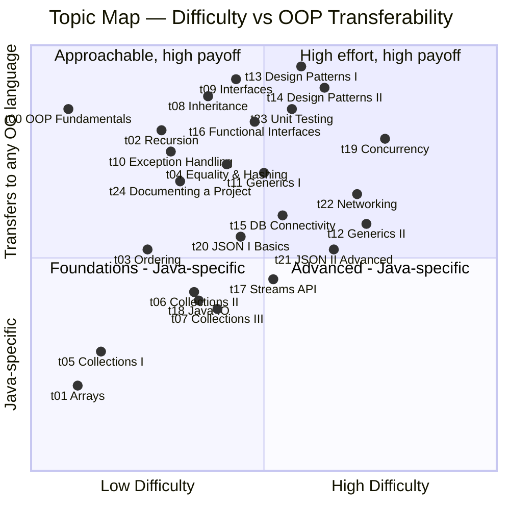

# COMP C8Z03 – Object‑Oriented Programming

This space holds your weekly topics, exercises, shared resources, and assessment briefs. Use it alongside Moodle and the official [module descriptor](https://courses.dkit.ie/index.cfm/page/module/moduleId/55497/deliveryperiodid/1066).

> **Branch notice — please read before using these notes**
>
> | Branch | Academic year | Who should use it |
> |:-------|:--------------|:------------------|
> | `main` | **2026/27** | Students taking the module in 2026/27 |
> | `2025-26` | **2025/26** | Students repeating the August 2026 exam |
>
> If you are sitting the **August 2026 repeat exam**, switch to the [`2025-26` branch](../../tree/2025-26) — those notes match the 2025/26 delivery of the module. The `main` branch has been updated for 2026/27 and **should not be used for repeat-exam preparation**.

---

## 1. Module Content

| Topic | Description | Requires | Notes | Exercises | Challenge Exercises |
|:--|:--|:--|:--|:--|:--|
| t00 | **OOP Fundamentals** — class anatomy, fields, constructors, access modifiers, guard clauses, object creation | — | [Notes](notes/topics/t00_oop_fundamentals/t00_oop_fundamentals_notes.md) | [Exercises](notes/topics/t00_oop_fundamentals/exercises/t00_oop_fundamentals_exercises.md) | — |
| t01 | **Arrays** — create, fill, iterate, and debug fixed-size 1D and 2D arrays | t00 | [Notes](notes/topics/t01_arrays/t01_arrays_notes.md) | [Exercises](notes/topics/t01_arrays/exercises/t01_arrays_exercises.md) | [Array of Suspects](notes/topics/t01_arrays/challenges/ce01_array_of_suspects.md) |
| t02 | **Recursion** — base case and recursive case, call-stack model, array/string/number patterns, flood fill, when not to recurse | t01 | [Notes](notes/topics/t02_recursion/t02_recursion_notes.md) | [Exercises](notes/topics/t02_recursion/exercises/t02_recursion_exercises.md) | — |
| t03 | **Ordering** — sort objects by natural order (Comparable) or custom rules (Comparator) | t01 | [Notes](notes/topics/t03_ordering/t03_ordering_notes.md) | [Exercises](notes/topics/t03_ordering/exercises/t03_ordering_exercises.md) | — |
| t04 | **Equality & Hashing** — implement equals/hashCode correctly; understand identity vs value equality | t03 | [Notes](notes/topics/t04_equality_hashing/t04_equality_hashing_notes.md) | [Exercises](notes/topics/t04_equality_hashing/exercises/t04_equality_hashing_exercises.md) | — |
| t05 | **Collections I** — dynamic lists with ArrayList; add, remove, and iterate safely | t01 | [Notes](notes/topics/t05_collections_1/t05_collections_1_notes.md) | [Exercises](notes/topics/t05_collections_1/exercises/t05_collections_1_exercises.md) | — |
| t06 | **Collections II** — LinkedList as list and deque; mutation-safe iteration with ListIterator | t05 | [Notes](notes/topics/t06_collections_2/t06_collections_2_notes.md) | [Exercises](notes/topics/t06_collections_2/exercises/t06_collections_2_exercises.md) | — |
| t07 | **Collections III** — HashSet, TreeSet, HashMap, TreeMap; choosing the right collection | t04, t06 | [Notes](notes/topics/t07_collections_3_set_map/t07_collections_3_set_map_notes.md) | [Exercises](notes/topics/t07_collections_3_set_map/exercises/t07_collections_3_set_map_exercises.md) | — |
| t08 | **Inheritance** — extend classes, override methods, and model hierarchies with abstract types | t07 | [Notes](notes/topics/t08_inheritance/t08_inheritance_notes.md) | [Exercises](notes/topics/t08_inheritance/exercises/t08_inheritance_exercises.md) | — |
| t09 | **Interfaces** — define shared behaviour contracts; enable polymorphism without inheritance | t08 | [Notes](notes/topics/t09_interface/t09_interface_notes.md) | [Exercises](notes/topics/t09_interface/exercises/t09_interface_exercises.md) | [Directory Distillery](notes/topics/t09_interface/challenges/ce02_the_directory_distillery.md) |
| t10 | **Exception Handling** — checked vs unchecked exceptions, try/catch/finally, custom exception types | t09 | [Notes](notes/topics/t10_exception_handling/t10_exception_handling_notes.md) | [Exercises](notes/topics/t10_exception_handling/exercises/t10_exception_handling_exercises.md) | — |
| t11 | **Generics I** — write type-safe reusable classes and methods using type parameters | t09 | [Notes](notes/topics/t11_generics_1/t11_generics_1_notes.md) | [Exercises](notes/topics/t11_generics_1/exercises/t11_generics_1_exercises.md) | [Frequency Forge](notes/topics/t11_generics_1/challenges/ce03_frequency_forge.md), [Cargo Manifest](notes/topics/t11_generics_1/challenges/ce04_cargo_manifest.md) |
| t12 | **Generics II** — use wildcards (`? extends` / `? super`) and apply the PECS rule | t11 | [Notes](notes/topics/t12_generics_2/t12_generics_2_notes.md) | [Exercises](notes/topics/t12_generics_2/exercises/t12_generics_2_exercises.md) | — |
| t13 | **Design Patterns I** — replace conditional logic with Strategy and Command patterns | t09 | [Notes](notes/topics/t13_design_patterns_1/t13_design_patterns_1_notes.md) | [Exercises](notes/topics/t13_design_patterns_1/exercises/t13_design_patterns_1_exercises.md) | — |
| t14 | **Design Patterns II** — decouple creation and events with Factory, Observer, and Adapter | t13 | [Notes](notes/topics/t14_design_patterns_2/t14_design_patterns_2_notes.md) | [Exercises](notes/topics/t14_design_patterns_2/exercises/t14_design_patterns_2_exercises.md) | — |
| t15 | **DB Connectivity** — connect to MySQL with JDBC; implement the DAO pattern for N-tier apps | t09 | [Notes](notes/topics/t15_dao/t15_dao_notes.md) | [Exercises](notes/topics/t15_dao/exercises/t15_dao_exercises.md) | — |
| t16 | **Functional Interfaces** — pass behaviour as data using Consumer, Function, Predicate, Supplier | t09 | [Notes](notes/topics/t16_functional_interfaces/t16_functional_interfaces_notes.md) | [Exercises](notes/topics/t16_functional_interfaces/exercises/t16_functional_interfaces_exercises.md) | [Alien vs Predicate](notes/topics/t16_functional_interfaces/challenges/ce05_alien_vs_predicate.md), [Accumulator Ops](notes/topics/t16_functional_interfaces/challenges/ce06_accumulator_ops.md) |
| t17 | **Streams API** — pipeline model, filter/map/flatMap, terminal ops, Collectors, IntStream | t16 | [Notes](notes/topics/t17_streams_api/t17_streams_api_notes.md) | [Exercises](notes/topics/t17_streams_api/exercises/t17_streams_api_exercises.md) | — |
| t18 | **Java I/O** — NIO.2 Path/Files API, BufferedReader/Writer, CSV parsing, config loaders | t17 | [Notes](notes/topics/t18_io/t18_io_notes.md) | [Exercises](notes/topics/t18_io/exercises/t18_io_exercises.md) | — |
| t19 | **Concurrency** — run tasks in parallel with Runnable threads and ExecutorService pools | t09 | [Notes](notes/topics/t19_concurrency/t19_concurrency_notes.md) | [Exercises](notes/topics/t19_concurrency/exercises/t19_concurrency_exercises.md) | — |
| t20 | **JSON I: Jackson Basics** — JSON format, ObjectMapper, serialisation/deserialisation, TypeReference | t15 | [Notes](notes/topics/t20_json_1_jackson_basics/t20_json_1_jackson_basics_notes.md) | [Exercises](notes/topics/t20_json_1_jackson_basics/exercises/t20_json_1_jackson_basics_exercises.md) | — |
| t21 | **JSON II: Jackson Advanced** — protocol design, request routing, Base64, BLOB/JDBC, JSON over sockets | t20 | [Notes](notes/topics/t21_json_2_jackson_advanced/t21_json_2_jackson_advanced_notes.md) | [Exercises](notes/topics/t21_json_2_jackson_advanced/exercises/t21_json_2_jackson_advanced_exercises.md) | — |
| t22 | **Networking** — build a multi-client TCP server with a JSON request/response protocol | t15, t21 | [Notes](notes/topics/t22_networking/t22_networking_notes.md) | [Exercises](notes/topics/t22_networking/exercises/t22_networking_exercises.md) | — |
| t23 | **Unit Testing** — JUnit 5, AAA pattern, naming conventions, DAO integration tests, coverage | t15, t21, t22 | [Notes](notes/topics/t23_unit_testing/t23_unit_testing_notes.md) | — | — |
| t24 | **Documenting a Project** — Javadoc tags, ER/flowchart/sequence/architecture diagrams with Mermaid | t15, t22 | [Notes](notes/topics/t24_documenting_a_project/t24_documenting_a_project_notes.md) | — | — |

---

## 2. Topic Map — Difficulty vs OOP Transferability

The chart below positions each topic on two axes:
- **X — Difficulty**: how much new syntax and mental model is required
- **Y — OOP beyond Java**: how directly the concept transfers to other OO languages (C#, C++, Python, Kotlin, etc.)

Topics in the top-right demand the most effort but give the most lasting value. Topics in the bottom-left are Java-specific foundations — essential here, less portable.



---

## 3. Continuous Assessment Briefs

| CA                   | Summary                                                                                                                                                                                                                                               | Brief                                                                                               |
|:-|:-|:-|
| **GCA1** | Work in **pairs** to design and implement a small records system. Load a large CSV from GitHub, parse to in-memory structures, support searching/filtering/ordering and simple reporting. | [CA brief](/notes/assessments/briefs/2025-26-l8-s2-oop-gca1.md), [Stage 2 Report Template](/notes/assessments/briefs/2025-26-l8-s2-oop-gca1-sample-report.md) |
| **GCA2** | Work in **groups** to design and implement a multi-tier client-server system with a JDBC DAO layer, JSON socket protocol, binary file (BLOB) storage, and a full JUnit test suite with ≥70% coverage. | CA brief - see Moodle, [Sample README](/notes/assessments/briefs/GCA2_README_SAMPLE.md), [Sample N-tier code](/code/src/assessments/gca/gca2/) |

---

## 4. Getting Started

- Ensure a recent JDK is installed and selected in your IDE.
- Open `code/` as a Maven project in IntelliJ: right-click `code/pom.xml` → **Add as Maven Project**. IntelliJ will download all dependencies automatically.
- Use your IDE's Markdown preview for notes files and Mermaid diagrams, or view them on GitHub.

> :bulb: **Keep a "bug diary".** For each bug you hit, note the cause and the fix. Patterns will emerge, and you'll get faster.

---

## 5. How to Use This Repo

- Start with the official [module descriptor](https://courses.dkit.ie/index.cfm/page/module/moduleId/55497/deliveryperiodid/1066) to understand *what* we cover in this module.
- Check **assessments/briefs/** for the current CA brief and rubric.
- Each week, open the matching folder in **topics/** (e.g. `t02_recursion/`):
  - Work through **exercises/** first (core skills), then try **challenges/** (apply + extend).
  - **Do not peek** at the **solutions/** until after we cover the material in class.
- Use **shared/** for general setup notes, style guidance, and cheat sheets.

---

## 6. Running Exercises from `Main`

Run `Main.java`. A menu appears:

```
=====================================================
         OOP Module — Topic Exercise Runner
=====================================================
  0.  Exit
  1.  t00 — OOP Fundamentals
  2.  t01 — Arrays
  3.  t02 — Recursion
  4.  t03 — Ordering
  ...
 25.  t24 — Documenting a Project
=====================================================
Select topic (0 to exit):
```

Enter a number to run all exercises for that topic. Enter `0` to exit. The menu loops until you exit.

Every exercise package contains a single entry point:

```java
// Each exercise/challenge has an Exercise class with a static run() method.
// Main calls them via their fully-qualified package path, e.g.:
t01_arrays.challenges.ce01.Exercise.run();

// Notes:
//  - Packages mirror notes/topics, e.g. t01_arrays.exercises.ex01
//  - Multiple Exercise classes are fine because packages make them unique
//  - Shared helpers live in package 'common', e.g. common.FileUtils
//  - t15 exercises require a running MySQL instance (see t15 note in menu)
```

---

## 7. Folder Map

```text
/                                        # repo root (L8---OOP---Module-Content)
├─ README.md                             # this file
├─ descriptors/                          # official module and programme descriptor PDFs
│
├─ code/                                 # all runnable Java (Maven project)
│  ├─ pom.xml                            # Maven build — Jackson, JUnit Jupiter, MySQL connector
│  ├─ data/                              # static data files used by exercises (CSV, XML, HTML)
│  │  ├─ ce01/                           # data for challenge exercise 01
│  │  ├─ ce02/                           # data for challenge exercise 02 (contacts CSVs)
│  │  ├─ ce03/                           # data for challenge exercise 03 (weapon XML, country CSV)
│  │  └─ exercises/                      # shared exercise data (e.g. profane_words.csv)
│  └─ src/
│     ├─ Main.java                       # entry point — interactive menu to run any topic
│     ├─ common/                         # shared helpers (FileUtils, etc.)
│     ├─ assessments/                    # assessment sample code
│     │  └─ gca/
│     │     └─ gca2/                     # GCA2 N-tier reference: Task, TaskDAO, Server, Client
│     └─ tNN_topic/                      # one package per topic (t00_oop_fundamentals … t24_documenting_a_project)
│        ├─ challenges/                  # challenge exercise solutions
│        │  └─ ceNN/Exercise.java
│        ├─ demos/                       # lecturer demo code
│        │  └─ deNN/Demo.java
│        └─ exercises/                   # standard exercise solutions
│           └─ eNN/Exercise.java         # each has a static run() entry point
│
└─ notes/                                # student-facing learning material (Markdown, non-runnable)
   ├─ applied/                           # applied case studies (e.g. TaskHub)
   │  └─ taskhub/
   ├─ assessments/
   │  ├─ briefs/                         # CA briefs, sample reports, README templates
   │  └─ self-assessments/              # MCQ self-assessment files (.gift format)
   ├─ shared/
   │  ├─ cheat sheets/                   # JUnit assertion guides
   │  ├─ general/                        # style guide, DRY notes, commit guidelines, tools
   │  └─ mind maps/                      # revision mindmaps (t01–t09, collections)
   └─ topics/                            # one folder per topic (t00–t24)
      └─ tNN_topic/
         ├─ tNN_topic_notes.md           # main notes file
         ├─ challenges/                  # challenge exercise briefs
         └─ exercises/                   # standard exercise briefs
            └─ tNN_topic_exercises.md
```

---

## 8. Cheatsheets

| Topic | Description |
|:--|:--|
| [Writing JUnit tests in Intellij](notes/shared/cheat%20sheets/cheatsheet_junit_in_intellij.md) | A practical JUnit "Snippet Gallery" for students: copy-pasteable assertion examples with brief explanations, plus real-world helper classes (`PricingUtils`, `DataUtils`) and complete test classes in the appendix. It also includes quick setup tips for adding JUnit to Maven/IntelliJ. |
| [Writing JUnit tests by parameter](/notes/shared/cheat%20sheets/cheatsheet_junit_asserts_by_parameter_type.md) | A guide to choosing the right JUnit assertions by parameter type (primitives, strings, arrays, lists, mixed inputs), with edge-case checklists and copy-paste snippets—plus a ready-to-run scaffold test class in the appendix. |

---

## 9. Mindmaps

| Topics Covered | Summary | Link |
|:--|:--|:--|
| Topics 01–07 | Revision mindmaps covering Arrays, Ordering (Comparable/Comparator), Collections (ArrayList & LinkedList), Equality & Hashing, Inheritance, and Interfaces. Each topic includes visual mindmaps, code snippets, and self-assessment prompts. | [Revision Mindmaps](/notes/shared/mind%20maps/revision_t01_t07.md) |
| Topics 08–16 | Revision mindmaps covering Generics I & II, Design Patterns I & II, DB Connectivity, Functional Interfaces, Concurrency, Networking, and JSON & Binary Storage. Each topic includes a Mermaid mindmap and key concept overview. | [Revision Mindmaps](/notes/shared/mind%20maps/revision_t08_t16.md) |

---

## 10. General Directions to Improve as a Programmer

- **Show up**: Consistent **class attendance** opens time for questions, feedback, and debugging together.
- **Ask early, ask often**: If you're stuck for 15–20 minutes, **ask**. Small gaps compound quickly.
- **Take structured notes**: Keep a simple, dated log of *what you learned* and *what still confuses you*. Include short code snippets and diagrams — especially for tricky ideas (e.g. references vs values, parameter passing).
- **Practice deliberately**: Write small programs daily. Re‑implement examples *from scratch* without looking.
- **Read code**: Study the sample solutions **after** attempting the exercises. Compare naming, layout, and tests.
- **Use a style guide**: Follow `shared/general/style-guide.md`. Clean, consistent code is easier to fix and extend.
- **Test as you go**: Add small `main` demos or assertions. Run code often. Don't leave all testing to the end.
- **Version control**: Commit early and often with meaningful messages. Branch for experiments.
- **Balance matters**: Sleep, nutrition, movement, and breaks improve problem‑solving. Overwork slows you down.
- **Be patient**: Skill grows with time-on-task. Focus on steady improvement, not perfection on day one.

---
