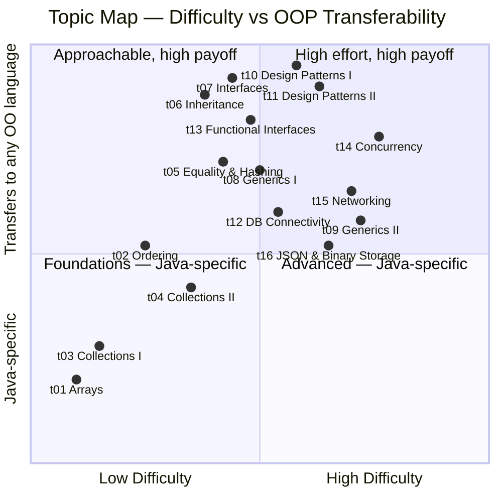

# COMP C8Z03 – Object‑Oriented Programming

This space holds your weekly topics, exercises, shared resources, and assessment briefs. Use it alongside Moodle and the official [module descriptor](https://courses.dkit.ie/index.cfm/page/module/moduleId/55497/deliveryperiodid/1066).

---

## Continuous Assessment Briefs

| CA                   | Summary                                                                                                                                                                                                                                               | Brief                                                                                               |
|:-|:-|:-|
| **GCA1** | Work in **pairs** to design and implement a small records system. Load a large CSV from GitHub, parse to in-memory structures, support searching/filtering/ordering and simple reporting. | [CA brief](/notes/assessments/briefs/2025-26-l8-s2-oop-gca1.md), [Stage 2 Report Template](/notes/assessments/briefs/2025-26-l8-s2-oop-gca1-sample-report.md) |
| **GCA2** | Work in **groups** to design and implement a multi-tier client-server system with a JDBC DAO layer, JSON socket protocol, binary file (BLOB) storage, and a full JUnit test suite with ≥70% coverage. | CA brief - see Moodle, [Sample README](/notes/assessments/briefs/GCA2_README_SAMPLE.md) |

---

## Module Content

| Topic | Description | Requires | Notes | Exercises | Challenge Exercises |
|:--|:--|:--|:--|:--|:--|
| t01 | **Arrays** — create, fill, iterate, and debug fixed-size 1D and 2D arrays | — | [Notes](notes/topics/t01_arrays/t01_arrays_notes.md) | [Exercises](notes/topics/t01_arrays/exercises/t01_arrays_exercises.md) | [Array of Suspects](notes/topics/t01_arrays/challenges/ce01_array_of_suspects.md) |
| t02 | **Ordering** — sort objects by natural order (Comparable) or custom rules (Comparator) | t01 | [Notes](/notes/topics/t02_ordering/t02_ordering_notes.md) | [Exercises](/notes/topics/t02_ordering/exercises/t02_ordering_exercises.md) | — |
| t03 | **Collections I** — dynamic lists with ArrayList; add, remove, and iterate safely | t01 | [Notes](/notes/topics/t03_collections_1/t03_collections_1_notes.md) | [Exercises](/notes/topics/t03_collections_1/exercises/t03_collections_1_exercises.md) | — |
| t04 | **Collections II** — LinkedList as list and deque; mutation-safe iteration with ListIterator | t03 | [Notes](/notes/topics/t04_collections_2/t04_collections_2_notes.md) | [Exercises](/notes/topics/t04_collections_2/exercises/t04_collections_2_exercises.md) | — |
| t05 | **Equality & Hashing** — implement equals/hashCode correctly; understand identity vs value equality | t03 | [Notes](/notes/topics/t05_equality_hashing/t05_equality_hashing_notes.md) | [Exercises](/notes/topics/t05_equality_hashing/exercises/t05_equality_hashing_exercises.md) | — |
| t06 | **Inheritance** — extend classes, override methods, and model hierarchies with abstract types | t05 | [Notes](/notes/topics/t06_inheritance/t06_inheritance_notes.md) | [Exercises](/notes/topics/t06_inheritance/exercises/t06_inheritance_exercises.md) | — |
| t07 | **Interfaces** — define shared behaviour contracts; enable polymorphism without inheritance | t06 | [Notes](/notes/topics/t07_interface/t07_interface_notes.md) | [Exercises](/notes/topics/t07_interface/exercises/t07_interface_exercises.md) | [Directory Distillery](notes/topics/t07_interface/challenges/ce02_the_directory_distillery.md) |
| t08 | **Generics I** — write type-safe reusable classes and methods using type parameters | t07 | [Notes](/notes/topics/t08_generics_1/t08_generics_1_notes.md) | [Exercises](/notes/topics/t08_generics_1/exercises/t08_generics_1_exercises.md) | [Frequency Forge](notes/topics/t08_generics_1/challenges/ce03_frequency_forge.md), [Cargo Manifest](notes/topics/t08_generics_1/challenges/ce04_cargo_manifest.md) |
| t09 | **Generics II** — use wildcards (`? extends` / `? super`) and apply the PECS rule | t08 | [Notes](/notes/topics/t09_generics_2/t09_generics_2_notes.md) | [Exercises](/notes/topics/t09_generics_2/exercises/t09_generics_2_exercises.md) | — |
| t10 | **Design Patterns I** — replace conditional logic with Strategy and Command patterns | t07 | [Notes](/notes/topics/t10_design_patterns_1/t10_design_patterns_1_notes.md) | [Exercises](/notes/topics/t10_design_patterns_1/exercises/t10_design_patterns_exercises.md) | — |
| t11 | **Design Patterns II** — decouple creation and events with Factory, Observer, and Adapter | t10 | [Notes](/notes/topics/t11_design_patterns_2/t11_design_patterns_2_notes.md) | [Exercises](/notes/topics/t11_design_patterns_2/exercises/t11_design_patterns_2_exercises.md) | — |
| t12 | **DB Connectivity** — connect to MySQL with JDBC; implement the DAO pattern for N-tier apps | t07 | [Notes](/notes/topics/t12_dao/t12_db_connectivity_dao_notes.md) | [Exercises](/notes/topics/t12_dao/exercises/t12_db_connectivity_exercises.md) | — |
| t13 | **Functional Interfaces** — pass behaviour as data using Consumer, Function, Predicate, Supplier | t07 | [Notes](/notes/topics/t13_functional_interfaces/t13_functional_interfaces_notes.md) | [Exercises](/notes/topics/t13_functional_interfaces/exercises/t13_functional_interfaces_exercises.md) | [Alien vs Predicate](notes/topics/t13_functional_interfaces/challenges/ce05_alien_vs_predicate.md), [Accumulator Ops](notes/topics/t13_functional_interfaces/challenges/ce06_accumulator_ops.md) |
| t14 | **Concurrency** — run tasks in parallel with Runnable threads and ExecutorService pools | t07 | [Notes](/notes/topics/t14_concurrency/t14_concurrency_notes.md) | [Exercises](/notes/topics/t14_concurrency/exercises/t14_concurrency_exercises.md) | — |
| t15 | **Networking** — build a multi-client TCP server with a JSON request/response protocol | t12 | [Notes](/notes/topics/t15_networking/t15_networking_notes.md) | [Exercises](/notes/topics/t15_networking/exercises/t15_networking_exercises.md) | — |
| t16 | **JSON + Binary File Storage** — serialise and deserialise Java objects with Jackson; Base64-encode binary data for JSON transport; store and retrieve `MEDIUMBLOB` columns with JDBC `setBytes()`/`getBytes()`; write metadata-only queries that skip the BLOB; send JSON over sockets | t12, t13 | [Notes](/notes/topics/t16_json/t16_json_notes.md) | [Exercises](/notes/topics/t16_json/exercises/t16_json_exercises.md) | — |

---

## Topic Map — Difficulty vs OOP Transferability

The chart below positions each topic on two axes:
- **X — Difficulty**: how much new syntax and mental model is required
- **Y — OOP beyond Java**: how directly the concept transfers to other OO languages (C#, C++, Python, Kotlin, etc.)

Topics in the top-right demand the most effort but give the most lasting value. Topics in the bottom-left are Java-specific foundations — essential here, less portable.



---

## Cheatsheets

| Topic | Description |
|:--|:--|
| [Writing JUnit tests in Intellij](notes/shared/cheat%20sheets/cheatsheet_junit_in_intellij.md) | A practical JUnit “Snippet Gallery” for students: copy-pasteable assertion examples with brief explanations, plus real-world helper classes (`PricingUtils`, `DataUtils`) and complete test classes in the appendix. It also includes quick setup tips for adding JUnit to Maven/IntelliJ. |
| [Writing JUnit tests by parameter](/notes/shared/cheat%20sheets/cheatsheet_junit_asserts_by_parameter_type.md) |  A guide to choosing the right JUnit assertions by parameter type (primitives, strings, arrays, lists, mixed inputs), with edge-case checklists and copy-paste snippets—plus a ready-to-run scaffold test class in the appendix. |

---

## Mindmaps

| Topics Covered | Summary | Link |
|:--|:--|:--|
| Topics 01–07 | Revision mindmaps covering Arrays, Ordering (Comparable/Comparator), Collections (ArrayList & LinkedList), Equality & Hashing, Inheritance, and Interfaces. Each topic includes visual mindmaps, code snippets, and self-assessment prompts. | [Revision Mindmaps](/notes/shared/mind%20maps/revision_t01_t07.md) |

---

## Folder Map

```text
/                                     # repo root (L8---OOP---Module-Content)
├─ README.md                          # overview + how to run
├─ code/                              # runnable Java code (solutions, demos)
│  └─ src/
│     ├─ common/                      # helpers used by multiple exercises/challenges
│     └─ tNN-topic/                  # mirrors a topic in notes/topics
│
├─ lecturer/                          # staff-only WIP (drafts, keys, lesson plans)
│
├─ descriptors/                       # official module and programme descriptor PDFs
│
└─ notes/                             # student-facing learning material (non-runnable)
   ├─ shared/
   │  ├─ cheat sheets/
   │  ├─ general/
   │  └─ mind maps/                        
   ├─ assessments/                    # continuous assessment documents for the module
   │  └─ briefs/
   └─ topics/                         # notes, exercises, applied case studies, and challenges exercises for the module
      └─ tNN-topic/                   # one folder per topic (e.g. t14_concurrency)
         ├─ challenges/               # challenge exercises for the topic
         └─ exercises/                # standard exercises for the topic
```

---

## How to use this repo
- Start with the official [module descriptor](https://courses.dkit.ie/index.cfm/page/module/moduleId/55497/deliveryperiodid/1066) to understand *what* we cover in this module.
- Check **assessments/briefs/** for the current CA/ICA brief and rubric.
- Each week, open the matching folder in **topics/** (e.g., `t01-arrays/`):
  - Work through **exercises/** first (core skills), then try **challenges/** (apply + extend).
  - **Do not peek** at the **solutions/** until after we cover the material in class.
- Use **shared/** for general setup notes, style guidance, and cheat sheets.

---

## Running exercises from `Main`

Open `code/` as a Maven project in IntelliJ (right-click `code/pom.xml` → **Add as Maven Project**), then run `Main`.

A menu appears:

```
=====================================================
         OOP Module — Topic Exercise Runner
=====================================================
  0.  Exit
  1.  t01 — Arrays
  2.  t02 — Ordering
  ...
 14.  t14 — Concurrency I
=====================================================
Select topic (0 to exit):
```

Enter a number to run all exercises for that topic. Enter `0` to exit. The menu loops until you exit.

Every exercise package contains a single entry point:

```java
// Each exercise/challenge has an Exercise class with a static run() method.
// Main calls them via their fully-qualified package path, e.g.:
t01_arrays.challenges.ce01.Exercise.run();

// Notes:
//  - Packages mirror notes/topics, e.g. t01_arrays.exercises.ex01
//  - Multiple Exercise classes are fine because packages make them unique
//  - Shared helpers live in package ‘common’, e.g. common.FileUtils
//  - t12 exercises require a running MySQL instance (see t12 note in menu)
```

---

## Getting Started
- Ensure a recent JDK is installed and selected in your IDE.
- Use your IDE’s Markdown preview for `notes.md` and Mermaid diagrams, or view on GitHub.
- Build and run small Java files directly in your IDE while working through exercises.

> :bulb: **Keep a “bug diary”.** For each bug you hit, note the cause and the fix. Patterns will emerge, and you’ll get faster.

---

## General Directions to Improve as a Programmer

- **Show up**: Consistent **class attendance** opens time for questions, feedback, and debugging together.
- **Ask early, ask often**: If you’re stuck for 15–20 minutes, **ask**. Small gaps compound quickly.
- **Take structured notes**: Keep a simple, dated log of *what you learned* and *what still confuses you*. Include short
  code snippets and diagrams—especially for tricky ideas (e.g., references vs values, parameter passing).
- **Practice deliberately**: Write small programs daily. Re‑implement examples *from scratch* without looking.
- **Read code**: Study the sample solutions **after** attempting the exercises. Compare naming, layout, and tests.
- **Use a style guide**: Follow `shared/general/style-guide.md`. Clean, consistent code is easier to fix and extend.
- **Test as you go**: Add small `main` demos or assertions. Run code often. Don’t leave all testing to the end.
- **Version control**: Commit early and often with meaningful messages. Branch for experiments.
- **Balance matters**: Sleep, nutrition, movement, and breaks improve problem‑solving. Overwork slows you down.
- **Be patient**: Skill grows with time-on-task. Focus on steady improvement, not perfection on day one.

---
