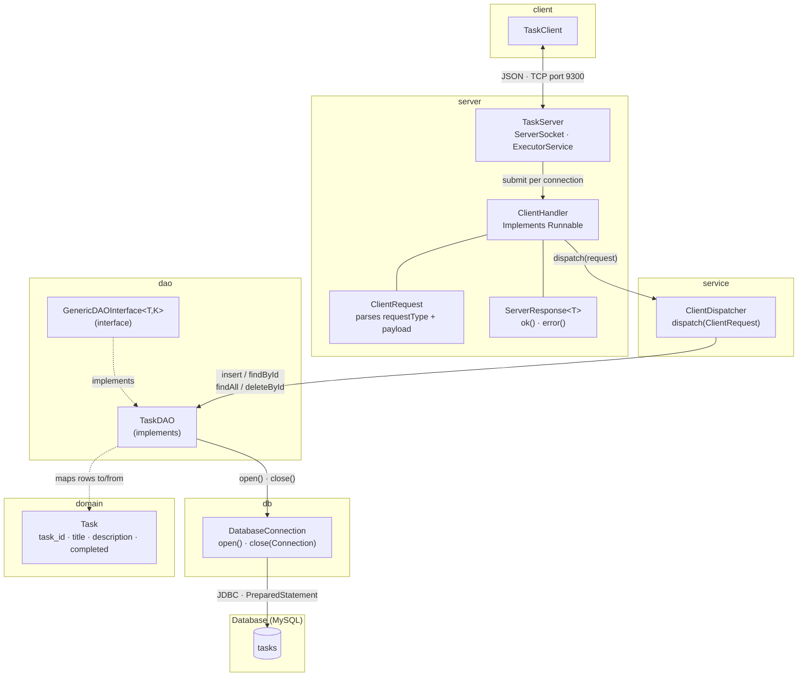
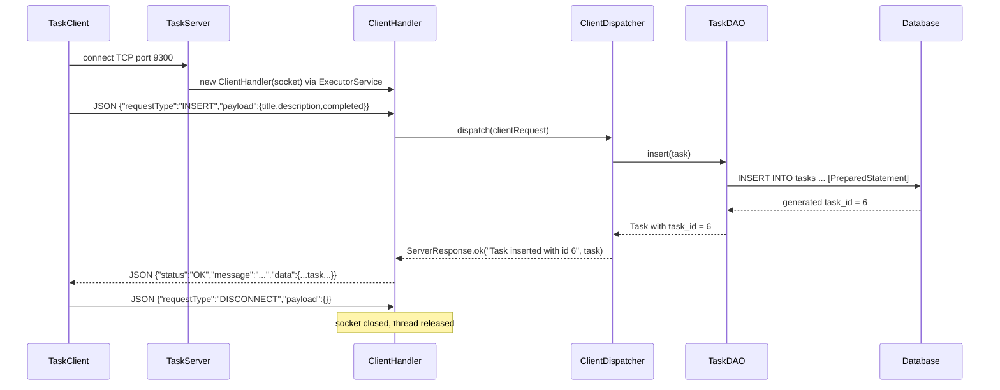
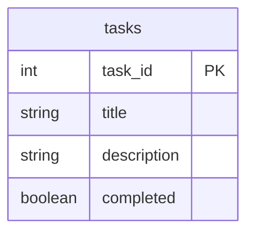

# GCA2 — N-Tier Reference System

A complete working example of the N-tier architecture required for GCA2.
The domain is a simple **Task** management system with one database table.
Use it as a reference for structuring your own project, understanding how
the layers connect, and writing unit tests for each tier.

---

## Package structure

| Package | Classes | Responsibility |
| :- | :- | :- |
| `domain` | `Task` | Entity / DTO — validated fields, `equals`, `hashCode` |
| `dao` | `GenericDAOInterface`, `TaskDAO` | Database CRUD via JDBC `PreparedStatement` |
| `db` | `DatabaseConnection` | JDBC connection helper — `open()` / `close()` |
| `service` | `ClientDispatcher` | Routes parsed requests to the correct DAO method |
| `server` | `TaskServer`, `ClientHandler`, `ClientRequest`, `ServerResponse<T>` | TCP server, per-client thread, JSON protocol types |
| `client` | `TaskClient` | Demo client — exercises all four operations |
| `sql` | `mysqlSetup.sql` | Recreates schema and seeds five rows |

---

## Setup

1. Run `sql/mysqlSetup.sql` against a local MySQL instance to create
   `gca2_support_db`, the `gca2_user` account, and the `tasks` table.
2. If you change the password, update the `DB_PASS` constant in `TaskServer`.

---

## Running

1. Run `TaskServer.main()` — the server blocks, waiting for connections on port **9 300**.
2. Run `TaskClient.main()` — the client connects, sends four requests, prints responses, disconnects.

---

## Architecture diagram



---

## Sequence diagram — INSERT request



---

## ER diagram



---

## JSON protocol reference

All requests follow the same envelope:

```json
{ "requestType": "<TYPE>", "payload": { ... } }
```

All responses follow the same envelope:

```json
{ "status": "OK|ERROR", "message": "...", "data": <payload or null> }
```

| Request type | Payload fields | Success `data` |
| :- | :- | :- |
| `INSERT` | `title` (String), `description` (String), `completed` (boolean) | Inserted `Task` with generated `task_id` |
| `FIND_BY_ID` | `taskId` (int) | Matching `Task`, or `ERROR` if not found |
| `LIST` | _(none)_ | `List<Task>` — empty array if table is empty |
| `DELETE_BY_ID` | `taskId` (int) | `true`, or `ERROR` if not found |
| `DISCONNECT` | _(none)_ | _(no response — server closes socket)_ |
