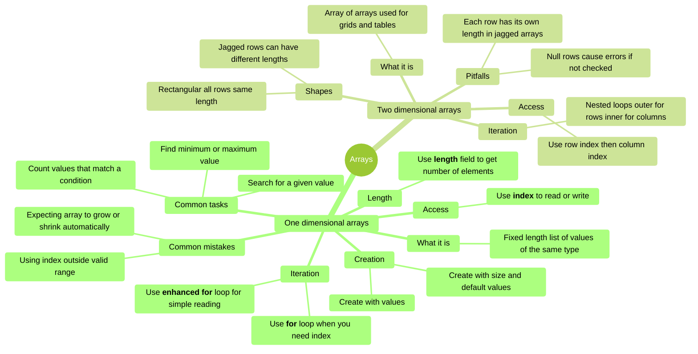
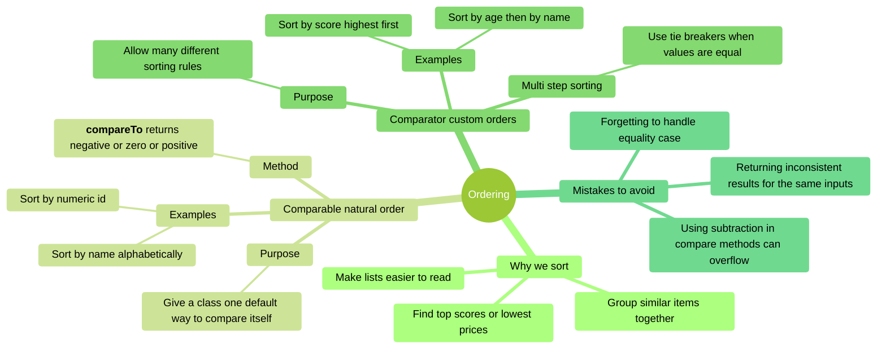
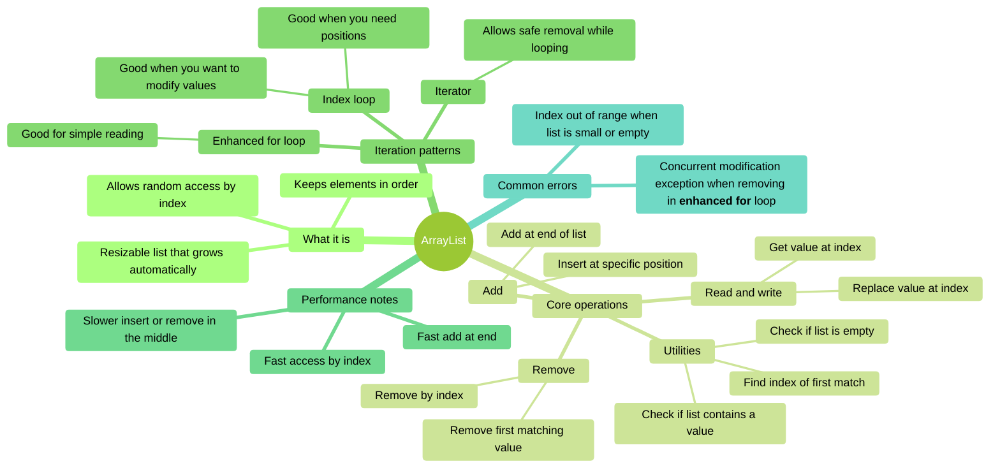
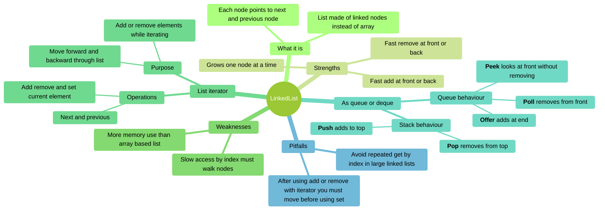
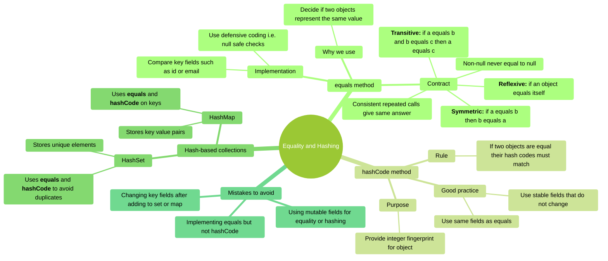
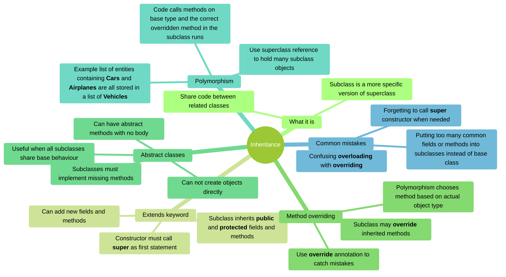
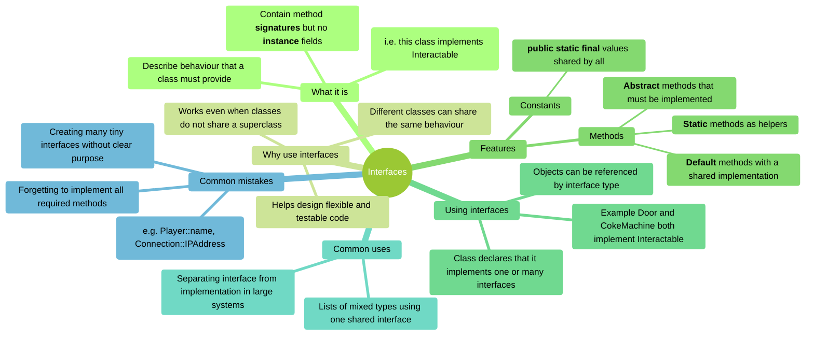

# COMP C8Z03 — Mindmaps - Topics 01–07

This document collects the mindmaps for topics 01-07. Each section has:
- A short explanation of what the topic covers.
- A Mermaid **mindmap** you can use to review key ideas.

> :warning: This revision document is not a substitute for reading, understanding, and learning the content covered in the related notes.
---

## Topic 01 — Arrays (1D and 2D)

### Overview
Arrays are the most basic way to store multiple values in Java. They have a fixed size and hold items of the same type.  You must understand arrays before learning lists, sorting, or searching.  
This mindmap shows how to create arrays, access elements, loop through them, and avoid common errors.



### Code Snippets

```java
// 1D array creation and access
int[] scores = {85, 92, 78, 90};
System.out.println(scores[0]);  // 85
System.out.println(scores.length);  // 4

// Enhanced for loop (read-only)
for (int score : scores) {
    System.out.println(score);
}

// Traditional for loop (when you need index)
for (int i = 0; i < scores.length; i++) {
    scores[i] = scores[i] + 5;  // Curve all scores
}

// 2D array (rectangular)
int[][] grid = {
    {1, 2, 3},
    {4, 5, 6},
    {7, 8, 9}
};
System.out.println(grid[1][2]);  // 6

// Nested loops for 2D array
for (int row = 0; row < grid.length; row++) {
    for (int col = 0; col < grid[row].length; col++) {
        System.out.print(grid[row][col] + " ");
    }
    System.out.println();
}
```

### Self-Assessment Prompts

1. **Why doesn't `array.length` have parentheses like `list.size()`?**  
   *(Hint: One is a field, the other is a method)*

2. **What happens if you try to access `scores[4]` when `scores.length` is 4?**  
   *(What error do you get, and why?)*

3. **In a jagged 2D array, why must you check `grid[row].length` for each row separately?**  
   *(What assumption breaks down compared to rectangular arrays?)*

4. **When should you use an enhanced for loop versus a traditional indexed for loop?**  
   *(Consider: reading vs. modifying, needing position vs. just values)*

---

## Topic 02 — Ordering (Comparable and Comparator)

### Overview
Sorting is essential when organising data. Java provides two main tools:
- `Comparable` defines one “natural” order for a class.
- `Comparator` allows many different custom orders.

This section helps you understand their differences and how to apply them correctly.



### Code Snippets

```java
// Comparable: natural order (one way to sort)
public class Student implements Comparable<Student> {
    private String name;
    private int id;
    
    @Override
    public int compareTo(Student other) {
        return Integer.compare(this.id, other.id);  // Sort by id
    }
}

// Comparator: custom orders (many ways to sort)
public class StudentNameComparator implements Comparator<Student> {
    @Override
    public int compare(Student s1, Student s2) {
        return s1.getName().compareTo(s2.getName());  // Sort by name
    }
}

// Using Comparators with sorting
List<Student> students = new ArrayList<>();
Collections.sort(students);  // Uses Comparable (natural order)
Collections.sort(students, new StudentNameComparator());  // Uses Comparator

// Lambda syntax for simple comparators
students.sort((s1, s2) -> s1.getName().compareTo(s2.getName()));
students.sort(Comparator.comparing(Student::getName));  // Even cleaner

// Multi-level sorting (tie breakers)
students.sort(Comparator.comparing(Student::getGrade)
                        .thenComparing(Student::getName));
```

### Self-Assessment Prompts

1. **Why is using subtraction (`return this.age - other.age`) dangerous in `compareTo` methods?**  
   *(Hint: What happens with very large positive and negative numbers?)*

2. **If a class implements `Comparable`, can you still sort it in different ways?**  
   *(How would you sort by a different field without changing the class?)*

3. **What does `compareTo` return when two objects are equal? Why is this important?**  
   *(What breaks if you return inconsistent results for the same comparison?)*

4. **When would you use a `Comparator` instead of `Comparable`?**  
   *(Consider: Can you modify the class? Do you need multiple sort orders?)*

---

## Topic 03 — Collections I: ArrayList

### Overview
`ArrayList` is Java’s most commonly used resizable list.  
It behaves like an array but grows as needed. This mindmap explains how to add, remove, and access items, and how performance changes depending on where you modify the list.



### Code Snippets

```java
// Creating and adding to ArrayList
List<String> names = new ArrayList<>();
names.add("Alice");       // Add at end - fast
names.add("Bob");
names.add(1, "Charlie");  // Insert at position 1 - slower

// Accessing and modifying
String first = names.get(0);           // Fast random access
names.set(1, "Charlotte");             // Replace at index
System.out.println(names.contains("Bob"));  // true

// Removing elements
names.remove(0);              // Remove by index
names.remove("Charlotte");    // Remove first match
names.clear();                // Remove all

// Index loop (when you need position)
for (int i = 0; i < names.size(); i++) {
    System.out.println(i + ": " + names.get(i));
}

// Enhanced for loop (simple reading)
for (String name : names) {
    System.out.println(name);
}

// Iterator (safe removal while looping)
Iterator<String> iter = names.iterator();
while (iter.hasNext()) {
    String name = iter.next();
    if (name.startsWith("A")) {
        iter.remove();  // Safe removal
    }
}

// Common mistake: ConcurrentModificationException
for (String name : names) {
    if (name.startsWith("A")) {
        names.remove(name);  // ERROR! Can't modify during enhanced for
    }
}
```

### Self-Assessment Prompts

1. **Why is adding to the end of an ArrayList fast, but inserting in the middle slower?**  
   *(Think about what happens to elements after the insertion point)*

2. **What causes a `ConcurrentModificationException`, and how do you avoid it?**  
   *(When can you NOT use `names.remove()` directly?)*

3. **When would you use `get(i)` in a loop versus an enhanced for loop?**  
   *(Consider: Do you need the index? Are you modifying elements?)*

4. **Why does `ArrayList` use an array internally, and what happens when it runs out of space?**  
   *(What's the trade-off between memory and performance?)*

---

## Topic 04 — Collections II: LinkedList and Iterators

### Overview
`LinkedList` stores items using connected nodes instead of an array.  
This makes some operations fast (adding at the front) and others slow (accessing by index).  
This mindmap also explains the `ListIterator`, which is essential for safe element removal during iteration.



### Code Snippets

```java
// Creating a LinkedList
LinkedList<String> list = new LinkedList<>();
list.addFirst("Alice");   // Fast - add at front
list.addLast("Bob");      // Fast - add at end
list.add(1, "Charlie");   // Insert at position

// Slow index access (must walk through nodes)
String item = list.get(2);  // Slow in large lists

// ListIterator - bidirectional and modifiable
ListIterator<String> iter = list.listIterator();
while (iter.hasNext()) {
    String name = iter.next();
    if (name.equals("Bob")) {
        iter.remove();         // Safe removal
        iter.add("Betty");     // Safe addition
    }
}

// Move backward
while (iter.hasPrevious()) {
    System.out.println(iter.previous());
}

// Queue operations (FIFO)
LinkedList<String> queue = new LinkedList<>();
queue.offer("First");      // Add to end
queue.offer("Second");
String head = queue.poll();  // Remove from front: "First"
String peek = queue.peek();  // Look at front: "Second"

// Stack operations (LIFO)
LinkedList<String> stack = new LinkedList<>();
stack.push("Bottom");      // Add to top
stack.push("Top");
String top = stack.pop();  // Remove from top: "Top"
```

### Self-Assessment Prompts

1. **Why is accessing `list.get(1000)` slow in a LinkedList but fast in an ArrayList?**  
   *(What must LinkedList do that ArrayList doesn't?)*

2. **When would you choose LinkedList over ArrayList?**  
   *(Consider: Where are you adding/removing elements? Do you need index access?)*

3. **Why can ListIterator move backward but a regular Iterator cannot?**  
   *(What's different about the underlying structure?)*

4. **After calling `iterator.remove()`, why can't you immediately call `iterator.set()`?**  
   *(What element would `set()` operate on after a removal?)*

---

## Topic 05 — Equality and Hashing

### Overview
To store custom objects correctly in sets and maps, Java needs two methods:
- `equals`  
- `hashCode`

This mindmap explains how they work together, the rules they must follow, and the problems that occur when the contract is broken.



### Code Snippets

```java
// Proper equals and hashCode implementation
public class Student {
    private int id;
    private String email;
    
    @Override
    public boolean equals(Object obj) {
        if (this == obj) return true;  // Same object
        if (obj == null || getClass() != obj.getClass()) return false;
        
        Student other = (Student) obj;
        return id == other.id && 
               Objects.equals(email, other.email);  // Null-safe
    }
    
    @Override
    public int hashCode() {
        return Objects.hash(id, email);  // Use same fields as equals
    }
}

// Using in HashSet (duplicates removed)
Set<Student> students = new HashSet<>();
students.add(new Student(1, "alice@email.com"));
students.add(new Student(1, "alice@email.com"));  // Duplicate - not added
System.out.println(students.size());  // 1

// Using in HashMap (keys must be unique)
Map<Student, Integer> grades = new HashMap<>();
Student alice = new Student(1, "alice@email.com");
grades.put(alice, 85);
grades.put(alice, 90);  // Replaces previous value
System.out.println(grades.get(alice));  // 90

// Common mistake: mutable keys
Student bob = new Student(2, "bob@email.com");
grades.put(bob, 75);
bob.setId(3);  // DANGER! Changed key after adding to map
System.out.println(grades.get(bob));  // null - can't find it anymore!
```

### Self-Assessment Prompts

1. **If two objects are equal according to `equals()`, what must be true about their `hashCode()` values?**  
   *(What breaks if they have different hash codes?)*

2. **Why should you use the same fields in both `equals()` and `hashCode()`?**  
   *(What happens if you use `id` in equals but not in hashCode?)*

3. **What goes wrong if you modify an object's key fields after adding it to a HashSet or HashMap?**  
   *(Why can't the collection find it anymore?)*

4. **Why do hash-based collections need both `equals()` and `hashCode()`?**  
   *(What does hashCode do first, and when does equals get called?)*

---

## Topic 06 — Inheritance

### Overview
Inheritance lets you create a hierarchy of related classes.  A superclass defines common behaviour; subclasses extend or customise it.  
This mindmap shows how `extends`, `super`, overriding, abstract classes, and polymorphism work together.



### Code Snippets

```java
// Basic inheritance
public class Vehicle {
    protected String make;
    protected int year;
    
    public Vehicle(String make, int year) {
        this.make = make;
        this.year = year;
    }
    
    public void start() {
        System.out.println("Vehicle starting...");
    }
}

public class Car extends Vehicle {
    private int numDoors;
    
    public Car(String make, int year, int numDoors) {
        super(make, year);  // Must call parent constructor first
        this.numDoors = numDoors;
    }
    
    @Override  // Annotation helps catch typos
    public void start() {
        System.out.println("Car engine starting...");
    }
}

// Abstract class with abstract methods
public abstract class Shape {
    protected String color;
    
    public abstract double getArea();  // No implementation
    
    public void setColor(String color) {  // Concrete method
        this.color = color;
    }
}

public class Circle extends Shape {
    private double radius;
    
    @Override
    public double getArea() {
        return Math.PI * radius * radius;  // Must implement
    }
}

// Polymorphism in action
List<Vehicle> fleet = new ArrayList<>();
fleet.add(new Car("Toyota", 2020, 4));
fleet.add(new Truck("Ford", 2019, 2000));

for (Vehicle v : fleet) {
    v.start();  // Calls correct version based on actual type
}
```

### Self-Assessment Prompts

1. **What's the difference between overriding and overloading?**  
   *(Hint: One changes behavior, one adds behavior)*

2. **Why must you call `super()` in a subclass constructor, and why must it be the first statement?**  
   *(What happens if the parent isn't fully constructed?)*

3. **When would you use an abstract class versus a concrete class?**  
   *(Consider: Do all subclasses share common implementation? Can you create instances?)*

4. **How does polymorphism work at runtime?**  
   *(If you have `Vehicle v = new Car()`, which `start()` method runs and why?)*

---

## Topic 07 — Interfaces

### Overview
Interfaces define *behaviour* without defining *data*.  They allow unrelated classes to share capabilities, support flexibility, and allow patterns such as “strategy” or “pluggable behaviours.”



### Code Snippets

```java
// Basic interface definition
public interface Interactable {
    void interact();  // Abstract method (must be implemented)
    
    default void playSound() {  // Default method (optional to override)
        System.out.println("Generic interaction sound");
    }
    
    static int MAX_INTERACTIONS = 10;  // Constant (public static final)
}

// Multiple unrelated classes implementing the same interface
public class Door implements Interactable {
    @Override
    public void interact() {
        System.out.println("Door opens");
    }
}

public class VendingMachine implements Interactable {
    @Override
    public void interact() {
        System.out.println("Dispense soda");
    }
    
    @Override
    public void playSound() {  // Override default
        System.out.println("*ka-chunk*");
    }
}

// A class can implement multiple interfaces
public class SmartDoor implements Interactable, Lockable {
    @Override
    public void interact() {
        System.out.println("Smart door unlocking...");
    }
    
    @Override
    public void lock() {
        System.out.println("Locked");
    }
}

// Polymorphism with interfaces
List<Interactable> objects = new ArrayList<>();
objects.add(new Door());
objects.add(new VendingMachine());
objects.add(new SmartDoor());

for (Interactable obj : objects) {
    obj.interact();  // Calls correct implementation
}
```

### Self-Assessment Prompts

1. **What's the key difference between an interface and an abstract class?**  
   *(Consider: Can you extend multiple? Can you have instance fields?)*

2. **When would you use a default method in an interface?**  
   *(What happens to existing implementations if you add a new method to an interface?)*

3. **Why can't interfaces have instance fields, only constants?**  
   *(Think about what an interface represents versus what a class represents)*

4. **How do interfaces enable polymorphism with unrelated classes?**  
   *(Can Door and VendingMachine share a superclass? How can they still be treated uniformly?)*

---

# Appendix — Glossary of Terms

### **Capability label**
A simple interface used to indicate that a class *can* do something (e.g., `Interactable`, `Moveable`).  
It acts like a “tag” describing behaviour.

### **Polymorphism**
The ability to treat different objects through the same type (e.g., a list of `Entity` holding `Player`, `Enemy`, etc.) and still call the correct method at runtime.

### **Iterator**
A special object used to safely walk through a collection.  Allows removal while iterating without errors.

### **ListIterator**
A more advanced iterator that can move *both forward and backward*, and can add or modify items while iterating.

### **Natural order**
The default sorting order for a class when implementing `Comparable`.

### **Custom comparator**
A separate object defining a different way to sort the same items.

### **Hash-based collection**
A data structure (like `HashSet` or `HashMap`) that uses hash codes for fast lookup.

### **Abstract method**
A method with no body that subclasses must implement.

### **Abstract class**
A class you cannot instantiate directly. Often used as a template for subclasses.

