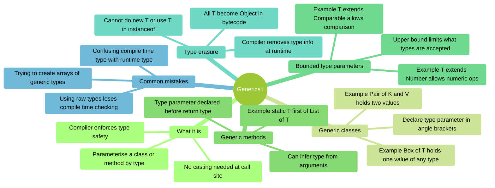
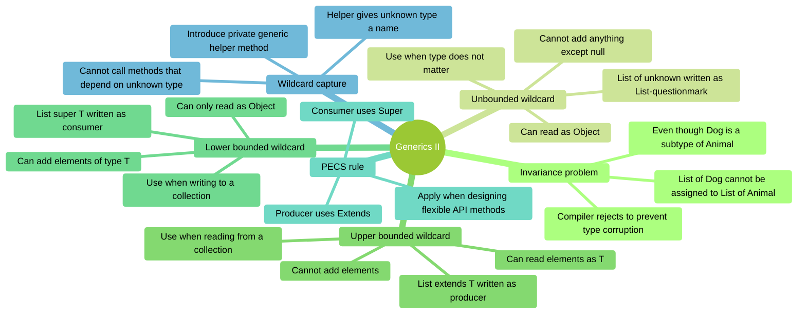
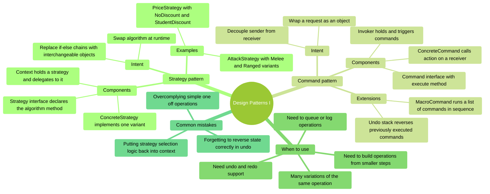
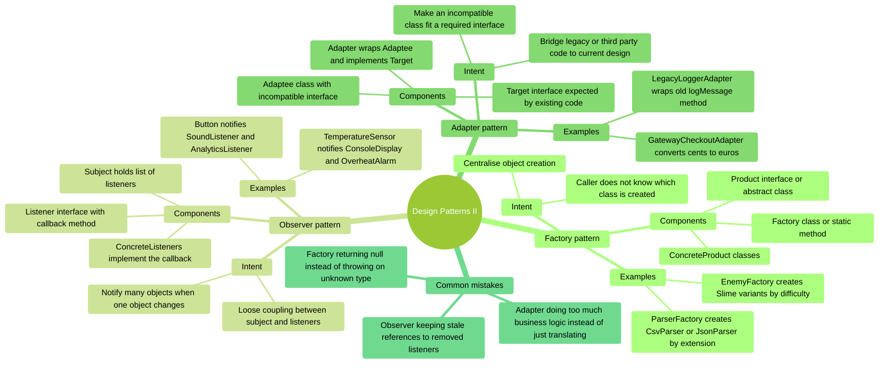
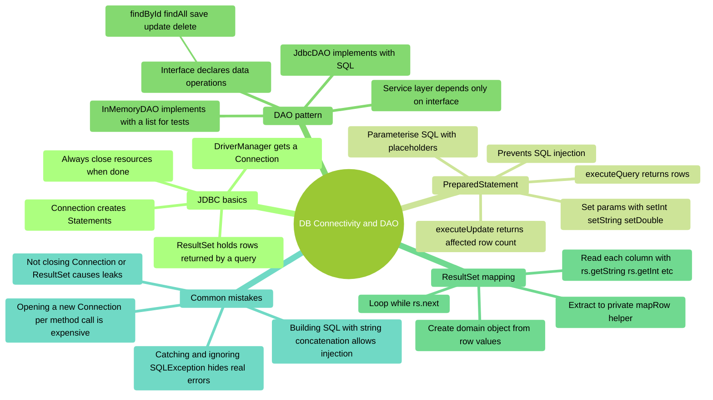
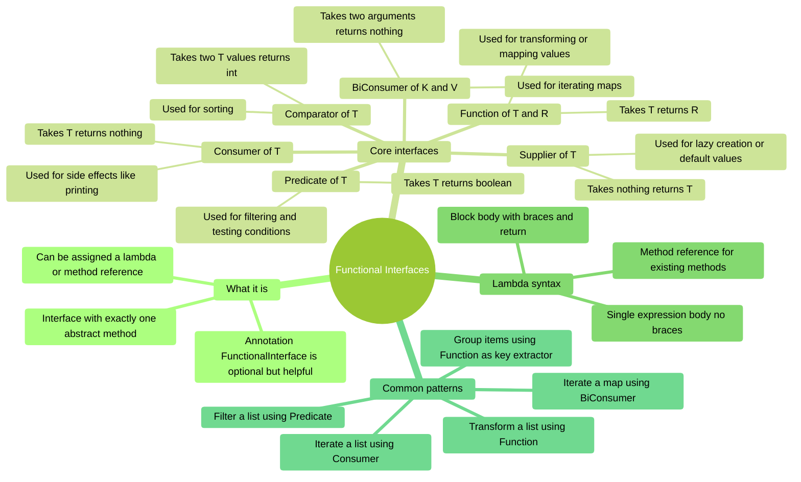
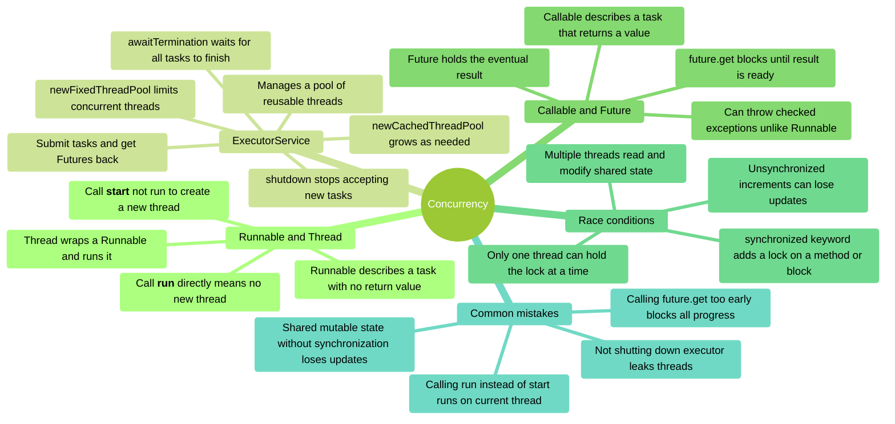
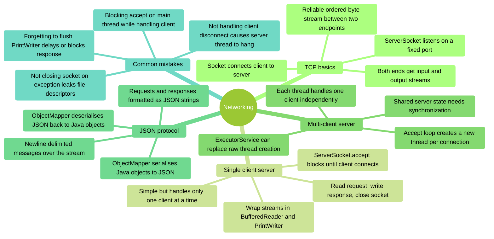
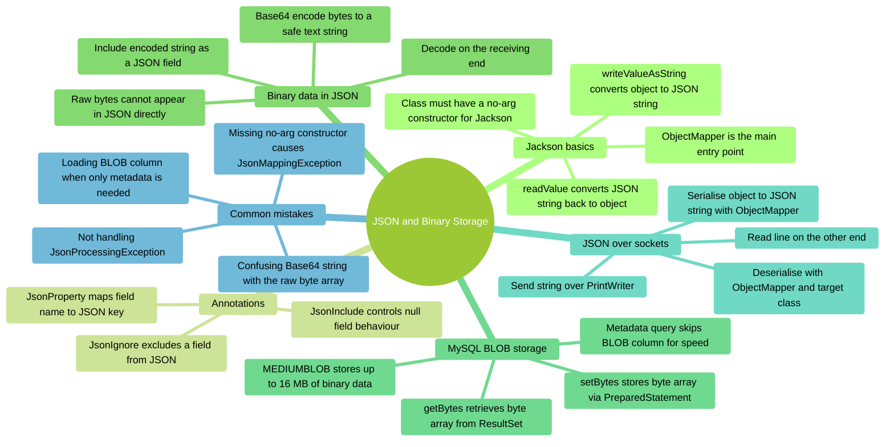

# COMP C8Z03 — Mindmaps - Topics 08–16

This document collects the mindmaps for topics 08-16. Each section has:
- A short explanation of what the topic covers.
- A Mermaid **mindmap** you can use to review key ideas.

> :warning: This revision document is not a substitute for reading, understanding, and learning the content covered in the related notes.
---

## Topic 08 — Generics I

### Overview
Generics let you write classes and methods that work with any type while staying type-safe.  
Instead of using `Object` (which loses type information and requires casting), you use type parameters like `T` or `E`.  
This mindmap shows how to declare generic classes and methods, apply bounds, and avoid the pitfalls of raw types.



### Code Snippets

```java
// Generic class
public class Box<T> {
    private T _value;

    public Box(T value) { _value = value; }
    public T get()      { return _value; }
}

Box<String>  strBox = new Box<>("hello");
Box<Integer> intBox = new Box<>(42);
String s = strBox.get();  // No cast needed

// Generic method
public static <T> T first(List<T> list) {
    if (list.isEmpty()) throw new NoSuchElementException();
    return list.get(0);
}

String name = first(List.of("Alice", "Bob"));  // T inferred as String

// Bounded type parameter — T must be Comparable
public static <T extends Comparable<T>> T max(T a, T b) {
    return a.compareTo(b) >= 0 ? a : b;
}

int bigger = max(3, 7);          // 7
String later = max("Apple", "Mango");  // "Mango"

// Raw type (avoid — no compile-time safety)
Box rawBox = new Box("unsafe");   // Raw type warning
Object val = rawBox.get();        // Must cast manually
```

### Self-Assessment Prompts

1. **What is the difference between using `Object` and using a type parameter `T`?**  
   *(What does the compiler know at each call site?)*

2. **Why can you not write `new T()` inside a generic class?**  
   *(What happens to T at runtime because of type erasure?)*

3. **What does `<T extends Comparable<T>>` mean, and why is it needed?**  
   *(Which method becomes available to T that wouldn't be available otherwise?)*

4. **Why are raw types dangerous, and what should you use instead?**  
   *(What compile-time protection do you lose with a raw type?)*

---

## Topic 09 — Generics II

### Overview
Generics are *invariant*: `List<Dog>` is **not** a `List<Animal>`, even if `Dog extends Animal`.  
Wildcards (`?`) solve this. The **PECS rule** (Producer Extends, Consumer Super) tells you which wildcard to use.  
This mindmap also covers wildcard capture, which is required for performing operations on `List<?>`.



### Code Snippets

```java
// Invariance — this does NOT compile
List<Dog> dogs = new ArrayList<>();
List<Animal> animals = dogs;  // COMPILE ERROR — invariant

// Unbounded wildcard — read anything, add nothing
public static void printAll(List<?> list) {
    for (Object item : list) {
        System.out.println(item);
    }
    // list.add("something");  // COMPILE ERROR
}

// Upper bounded — Producer Extends (read as Number)
public static double sum(List<? extends Number> numbers) {
    double total = 0;
    for (Number n : numbers) total += n.doubleValue();
    return total;
}
sum(List.of(1, 2, 3));       // Integer list — ok
sum(List.of(1.5, 2.5));      // Double list — ok

// Lower bounded — Consumer Super (write T into list)
public static <T> void fill(List<? super T> list, T value, int count) {
    for (int i = 0; i < count; i++) list.add(value);
}
List<Number> nums = new ArrayList<>();
fill(nums, 42, 3);   // Integer is a subtype of Number — ok

// Full PECS copy
public static <T> void copy(List<? extends T> src, List<? super T> dst) {
    for (T item : src) dst.add(item);
}

// Wildcard capture helper
public static void swapFirstTwo(List<?> list) {
    swapHelper(list);  // delegates to typed helper
}
private static <T> void swapHelper(List<T> list) {
    T tmp = list.get(0);
    list.set(0, list.get(1));
    list.set(1, tmp);
}
```

### Self-Assessment Prompts

1. **Why is `List<Dog>` not a subtype of `List<Animal>` in Java?**  
   *(What dangerous operation would be allowed if it were?)*

2. **Why can you not add elements to a `List<? extends Animal>`?**  
   *(What does the compiler not know about the actual list type?)*

3. **State the PECS rule and give one example of each side.**  
   *(What does "producer" mean? What does "consumer" mean?)*

4. **Why is a wildcard capture helper needed for operations like swap on `List<?>`?**  
   *(What does the helper method give you that `List<?>` alone does not?)*

---

## Topic 10 — Design Patterns I

### Overview
Strategy and Command are *behavioural* patterns that replace hard-coded conditional logic with pluggable objects.  
- **Strategy** lets you swap algorithms at runtime by extracting them into interchangeable objects.  
- **Command** encapsulates a request as an object, enabling queueing, logging, and undo.



### Code Snippets

```java
// Strategy pattern
public interface AttackStrategy {
    void attack(String target);
}

public class MeleeAttack implements AttackStrategy {
    @Override
    public void attack(String target) {
        System.out.println("Striking " + target + " with sword");
    }
}

public class RangedAttack implements AttackStrategy {
    @Override
    public void attack(String target) {
        System.out.println("Shooting " + target + " with arrow");
    }
}

public class Enemy {
    private AttackStrategy _strategy;

    public Enemy(AttackStrategy strategy) { _strategy = strategy; }
    public void setStrategy(AttackStrategy s) { _strategy = s; }
    public void attack(String target)         { _strategy.attack(target); }
}

Enemy goblin = new Enemy(new MeleeAttack());
goblin.attack("Player");         // Striking Player with sword
goblin.setStrategy(new RangedAttack());
goblin.attack("Player");         // Shooting Player with arrow

// Command with undo stack
public interface UndoableCommand {
    void execute();
    void undo();
}

public class AddNumberCommand implements UndoableCommand {
    private Counter _counter;
    private int _amount;

    public AddNumberCommand(Counter counter, int amount) {
        _counter = counter;
        _amount  = amount;
    }

    @Override public void execute() { _counter.add(_amount); }
    @Override public void undo()    { _counter.add(-_amount); }
}

Deque<UndoableCommand> history = new ArrayDeque<>();
UndoableCommand cmd = new AddNumberCommand(counter, 5);
cmd.execute();
history.push(cmd);

// Undo last command
if (!history.isEmpty()) history.pop().undo();
```

### Self-Assessment Prompts

1. **How does Strategy differ from a simple set of if/else branches?**  
   *(What happens to the context class when you need to add a new strategy?)*

2. **What is a MacroCommand, and how does it demonstrate the value of the Command pattern?**  
   *(What interface does MacroCommand itself implement?)*

3. **What state does an undoable Command need to store, and why?**  
   *(What information is needed to reverse an action that was already executed?)*

4. **Why does Command decouple the sender from the receiver?**  
   *(Does the invoker need to know which object the command acts on?)*

---

## Topic 11 — Design Patterns II

### Overview
Factory, Observer, and Adapter are three patterns that address *creation*, *event notification*, and *compatibility*.  
- **Factory** centralises object creation behind a method, hiding which concrete class is instantiated.  
- **Observer** lets objects subscribe to events so they are notified automatically when state changes.  
- **Adapter** wraps an incompatible interface to make it fit one that existing code expects.



### Code Snippets

```java
// Factory pattern
public interface Parser { List<String> parse(String input); }

public class CsvParser  implements Parser { /* ... */ }
public class JsonParser implements Parser { /* ... */ }

public class ParserFactory {
    public static Parser createFor(String extension) {
        return switch (extension.toLowerCase()) {
            case "csv"  -> new CsvParser();
            case "json" -> new JsonParser();
            default     -> throw new IllegalArgumentException("Unknown: " + extension);
        };
    }
}

Parser p = ParserFactory.createFor("csv");

// Observer pattern
public interface ClickListener {
    void onClick(String buttonName);
}

public class Button {
    private String _name;
    private List<ClickListener> _listeners = new ArrayList<>();

    public Button(String name) { _name = name; }

    public void addListener(ClickListener l)    { _listeners.add(l); }
    public void removeListener(ClickListener l) { _listeners.remove(l); }

    public void click() {
        for (ClickListener l : _listeners) l.onClick(_name);
    }
}

Button btn = new Button("Submit");
btn.addListener(name -> System.out.println("Sound for: " + name));
btn.addListener(name -> System.out.println("Analytics: " + name));
btn.click();  // Both listeners notified

// Adapter pattern
public interface Logger { void log(String message); }

public class LegacyLogger {
    public void logMessage(String level, String msg) {
        System.out.println("[" + level + "] " + msg);
    }
}

public class LegacyLoggerAdapter implements Logger {
    private LegacyLogger _legacy;

    public LegacyLoggerAdapter(LegacyLogger legacy) { _legacy = legacy; }

    @Override
    public void log(String message) {
        _legacy.logMessage("INFO", message);  // Translate the call
    }
}

Logger logger = new LegacyLoggerAdapter(new LegacyLogger());
logger.log("Application started");
```

### Self-Assessment Prompts

1. **What advantage does a Factory method give over calling `new CsvParser()` directly in your code?**  
   *(What happens when you need to add a third parser type?)*

2. **How does Observer achieve loose coupling between subject and listeners?**  
   *(Does Button need to know what SoundListener does?)*

3. **What is the difference between an Adapter and a subclass?**  
   *(When can you not subclass the adaptee instead?)*

4. **Why might you prefer an interface-based Observer over direct method calls?**  
   *(What does it cost to add a new listener? What does it cost to remove one?)*

---

## Topic 12 — DB Connectivity and DAO

### Overview
JDBC (Java Database Connectivity) lets Java programs communicate with relational databases.  
The **DAO (Data Access Object)** pattern separates database code from business logic by hiding all SQL behind an interface.  
A service layer then uses the DAO interface without knowing whether the backing store is MySQL, in-memory, or anything else.



### Code Snippets

```java
// Opening a connection (use try-with-resources to auto-close)
String url  = "jdbc:mysql://localhost:3306/car_rental?useSSL=false&serverTimezone=UTC";
String user = "car_rental_user";
String pass = "your_password";

try (Connection conn = DriverManager.getConnection(url, user, pass)) {
    System.out.println("Connected!");
}

// PreparedStatement — prevents SQL injection
String sql = "SELECT * FROM cars WHERE make LIKE ?";
try (Connection conn = DriverManager.getConnection(url, user, pass);
     PreparedStatement ps = conn.prepareStatement(sql)) {

    ps.setString(1, "%Ford%");

    try (ResultSet rs = ps.executeQuery()) {
        while (rs.next()) {
            System.out.println(mapRow(rs));
        }
    }
}

// mapRow helper
private static Car mapRow(ResultSet rs) throws SQLException {
    return new Car(
        rs.getInt("id"),
        rs.getString("reg"),
        rs.getString("make"),
        rs.getString("model"),
        rs.getDouble("daily_rate"),
        rs.getString("status")
    );
}

// DAO interface — hides SQL from caller
public interface CarDao {
    Car        findById(int id)           throws Exception;
    List<Car>  findAll()                  throws Exception;
    void       save(Car car)              throws Exception;
    void       delete(int id)             throws Exception;
}

// Service layer uses DAO interface only
public class CarRentalService {
    private CarDao _dao;

    public CarRentalService(CarDao dao) { _dao = dao; }

    public void rentCar(int carId) throws Exception {
        Car car = _dao.findById(carId);
        if (!"AVAILABLE".equals(car.getStatus()))
            throw new IllegalStateException("Car not available");
        // update status...
    }
}
```

### Self-Assessment Prompts

1. **Why should you use `PreparedStatement` instead of building SQL strings with `+`?**  
   *(What attack does string concatenation allow?)*

2. **Why does the DAO pattern use an interface rather than coding directly against `JdbcCarDao`?**  
   *(What does this allow you to swap in for testing?)*

3. **What problem does `try-with-resources` solve when working with JDBC?**  
   *(What happens to a `Connection` if you forget to close it?)*

4. **Why extract `mapRow` as a separate private method rather than writing the mapping inline?**  
   *(How many places in `JdbcCarDao` call this?)*

---

## Topic 13 — Functional Interfaces

### Overview
A *functional interface* has exactly one abstract method. Java's `java.util.function` package provides the most commonly needed ones.  
Lambdas and method references let you pass behaviour as a value — for example, passing a filter rule to a method without creating a named class.



### Code Snippets

```java
// Predicate<T> — test a condition
Predicate<String> isLong = s -> s.length() > 5;
System.out.println(isLong.test("Hello"));     // false
System.out.println(isLong.test("HelloWorld")); // true

// Function<T,R> — transform a value
Function<String, Integer> strLen = String::length;  // method reference
System.out.println(strLen.apply("Hello"));  // 5

// Consumer<T> — side effect, no return
Consumer<String> printer = System.out::println;
printer.accept("Printed!");

// Supplier<T> — produce a value
Supplier<List<String>> listMaker = ArrayList::new;
List<String> fresh = listMaker.get();

// BiConsumer<K,V> — iterate a map
Map<String, Integer> scores = Map.of("Alice", 90, "Bob", 85);
BiConsumer<String, Integer> printEntry = (k, v) ->
    System.out.println(k + " scored " + v);
scores.forEach(printEntry);

// Practical: filter + map pipeline
public static <T> List<T> filterItems(List<T> items, Predicate<T> predicate) {
    List<T> result = new ArrayList<>();
    for (T item : items) {
        if (predicate.test(item)) result.add(item);
    }
    return result;
}

public static <T, R> List<R> mapTo(List<T> items, Function<T, R> mapper) {
    List<R> result = new ArrayList<>();
    for (T item : items) result.add(mapper.apply(item));
    return result;
}

List<String> names   = List.of("Alice", "Bob", "Charlotte");
List<String> long_   = filterItems(names, s -> s.length() > 4);
List<Integer> lens   = mapTo(long_, String::length);
```

### Self-Assessment Prompts

1. **What is the difference between `Consumer<T>` and `Function<T,R>`?**  
   *(When would you use one versus the other?)*

2. **Why is `Supplier<T>` useful for expensive or lazy operations?**  
   *(When is the value produced relative to when `Supplier` is created?)*

3. **What does a method reference like `String::length` mean, and when can you use one?**  
   *(What lambda expression is it equivalent to?)*

4. **How would you combine a `Predicate` and a `Function` to produce a filtered and transformed list?**  
   *(Write out the two method signatures and show how they chain together)*

---

## Topic 14 — Concurrency

### Overview
Concurrency lets multiple tasks run at the same time.  
Java provides `Runnable`/`Thread` for basic threading, `ExecutorService` for managed thread pools, `Callable`/`Future` for tasks that return results, and `synchronized` to protect shared state.



### Code Snippets

```java
// Runnable — task with no return value
public class DeliveryTask implements Runnable {
    private String _orderId;

    public DeliveryTask(String orderId) { _orderId = orderId; }

    @Override
    public void run() {
        System.out.println(Thread.currentThread().getName() + " delivering " + _orderId);
    }
}

Thread t = new Thread(new DeliveryTask("ORD-001"));
t.start();  // Creates a new thread — do NOT call t.run()

// ExecutorService — managed thread pool
ExecutorService pool = Executors.newFixedThreadPool(3);
for (int i = 0; i < 6; i++) {
    pool.submit(new DeliveryTask("ORD-00" + i));
}
pool.shutdown();
pool.awaitTermination(10, TimeUnit.SECONDS);

// Callable + Future — task that returns a value
public class CostEstimate implements Callable<Double> {
    private String _orderId;

    public CostEstimate(String orderId) { _orderId = orderId; }

    @Override
    public Double call() throws InterruptedException {
        Thread.sleep(500);  // Simulate work
        return 42.50;
    }
}

ExecutorService pool2 = Executors.newCachedThreadPool();
Future<Double> future = pool2.submit(new CostEstimate("ORD-007"));
Double cost = future.get();  // Blocks until result is ready
pool2.shutdown();

// Race condition and fix with synchronized
public class Counter {
    private int _total = 0;

    public synchronized void increment() {  // Only one thread at a time
        _total++;
    }

    public synchronized int getTotal() { return _total; }
}
```

### Self-Assessment Prompts

1. **What is the difference between calling `thread.start()` and `thread.run()`?**  
   *(In which thread does the task execute in each case?)*

2. **What is a race condition, and why does `_total++` have one?**  
   *(How many operations does `++` actually involve?)*

3. **What does `synchronized` guarantee, and what is its cost?**  
   *(What happens to other threads while one thread holds the lock?)*

4. **Why does `Future.get()` block, and when is this a problem?**  
   *(What would happen if you called `get()` immediately after submitting 100 tasks?)*

---

## Topic 15 — Networking

### Overview
Java's `java.net` package provides `ServerSocket` and `Socket` for TCP communication.  
A server listens for connections on a port; each accepted connection returns a `Socket` used for reading and writing.  
For multiple simultaneous clients, each connection is handled in its own thread.



### Code Snippets

```java
// Server side — single client
try (ServerSocket server = new ServerSocket(9090)) {
    System.out.println("Waiting for connection...");
    try (Socket client = server.accept();  // Blocks until client connects
         BufferedReader in  = new BufferedReader(new InputStreamReader(client.getInputStream()));
         PrintWriter    out = new PrintWriter(client.getOutputStream(), true)) {

        String request = in.readLine();
        System.out.println("Received: " + request);
        out.println("Echo: " + request);  // true in PrintWriter = auto-flush
    }
}

// Client side
try (Socket socket = new Socket("localhost", 9090);
     PrintWriter    out = new PrintWriter(socket.getOutputStream(), true);
     BufferedReader in  = new BufferedReader(new InputStreamReader(socket.getInputStream()))) {

    out.println("Hello server");
    String response = in.readLine();
    System.out.println("Server said: " + response);
}

// Multi-client server — thread per connection
try (ServerSocket server = new ServerSocket(9090)) {
    while (true) {
        Socket client = server.accept();
        new Thread(() -> handleClient(client)).start();
    }
}

private static void handleClient(Socket socket) {
    try (socket;
         BufferedReader in  = new BufferedReader(new InputStreamReader(socket.getInputStream()));
         PrintWriter    out = new PrintWriter(socket.getOutputStream(), true)) {

        String line;
        while ((line = in.readLine()) != null) {
            out.println(processRequest(line));
        }
    } catch (IOException e) {
        System.out.println("Client disconnected: " + e.getMessage());
    }
}

// JSON over socket
ObjectMapper mapper = new ObjectMapper();
String json = mapper.writeValueAsString(myObject);  // Serialise
out.println(json);

String received = in.readLine();
MyObject obj = mapper.readValue(received, MyObject.class);  // Deserialise
```

### Self-Assessment Prompts

1. **Why does a multi-client server need a new thread for each accepted connection?**  
   *(What happens to other clients if the server handles one client without a thread?)*

2. **Why must you flush `PrintWriter` after writing a response?**  
   *(What happens to the data if you do not flush and close?)*

3. **Why does `ServerSocket.accept()` block?**  
   *(What is the server waiting for, and how does it know when to proceed?)*

4. **What advantage does a JSON-based protocol give over sending raw text?**  
   *(How does the receiver know what fields are in the message?)*

---

## Topic 16 — JSON and Binary File Storage

### Overview
**Jackson** serialises Java objects to JSON and deserialises them back.  
Binary data (images, files) cannot go directly into JSON — it is Base64-encoded first to produce a plain text string.  
MySQL stores binary data as `MEDIUMBLOB` columns, accessed via `setBytes()` / `getBytes()` in JDBC.  
When you only need metadata, write queries that skip the BLOB column to avoid loading large data unnecessarily.



### Code Snippets

```java
// Basic Jackson serialisation / deserialisation
ObjectMapper mapper = new ObjectMapper();

// Object -> JSON string
Player player = new Player("Alice", 42);
String json = mapper.writeValueAsString(player);
System.out.println(json);  // {"name":"Alice","level":42}

// JSON string -> Object (class needs a no-arg constructor)
Player loaded = mapper.readValue(json, Player.class);
System.out.println(loaded.getName());  // Alice

// Jackson annotations
public class Player {
    @JsonProperty("name")   private String _name;
    @JsonProperty("level")  private int    _level;
    @JsonIgnore             private String _sessionToken;  // Not serialised

    public Player() {}  // Required by Jackson
    public Player(String name, int level) { _name = name; _level = level; }
    public String getName()  { return _name;  }
    public int    getLevel() { return _level; }
}

// Base64 encode/decode binary data
byte[]  imageBytes   = Files.readAllBytes(Path.of("photo.jpg"));
String  encoded      = Base64.getEncoder().encodeToString(imageBytes);
byte[]  decoded      = Base64.getDecoder().decode(encoded);

// Store in JSON
Map<String, String> payload = new HashMap<>();
payload.put("filename", "photo.jpg");
payload.put("data", encoded);
String jsonPayload = mapper.writeValueAsString(payload);

// JDBC BLOB — store and retrieve
String insertSql = "INSERT INTO files (name, data) VALUES (?, ?)";
try (Connection conn = DriverManager.getConnection(url, user, pass);
     PreparedStatement ps = conn.prepareStatement(insertSql)) {
    ps.setString(1, "photo.jpg");
    ps.setBytes(2, imageBytes);  // Store binary
    ps.executeUpdate();
}

String selectSql = "SELECT data FROM files WHERE name = ?";
try (Connection conn = DriverManager.getConnection(url, user, pass);
     PreparedStatement ps = conn.prepareStatement(selectSql)) {
    ps.setString(1, "photo.jpg");
    try (ResultSet rs = ps.executeQuery()) {
        if (rs.next()) {
            byte[] retrieved = rs.getBytes("data");
            Files.write(Path.of("retrieved.jpg"), retrieved);
        }
    }
}

// Metadata-only query (skip BLOB for speed)
String metaSql = "SELECT id, name, created_at FROM files";  // No 'data' column
```

### Self-Assessment Prompts

1. **Why does Jackson require a no-arg constructor, and what exception do you get if it is missing?**  
   *(What does Jackson need to do before it can set field values?)*

2. **Why can raw bytes not be stored directly in a JSON string?**  
   *(What characters can appear in a JSON string, and what might be in a binary file?)*

3. **What is the difference between `setBytes()` storing the raw bytes and storing the Base64 string?**  
   *(Which approach does MySQL `MEDIUMBLOB` use, and which is used when sending over JSON?)*

4. **Why write a metadata-only query that excludes the BLOB column?**  
   *(What is the performance impact of always loading a 5 MB image column in a list query?)*

---

# Appendix — Glossary of Terms

### **Type parameter**
A placeholder (e.g. `T`, `E`, `K`) used in a generic class or method to represent any type the caller chooses.

### **Type erasure**
The process by which the Java compiler removes all generic type information at runtime. All `T` become `Object` in the compiled bytecode.

### **Raw type**
A generic class used without specifying a type parameter (e.g. `List` instead of `List<String>`). Loses compile-time type safety.

### **PECS**
*Producer Extends, Consumer Super.* The rule for choosing between `? extends T` and `? super T` in wildcard-bounded method signatures.

### **Wildcard**
The `?` symbol used in a generic type to represent an unknown type (e.g. `List<?>`, `List<? extends Number>`).

### **Strategy pattern**
A behavioural pattern that extracts interchangeable algorithms behind a common interface so they can be swapped at runtime.

### **Command pattern**
A behavioural pattern that wraps a request as an object, enabling queuing, logging, and undo/redo.

### **Factory pattern**
A creational pattern that centralises object creation in a single method, hiding which concrete class is instantiated from the caller.

### **Observer pattern**
A behavioural pattern where a subject holds a list of listeners and notifies them automatically when its state changes.

### **Adapter pattern**
A structural pattern that wraps an incompatible class so it matches an interface that existing code expects.

### **DAO (Data Access Object)**
A pattern that separates all database access code behind an interface. The service layer depends on the interface, not on the JDBC implementation.

### **PreparedStatement**
A pre-compiled SQL statement with `?` placeholders. Parameters are set explicitly, preventing SQL injection.

### **Functional interface**
An interface with exactly one abstract method. Can be assigned a lambda expression or method reference.

### **Lambda expression**
An anonymous function written inline (e.g. `x -> x * 2`). Used to implement functional interfaces without a named class.

### **Method reference**
A shorthand for a lambda that delegates to an existing method (e.g. `String::length` instead of `s -> s.length()`).

### **Race condition**
A bug where the outcome depends on the unpredictable ordering of operations across multiple threads accessing shared state.

### **synchronized**
A Java keyword that adds a mutual-exclusion lock to a method or block, ensuring only one thread can execute it at a time.

### **Future**
An object representing the eventual result of an asynchronous `Callable` task. Calling `get()` blocks until the result is available.

### **MEDIUMBLOB**
A MySQL column type for storing up to 16 MB of binary data. Accessed via `setBytes()` and `getBytes()` in JDBC.

### **Base64**
An encoding scheme that converts arbitrary binary data to a string of printable ASCII characters, safe for inclusion in JSON or text protocols.

### **ObjectMapper**
The main Jackson class for converting Java objects to JSON strings (`writeValueAsString`) and back (`readValue`).
