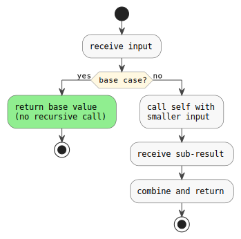
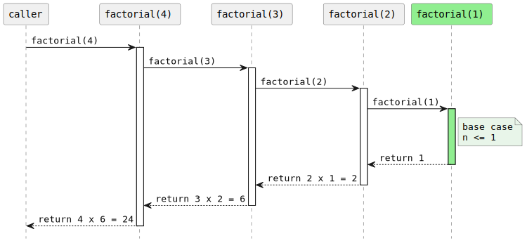
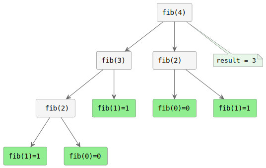

---
title: "Recursion"
subtitle: "COMP C8Z03 — Year 2 OOP"
topic_code: t02_recursion
description: "Understanding and writing recursive methods in Java: base case, recursive case, call-stack model, common patterns (factorial, Fibonacci, array/string recursion, binary search), and when to prefer iteration."
created: 2026-05-27
last_updated: 2026-05-29
version: 1.1
status: published
authors: ["OOP Teaching Team"]
tags: [java, recursion, call-stack, base-case, factorial, fibonacci, binary-search, year2, comp-c8z03]
difficulty_tier: Foundation
mlos: [MLO1, MLO3]
previous_topic: t01_arrays
prerequisites:
  - Variables, if statements, and loops
  - Methods with parameters and return values
  - Arrays (t01_arrays)
---

# Recursion

> **Prerequisites:**
> - variables, `if`, loops, methods with return values
> - arrays (t01)

---

## What you'll learn

| Skill Type | You will be able to… |
|:-----------|:-----------------------|
| Understand | Explain what a base case and recursive case are, and why both are required |
| Understand | Trace a recursive call on a call-stack diagram |
| Use        | Write recursive methods for numbers, arrays, and strings |
| Use        | Recognise when recursion is the natural fit (tree-shaped problems) |
| Debug      | Identify missing base cases, missing progress, and stack overflow symptoms |
| Check      | Decide when to prefer a loop over recursion |

---

## Core idea: two mandatory parts

Every correct recursive method has exactly two parts:

| Part | Role | If missing… |
|:-----|:-----|:------------|
| **Base case** | Handles the simplest input without any recursive call | Infinite loop → `StackOverflowError` |
| **Recursive case** | Calls the same method with a *smaller* or *simpler* input | Never reaches the base case |

```java
static int factorial(int n) {
    if (n <= 1) return 1;          // base case
    return n * factorial(n - 1);   // recursive case (n shrinks toward 1)
}
```

<details>
<summary>Diagram markdown</summary>

```kroki-plantuml
' alt: Recursion anatomy — base case vs recursive case
@startuml
skinparam backgroundColor white
skinparam DefaultFontName monospaced
skinparam ArrowColor #444444
skinparam ActivityBorderColor #444444
skinparam ActivityBackgroundColor #F8F8F8
skinparam ActivityDiamondBackgroundColor #FFF8E1
skinparam ActivityDiamondBorderColor #888888
skinparam NoteBackgroundColor #E8F5E9
skinparam NoteBorderColor #888888
start
:receive input;
if (base case?) then (yes)
  #LightGreen:return base value\n(no recursive call);
  stop
else (no)
  :call self with\nsmaller input;
  :receive sub-result;
  :combine and return;
  stop
endif
@enduml
```

</details>

<!-- kroki:rendered images/rendered/9d90c529.svg sha256:9d90c529 alt="Recursion anatomy — base case vs recursive case" -->


---

## Call-stack model

When `factorial(4)` runs, Java pushes one stack frame per call. The activation bars below show each frame on the stack; the arrows on the way back up are the return values unwinding:

<details>
<summary>Diagram markdown</summary>

```kroki-plantuml
' alt: factorial(4) call stack — frames pushed down, values unwound up
@startuml
skinparam backgroundColor white
skinparam DefaultFontName monospaced
skinparam SequenceArrowThickness 1
skinparam SequenceLifeLineBorderColor #555
skinparam SequenceParticipantBackgroundColor #F0F0F0
skinparam SequenceParticipantBorderColor #666
skinparam ActivationBorderColor #666
skinparam ActivationBackgroundColor #FFFDE7
skinparam NoteBackgroundColor #E8F5E9
skinparam NoteBorderColor #666
hide footbox

participant "caller" as C
participant "factorial(4)" as F4
participant "factorial(3)" as F3
participant "factorial(2)" as F2
participant "factorial(1)" as F1 #LightGreen

C -> F4 : factorial(4)
activate F4
F4 -> F3 : factorial(3)
activate F3
F3 -> F2 : factorial(2)
activate F2
F2 -> F1 : factorial(1)
activate F1 #LightGreen
note right of F1 : base case\nn <= 1
F1 --> F2 : return 1
deactivate F1
F2 --> F3 : return 2 x 1 = 2
deactivate F2
F3 --> F4 : return 3 x 2 = 6
deactivate F3
F4 --> C : return 4 x 6 = 24
deactivate F4
@enduml
```

</details>

<!-- kroki:rendered images/rendered/9ba98703.svg sha256:9ba98703 alt="factorial(4) call stack — frames pushed down, values unwound up" -->


If you forget the base case, frames pile up until Java throws `StackOverflowError`.

---

## Pattern 1 — Number recursion

### Factorial (classic warm-up)

```java
static int factorial(int n) {
    if (n < 0) throw new IllegalArgumentException("n must be >= 0");
    if (n <= 1) return 1;
    return n * factorial(n - 1);
}
// factorial(5) = 120
```

### Fibonacci (branching recursion)

```java
static int fib(int n) {
    if (n < 0) throw new IllegalArgumentException();
    if (n <= 1) return n;            // fib(0)=0, fib(1)=1
    return fib(n - 1) + fib(n - 2); // two recursive calls
}
// fib(7) = 13
```

> ⚠️ Naïve Fibonacci is **exponential** — `fib(40)` makes ~330 million calls. For large `n`, use memoisation or a loop.

The call tree for `fib(4)` shows why: every non-leaf node spawns **two** sub-calls, and sub-trees are recomputed repeatedly (green nodes are base cases):

<details>
<summary>Diagram markdown</summary>

```kroki-plantuml
' alt: fib(4) call tree — exponential branching with repeated sub-problems
@startuml
skinparam backgroundColor white
skinparam DefaultFontName monospaced
skinparam ArrowColor #666
skinparam RectangleBorderColor #666
skinparam RectangleBackgroundColor #F5F5F5
skinparam NoteBackgroundColor #E8F5E9
skinparam NoteBorderColor #666

rectangle "fib(4)" as f4
rectangle "fib(3)" as f3
rectangle "fib(2)  " as f2a
rectangle " fib(2)" as f2b
rectangle "fib(1)=1" as f1a #LightGreen
rectangle "fib(0)=0" as f0a #LightGreen
rectangle "fib(1)=1" as f1b #LightGreen
rectangle "fib(1)=1" as f1c #LightGreen
rectangle "fib(0)=0" as f0b #LightGreen

f4 --> f3
f4 --> f2a
f3 --> f2b
f3 --> f1a
f2a --> f1b
f2a --> f0a
f2b --> f1c
f2b --> f0b

note bottom of f4 : result = 3
@enduml
```

</details>

<!-- kroki:rendered images/rendered/95c16aef.svg sha256:95c16aef alt="fib(4) call tree — exponential branching with repeated sub-problems" -->


---

## Pattern 2 — Array recursion

### Sum of array (index-based)

```java
static int sum(int[] xs, int i) {
    if (i == xs.length) return 0;        // base: past the end
    return xs[i] + sum(xs, i + 1);      // add current, advance index
}
// sum(new int[]{1,2,3,4}, 0) = 10

// Public wrapper (hides the index parameter)
static int sum(int[] xs) { return sum(xs, 0); }
```

### Reverse an array in-place

```java
static void reverse(int[] xs, int lo, int hi) {
    if (lo >= hi) return;                // base: pointers met or crossed
    int tmp = xs[lo]; xs[lo] = xs[hi]; xs[hi] = tmp;
    reverse(xs, lo + 1, hi - 1);        // shrink window from both ends
}
// reverse({1,2,3,4,5}, 0, 4) → {5,4,3,2,1}
```

### Binary search (sorted array)

```java
static int binarySearch(int[] xs, int target, int lo, int hi) {
    if (lo > hi) return -1;             // base: not found
    int mid = lo + (hi - lo) / 2;
    if (xs[mid] == target) return mid;
    if (xs[mid] < target) return binarySearch(xs, target, mid + 1, hi);
    return binarySearch(xs, target, lo, mid - 1);
}
// public wrapper:
static int binarySearch(int[] xs, int target) {
    return binarySearch(xs, target, 0, xs.length - 1);
}
```

---

## Pattern 3 — String recursion

### Palindrome check

```java
static boolean isPalindrome(String s) {
    if (s.length() <= 1) return true;                         // base
    if (s.charAt(0) != s.charAt(s.length() - 1)) return false;
    return isPalindrome(s.substring(1, s.length() - 1));      // shrink both ends
}
// isPalindrome("racecar") = true
```

### Reverse a string

```java
static String reverse(String s) {
    if (s.isEmpty()) return "";                  // base
    return reverse(s.substring(1)) + s.charAt(0); // tail + head
}
// reverse("hello") = "olleh"
```

---

## Games example — Flood fill (paint-bucket)

A grid cell is either empty (`0`) or a wall (`1`). Starting from `(row, col)`, fill all reachable empty cells with a target colour.

```java
static void fill(int[][] grid, int row, int col, int colour) {
    // Base: out of bounds or already a wall/filled
    if (row < 0 || row >= grid.length) return;
    if (col < 0 || col >= grid[row].length) return;
    if (grid[row][col] != 0) return;              // wall or already visited

    grid[row][col] = colour;                      // mark this cell

    // Recursive case: spread in four directions
    fill(grid, row - 1, col, colour);
    fill(grid, row + 1, col, colour);
    fill(grid, row, col - 1, colour);
    fill(grid, row, col + 1, colour);
}
```

```java
int[][] map = {
    {0, 0, 1, 0},
    {0, 0, 1, 0},
    {0, 0, 0, 0},
    {1, 0, 0, 0}
};
fill(map, 0, 0, 7); // fills the connected region top-left with colour 7
```

IPO breakdown:

| Inputs | Process | Output |
|:-------|:--------|:-------|
| `grid`, start `(row, col)`, `colour` | Check bounds/wall; paint; recurse 4 neighbours | `grid` mutated — connected region coloured |

---

## Software example — Directory size walker

Walk a file-system tree and count total bytes. The tree structure is inherently recursive: a directory contains files and sub-directories.

```java
import java.io.File;

static long totalSize(File node) {
    if (node.isFile()) return node.length();     // base: a single file
    long total = 0;
    File[] children = node.listFiles();
    if (children != null) {
        for (File child : children) {
            total += totalSize(child);            // recurse into each child
        }
    }
    return total;
}
```

```java
File root = new File("src");
System.out.println("Total bytes: " + totalSize(root));
```

Why recursion fits: the structure is a tree. Each sub-directory is the same kind of thing as the root. A loop cannot naturally handle arbitrary depth without a stack data structure — recursion provides that stack implicitly.

---

## Common problems & fixes

| Problem | Symptom | Fix |
|:--------|:--------|:----|
| Missing base case | `StackOverflowError` immediately | Add a guard that returns without recursing |
| Base case never reached | `StackOverflowError` after deep calls | Check that each call makes the problem *strictly smaller* |
| Wrong return value | Silent wrong answer | Trace the call manually with a tiny input (n=2 or n=3) |
| Off-by-one in index | `ArrayIndexOutOfBoundsException` | Double-check boundary: `i == xs.length` vs `i == xs.length - 1` |
| Exponential work (Fibonacci) | Correct but very slow for large n | Add memoisation (`Map<Integer,Integer>`) or convert to a loop |
| Modifying input unexpectedly | Hard-to-find bugs | Create new objects/arrays instead of mutating, or document mutation clearly |

---

## When NOT to recurse

Recursion is elegant but not always the best tool:

| Scenario | Prefer… | Why |
|:---------|:--------|:----|
| Simple counting or summing | A loop | Fewer stack frames, faster, clearer |
| Large `n` without memoisation (Fibonacci) | Loop or memo | Avoids exponential calls |
| Deep trees (depth > ~5000) | Iterative + explicit stack | Java default stack is ~512 KB; deep recursion overflows |
| Linear list traversal | A loop | Same asymptotic complexity, no overhead |
| Tree / graph search | Recursion (or explicit stack) | Natural fit — depth-first search is recursive by nature |

---

## Try it step-by-step

Each step compiles on its own. Paste and run them one by one.

### Step A — Trace factorial(3) by hand before running it

```java
// Write out each stack frame:
// factorial(3) = 3 * factorial(2)
//                    factorial(2) = 2 * factorial(1)
//                                       factorial(1) = 1
//                    ← returns 2
// ← returns 6
System.out.println(factorial(3)); // 6
```

### Step B — Add a recursive sum with a public wrapper

```java
static int sumHelper(int[] xs, int i) {
    if (i == xs.length) return 0;
    return xs[i] + sumHelper(xs, i + 1);
}
static int sum(int[] xs) {
    if (xs == null || xs.length == 0) return 0;
    return sumHelper(xs, 0);
}
System.out.println(sum(new int[]{10, 20, 30})); // 60
```

### Step C — Write and test isPalindrome

```java
System.out.println(isPalindrome("racecar")); // true
System.out.println(isPalindrome("hello"));   // false
System.out.println(isPalindrome("a"));       // true
System.out.println(isPalindrome(""));        // true
```

---

## Practice time

| Task | Time | What to do | Expected result |
|:-----|:-----|:-----------|:----------------|
| A | 10m | Write `power(int base, int exp)` recursively. Return `base^exp`. Guard against negative `exp`. | `power(2,10) = 1024` |
| B | 15m | Write `countOccurrences(String s, char c)` that counts how many times `c` appears in `s`, using recursion. | `countOccurrences("banana", 'a') = 3` |
| C | 20m | Write `flatten(int[][] grid)` that returns a new `int[]` containing every element of `grid` in row-major order, using recursive helper methods. | `{{1,2},{3,4}} → {1,2,3,4}` |

---

## Reflective questions

1. What are the two mandatory parts of any recursive method? What happens if either is missing?
2. Draw the call-stack diagram for `factorial(4)`. At which point does the stack start unwinding?
3. Why is naïve Fibonacci slow? What would you change to fix it, and what trade-off does that introduce?
4. For the flood-fill example, what plays the role of the "base case" and what plays the role of "making the problem smaller"?
5. You need to search a file system for all `.java` files. Would you use recursion or a loop? Justify your answer.
6. A classmate's recursive method throws `StackOverflowError` after a few seconds. List two possible causes and one diagnostic step for each.

---

## Lesson Context

```yaml
previous_lesson:
  topic_code: t01_arrays
  domain_emphasis: Balanced

this_lesson:
  topic_code: t02_recursion
  primary_domain_emphasis: Balanced
  difficulty_tier: Foundation
mlos: [MLO1, MLO3]
```
