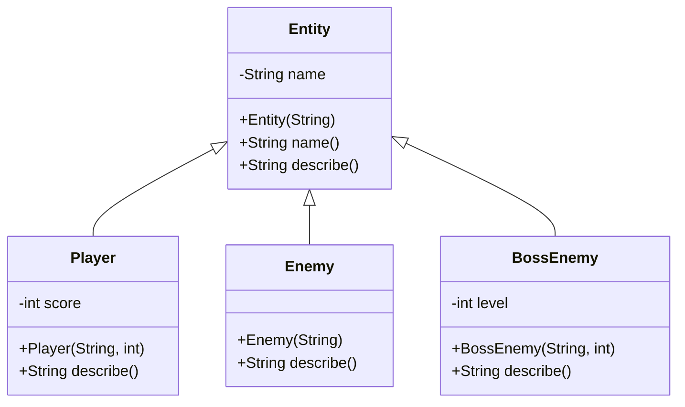
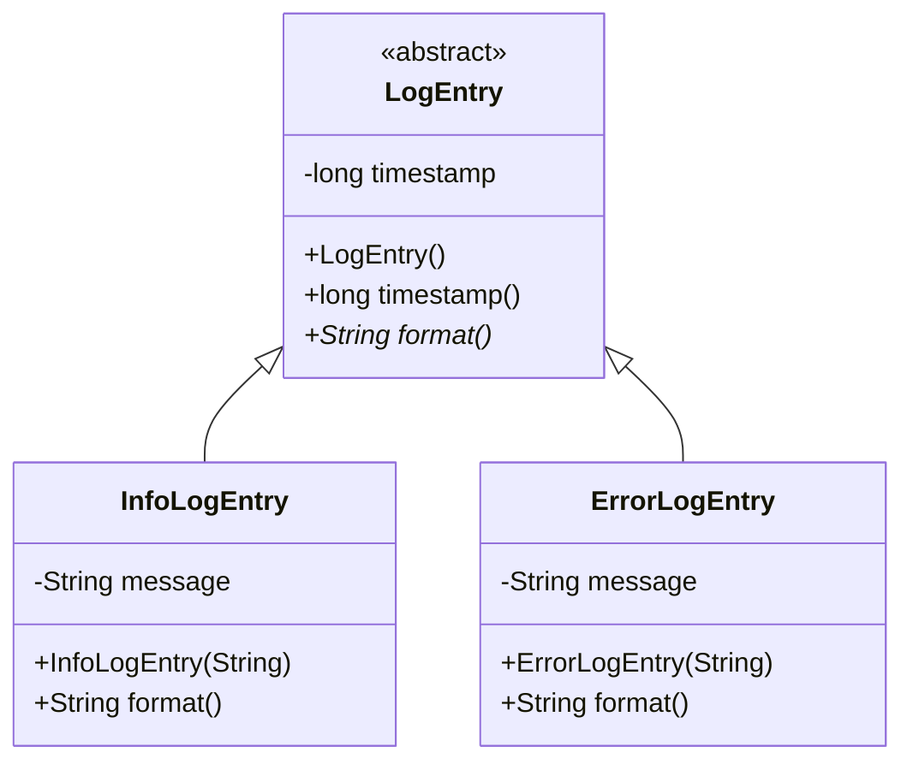

# Inheritance

> **Prerequisites:**
> - Understanding of fields, constructors, and methods  
> - Experience writing small Java classes  
> - Basic use of `ArrayList` and loops  
> - Familiarity with `compareTo` / Comparator from earlier lessons

---

## What you'll learn

| Skill Type | You will be able to… |
| :-- | :-- |
| Understand | Explain what inheritance is and when to use it (and when not to). |
| Use | Create subclasses with `extends` and call parent constructors using `super`. |
| Use | Override methods correctly using `@Override`. |
| Analyze | Distinguish clearly between method overriding and overloading. |
| Analyze | Decide when to use an abstract base class instead of a concrete class. |
| Debug | Identify and fix common inheritance issues (constructor chains, missing overrides, field hiding). |

---

## Why this matters

Real systems — games and software applications — rarely consist of just one kind of object.  
You will often have **families of related types** that share some behaviour but differ in details:

- In a **game**, you might have players, enemies, projectiles, pickups, and triggers.  
- In **software**, you might have different kinds of users, accounts, documents, or log entries.

Inheritance gives you a way to:

- Put **shared behaviour** in one place (a parent class)  
- Create **specialised types** (subclasses) that reuse that behaviour and add their own  
- Use **polymorphism**: treat many specific objects as instances of a more general type

Used well, inheritance reduces duplication and makes systems easier to extend.  
Used poorly, it creates brittle hierarchies that are hard to change.  
This lesson helps you use inheritance **deliberately and safely**.

---

## How this builds on previous content

- From **Arrays & Collections** (t01–t04) you learned to store and process objects in lists. Now, you’ll store collections of *different but related* objects through a shared parent.
- From **Ordering (Comparable & Comparator)** you already saw specialisation of behaviour (different comparison rules). Inheritance generalises that idea to whole classes.
- From **Equality & Hashing** you learned that class structure affects correctness. Here, you’ll see how subclassing impacts behaviour and contracts.

---

## Core Ideas / Concepts

> For each core idea, we first explain the concept, then show a short code example, followed by a brief explanation of how the example illustrates the idea.

---

### Core Idea 1 — Basic inheritance with `extends` (the “is-a” relationship)

**Explanation**  
Inheritance models an **“is-a”** relationship between classes. A subclass “is a” more specific version of its parent class and therefore:

- Inherits its fields and methods.
- Can add new fields and methods.
- Can override inherited methods to change behaviour.

You should use inheritance when there is a clear, stable “is-a” relationship — e.g. a `Player` **is an** `Entity`, or an `AdminUser` **is a** `User`.

```java
class Entity {
    private String name;

    public Entity(String name) {
        this.name = name;
    }

    public String name() {
        return name;
    }

    public String describe() {
        return "Entity: " + name;
    }
}

class Player extends Entity {
    private int score;

    public Player(String name, int score) {
        super(name);           // call Entity(String) constructor
        this.score = score;
    }

    @Override
    public String describe() {
        return "Player " + name() + " (score=" + score + ")";
    }
}
```

**Snippet explanation**  
This snippet introduces a simple inheritance hierarchy. `Entity` is the general base class that stores a name and can describe itself. `Player` extends `Entity`, reuses the name handling via `super(name)` and `name()`, and overrides `describe()` to print a more specific message that includes the player’s score.

---

### Core Idea 2 — Method overriding vs method overloading

**Explanation**  
Two similar-sounding concepts often cause confusion:

- **Overriding**: A subclass provides a **new implementation** of a method with the **same signature** as in the parent. This is central to polymorphism.
- **Overloading**: A class provides **multiple methods with the same name** but **different parameter lists**. This is about convenience, not polymorphism.

Overriding changes behaviour for inherited methods. Overloading just adds more ways to call a method.

```java
class Enemy extends Entity {

    public Enemy(String name) {
        super(name);
    }

    // Overriding: same name, same parameters, different body
    @Override
    public String describe() {
        return "Enemy: " + name();
    }

    // Overloading: same name "move", different parameter lists
    public void move(int dx, int dy) {
        // move by offsets
    }

    public void move(java.awt.Point p) {
        // move to absolute position
    }
}
```

**Snippet explanation**  
Here `Enemy` overrides `describe()` to change how an `Entity` is described when it is specifically an enemy. The two `move` methods illustrate overloading: they share the same name but accept different parameter types. Overriding (`describe`) is what enables polymorphism; overloading (`move`) is just a convenience for callers.

---

### Core Idea 3 — Using `super` to extend parent behaviour

**Explanation**  
Sometimes you don’t want to completely replace parent behaviour; you want to **build on it**.  
The `super` keyword lets you:

- Call the parent constructor.
- Call the parent version of an overridden method.

This is useful when the parent method already does something important (e.g. logging, reuse of formatting) and the subclass wants to add its own extra details.

```java
class BossEnemy extends Enemy {
    private int level;

    public BossEnemy(String name, int level) {
        super(name);                  // calls Enemy(String) → Entity(String)
        this.level = level;
    }

    @Override
    public String describe() {
        String base = super.describe();   // Enemy.describe()
        return base + " [Boss Level " + level + "]";
    }
}
```

**Snippet explanation**  
`BossEnemy` reuses the constructor work already done by `Enemy` (and `Entity`) by calling `super(name)`. In `describe()`, it first calls `super.describe()` to get the enemy description, then appends boss-specific information. This shows how `super` can be used to extend inherited behaviour without duplicating it.

---

### Core Idea 4 — Abstract classes as partially implemented templates

**Explanation**  
An **abstract class** acts as a **template** for a set of related types. It lets you:

- Put shared fields and concrete methods in one place.
- Declare **abstract methods** that subclasses must implement.

Use an abstract class when:

- There is a strong “is-a” relationship between subclasses and the base type.
- You want to share implementation details (fields, helper methods).
- You want to enforce that all subclasses implement certain behaviours.

```java
abstract class Weapon {
    private final String id;

    public Weapon(String id) {
        this.id = id;
    }

    public String id() {
        return id;
    }

    // Abstract: subclasses MUST provide an implementation
    public abstract int damage();

    // Concrete: shared behaviour using the abstract method
    public String describe() {
        return id + " (damage=" + damage() + ")";
    }
}

class Sword extends Weapon {

    public Sword(String id) {
        super(id);
    }

    @Override
    public int damage() {
        return 25;
    }
}
```

**Snippet explanation**  
`Weapon` defines the shared state (`id`) and a concrete `describe()` method, but leaves `damage()` abstract so each weapon type can decide its own damage. `Sword` is a concrete subclass that provides the `damage()` implementation. When you call `describe()` on a `Weapon` reference, the actual damage value comes from the subclass.

---

### Core Idea 5 — Polymorphism via parent types

**Explanation**  
Polymorphism lets you treat different subclasses **through their common parent type**.  
You can write code that deals with general types (`Entity`, `Weapon`) but actually operates on more specific objects (`Player`, `Enemy`, `Sword`).

This is especially useful when you have:

- Collections of mixed objects that share a base type.
- Generic methods that should work for all subclasses.
- Systems like update loops, rendering, or exporting that operate by calling a single method on many types.

```java
java.util.ArrayList<Entity> entities = new java.util.ArrayList<>();
entities.add(new Player("Zara", 100));
entities.add(new Enemy("Goblin"));
entities.add(new BossEnemy("Dragon", 5));

for (Entity e : entities) {
    System.out.println(e.describe());
}
```

**Snippet explanation**  
The `entities` list is typed as `ArrayList<Entity>` but stores different concrete types (`Player`, `Enemy`, `BossEnemy`). Inside the loop, calling `e.describe()` triggers the correct overridden method based on the actual object type, not the reference type. This is core inheritance-based polymorphism.

---

## Progressive coding steps (A → B → C)

### Step A — Creating a simple subclass

```java
Entity e = new Entity("Object");
Player p = new Player("Zara", 100);

System.out.println(e.describe());   // Entity: Object
System.out.println(p.describe());   // Player Zara (score=100)
```

**Snippet explanation**  
This small demo contrasts the base type (`Entity`) with a subclass (`Player`). Both objects support `describe()`, but the subclass version prints more detailed, player-specific information.

---

### Step B — Using abstract base classes

```java
Weapon sword = new Sword("IronBlade");
System.out.println(sword.describe());   // IronBlade (damage=25)
```

**Snippet explanation**  
Here we use the abstract type `Weapon` as the reference, but the actual object is a `Sword`. Calling `describe()` goes through the abstract class method, which in turn calls the overridden `damage()` in `Sword`. This shows that abstract classes can still be used as polymorphic types.

---

### Step C — Polymorphic collections of entities

```java
java.util.ArrayList<Entity> world = new java.util.ArrayList<>();
world.add(new Player("Zara", 100));
world.add(new Enemy("Goblin"));
world.add(new BossEnemy("Dragon", 5));

for (Entity entity : world) {
    System.out.println(entity.describe());
}
```

**Snippet explanation**  
The `world` list holds different kinds of entities. The loop does not need to know which specific subclass each item is; it simply calls `describe()`, relying on polymorphism to pick the right implementation at runtime.

---

## Useful snippets (guards & helpers)

```java
// Defensive constructor in a base class
public Entity(String name) {
    if (name == null || name.isBlank())
        throw new IllegalArgumentException("name must not be blank");
    this.name = name.trim();
}
```

**Snippet explanation**  
This constructor guards against invalid names. It ensures that any subclass that calls `super(name)` cannot create an `Entity` with a null or blank name. This kind of defensive logic is often placed in base classes to keep all subclasses safe.

```java
// Null-safe helper for describing entities
public static void safeDescribe(Entity e) {
    if (e != null)
        System.out.println(e.describe());
}
```

**Snippet explanation**  
`safeDescribe` prevents a potential `NullPointerException` by checking for `null` before calling `describe()`. It’s a small utility that makes code using `Entity` objects more robust, especially when references may be missing.

---

## Games Example

Imagine a simple 2D game with:

- `Player`  
- `Enemy`  
- `BossEnemy`  

All of them can be treated as `GameEntity` in the update loop.

```java
abstract class GameEntity {
    protected String name;

    public GameEntity(String name) {
        this.name = name;
    }

    public abstract void update(double dt);
    public abstract void render();
}

class PlayerEntity extends GameEntity {
    public PlayerEntity(String name) {
        super(name);
    }

    @Override
    public void update(double dt) {
        // handle input, movement
    }

    @Override
    public void render() {
        // draw player sprite
    }
}

class EnemyEntity extends GameEntity {
    public EnemyEntity(String name) {
        super(name);
    }

    @Override
    public void update(double dt) {
        // simple AI
    }

    @Override
    public void render() {
        // draw enemy sprite
    }
}

java.util.ArrayList<GameEntity> gameEntities = new java.util.ArrayList<>();
gameEntities.add(new PlayerEntity("Hero"));
gameEntities.add(new EnemyEntity("Slime"));

for (GameEntity ge : gameEntities) {
    ge.update(0.016);
    ge.render();
}
```

**Snippet explanation**  
`GameEntity` is an abstract base class that requires `update` and `render` methods. `PlayerEntity` and `EnemyEntity` provide concrete versions of these methods. The `gameEntities` list holds both types, and the game loop treats them uniformly — calling `update` and `render` on each without caring which subclass they are.

---

## Software Development Example

Consider a logging system that writes different types of log entries:

```java
abstract class LogEntry {
    private final long timestamp;

    public LogEntry() {
        this.timestamp = System.currentTimeMillis();
    }

    public long timestamp() {
        return timestamp;
    }

    public abstract String format();
}

class InfoLogEntry extends LogEntry {
    private final String message;

    public InfoLogEntry(String message) {
        this.message = message;
    }

    @Override
    public String format() {
        return "[INFO] " + timestamp() + " - " + message;
    }
}

class ErrorLogEntry extends LogEntry {
    private final String message;

    public ErrorLogEntry(String message) {
        this.message = message;
    }

    @Override
    public String format() {
        return "[ERROR] " + timestamp() + " - " + message;
    }
}

public static void writeAll(java.util.List<LogEntry> logs) {
    for (LogEntry log : logs) {
        System.out.println(log.format());
    }
}
```

**Snippet explanation**  
`LogEntry` provides shared behaviour (timestamping) and defines an abstract `format()` method. `InfoLogEntry` and `ErrorLogEntry` specialise the formatting for info vs error messages. The `writeAll` method uses the base type `LogEntry` and can print any subclass without needing `if`-`else` chains.

---

## Debugging & Pitfalls

| Pitfall | Why it happens | How to fix / avoid |
| :-- | :-- | :-- |
| Missing `@Override` | Method signature doesn’t match parent method, so it *doesn’t* override | Always use `@Override` on overridden methods to let the compiler catch mistakes. |
| Field hiding (`int x` in parent and child) | Subclass redeclares a field with same name; parent field still exists but is hidden | Don’t reuse field names; use getters/setters or `protected` fields if access is needed. |
| Forgetting `super(...)` | Parent constructor with parameters is never called | Ensure subclass constructors call `super(...)` **first** when the parent has no no-arg constructor. |
| Overusing inheritance | Classes are not truly in an “is-a” relationship | Prefer composition (e.g. `has-a` relationship) or interfaces for shared behaviour without deep hierarchies. |
| Confusion about reference vs object type | Expecting subclass-only methods on a parent reference | Remember: reference type controls which methods you can call; object type controls which implementation runs. |

---

## Reflective Questions

- When is inheritance the right tool, and when might composition or interfaces be a better choice?  
- Think of an example from your own code or a game you enjoy — what might the inheritance hierarchy look like there?  
- How would you refactor a deeply nested (3–4 levels) inheritance chain to make it easier to maintain?  
- If you introduced a new subclass and something stopped working as expected, what would be your first three debugging steps?

---

## Appendix A — Mermaid diagrams (UML-style)





---

## Lesson Context

```yaml
previous_lesson:
  topic_code: t05_equality_hashing
  domain_emphasis: Balanced

this_lesson:
  topic_code: t06_inheritance
  primary_domain_emphasis: Balanced
  difficulty_tier: Intermediate
```
