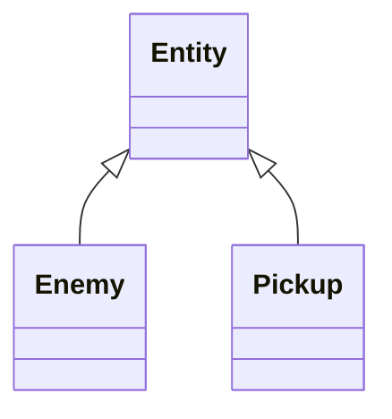
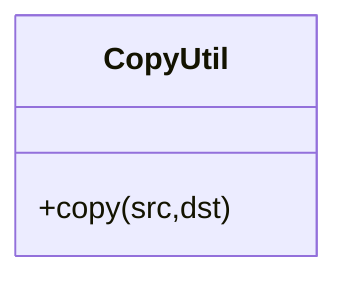
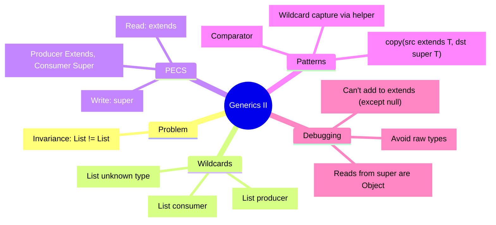

# Generics II — Wildcards, Variance & PECS

> **Prerequisites:**
> - You understand `Box<T>`, generic methods, and bounds like `T extends Comparable<T>`
> - You can use `List<T>` and basic loops

## What you'll learn

| Skill Type | You will be able to… |
| :- | :- |
| Understand | Explain *invariance* and why `List<Enemy>` is not a `List<Entity>`. |
| Use | Choose between `List<T>`, `List<?>`, `List<? extends T>`, and `List<? super T>`. |
| Apply | Use the **PECS** rule to design method parameters correctly. |
| Analyze | Predict what operations are allowed on an `extends` list vs a `super` list (read vs write). |
| Create | Implement a type-safe `copy` / `addAll` style method using wildcards. |
| Debug | Fix compile errors caused by wildcard misuse and interpret “capture of ?” messages. |

## Why this matters

Java generics are **invariant** by default. That surprises people and causes real friction when you want APIs to work across type hierarchies.

Example: If `Enemy` extends `Entity`, many students expect:

```java
java.util.List<Enemy> enemies = new java.util.ArrayList<>();
java.util.List<Entity> entities = enemies; // expected? but NOT allowed
```

Week 2 gives you the tools to express *variance* safely using **wildcards**.

## Core Ideas / Concepts

### Core Idea 1 — Invariance (the root problem)

**Explanation**  
Even if `Enemy` is an `Entity`, a `List<Enemy>` is *not* a `List<Entity>`.

Why? Because if it were allowed, you could do this:

```java
final class Entity { }
final class Enemy extends Entity { }
final class Pickup extends Entity { }

public static void demo() {
    java.util.List<Enemy> enemies = new java.util.ArrayList<>();

    // If this were allowed, we'd break type safety:
    // java.util.List<Entity> entities = enemies;
    // entities.add(new Pickup());      // legal for List<Entity>
    // Enemy e = enemies.get(0);        // would crash later
}
```

**Snippet explanation**  
If `List<Enemy>` could be treated as `List<Entity>`, then someone could add a `Pickup` into a list that is meant to contain only `Enemy`.  
So Java forbids it: **generic types are invariant**.

### Core Idea 2 — Wildcards: “some type” (`?`) and why `List<?>` is read-only for adding

**Explanation**  
`?` means “an unknown type”.  
If you have `List<?>`, the compiler doesn’t know what element type it really holds.

```java
public static void demo(java.util.List<?> items) {
    Object first = items.get(0); // always safe

    // Not allowed (except null):
    // items.add("hi");
    // items.add(10);

    items.add(null); // the only safe value to add
}
```

**Snippet explanation**  
You can **read** from a `List<?>` as `Object`.  
You can’t safely **add** a non-null value, because you don’t know the list’s true element type.

### Core Idea 3 — Upper-bounded wildcards: `? extends T` (Producer Extends)

**Explanation**  
`List<? extends T>` means: “a list of **some subtype** of `T`”.  
This is used when you want to **read T values out** (the list *produces* values).

```java
public static double sumNumbers(java.util.List<? extends Number> nums) {
    double sum = 0.0;

    for (Number n : nums)
        sum += n.doubleValue();

    return sum;
}

public static void demo() {
    java.util.List<Integer> a = java.util.List.of(1, 2, 3);
    java.util.List<Double> b = java.util.List.of(0.5, 1.5);

    System.out.println(sumNumbers(a));
    System.out.println(sumNumbers(b));
}
```

**Snippet explanation**  
Both `List<Integer>` and `List<Double>` can be passed as `List<? extends Number>` because they are lists of something that *is a Number*.

**Important rule**  
With `? extends T`, you generally **cannot add** `T` values (except `null`):

```java
public static void notAllowed(java.util.List<? extends Number> nums) {
    // nums.add(10);      // not allowed
    // nums.add(10.0);    // not allowed
    nums.add(null);       // allowed
}
```

Because the list might actually be `List<Integer>`, and adding a `Double` would be unsafe.

### Core Idea 4 — Lower-bounded wildcards: `? super T` (Consumer Super)

**Explanation**  
`List<? super T>` means: “a list of `T` or any **supertype** of `T`”.  
This is used when you want to **add T values into** the list (the list *consumes* values).

```java
final class Entity { }
final class Enemy extends Entity { }

public static void addEnemies(java.util.List<? super Enemy> out) {
    out.add(new Enemy());
    out.add(new Enemy());
}

public static void demo() {
    java.util.List<Enemy> enemies = new java.util.ArrayList<>();
    java.util.List<Entity> entities = new java.util.ArrayList<>();
    java.util.List<Object> objects = new java.util.ArrayList<>();

    addEnemies(enemies);
    addEnemies(entities);
    addEnemies(objects);
}
```

**Snippet explanation**  
All three lists can *consume* `Enemy` values because they are typed to accept `Enemy` or something more general.

**Important rule**  
With `? super T`, when you read back, you only safely get `Object`:

```java
public static void readBack(java.util.List<? super Enemy> out) {
    Object x = out.get(0); // safe
    // Enemy e = out.get(0); // not safe without a cast
}
```

### Core Idea 5 — PECS (the rule-of-thumb)

**PECS** stands for:

- **P**roducer **E**xtends  
- **C**onsumer **S**uper

| Intent | Use | Why |
| :- | :- | :- |
| “I only need to read items as T” | `? extends T` | The list produces T values. |
| “I need to add items of type T” | `? super T` | The list consumes T values. |

### Core Idea 6 — The classic API: `copy` (uses both extends and super)

**Explanation**  
Copying means:
- you **read** from the source (producer) → `extends`
- you **write** into the destination (consumer) → `super`

```java
public static <T> void copy(java.util.List<? extends T> src, java.util.List<? super T> dst) {
    if (src == null || dst == null)
        throw new NullPointerException("src and dst must not be null");

    for (T item : src)
        dst.add(item);
}

public static void demo() {
    java.util.List<Integer> src = java.util.List.of(1, 2, 3);

    java.util.List<Number> dst1 = new java.util.ArrayList<>();
    java.util.List<Object> dst2 = new java.util.ArrayList<>();

    copy(src, dst1); // Integer -> Number
    copy(src, dst2); // Integer -> Object
}
```

**Snippet explanation**  
`src` produces values of type `T` (or subtype), so we use `? extends T`.  
`dst` consumes values of type `T`, so we use `? super T`.

This is PECS in practice.

### Core Idea 7 — `Comparator<? super T>` (why many Java APIs use `super`)

**Explanation**  
A `Comparator<Animal>` can compare `Dog` objects too. So APIs often accept `Comparator<? super T>`.

```java
final class Animal { }
final class Dog extends Animal { }

final class AnimalNameComparator implements java.util.Comparator<Animal> {
    @Override
    public int compare(Animal a, Animal b) {
        return 0;
    }
}

public static void demo() {
    java.util.List<Dog> dogs = new java.util.ArrayList<>();
    java.util.Comparator<Animal> cmp = new AnimalNameComparator();

    // This works because Comparator is a consumer of T in sort:
    dogs.sort(cmp); // effectively Comparator<? super Dog>
}
```

**Snippet explanation**  
Sorting “consumes” elements for comparison.  
So allowing a comparator of a *supertype* is safe and useful.

### Core Idea 8 — “Capture of ?” errors (what they mean)

**Explanation**  
Sometimes the compiler says things like “capture of ?” when the wildcard type can’t be named directly.

Example:

```java
public static void swapFirstTwo(java.util.List<?> items) {
    // items.add(items.get(0)); // not allowed
}
```

A common pattern is to **capture** the wildcard by delegating to a helper method with a type parameter:

```java
public static void swapFirstTwo(java.util.List<?> items) {
    swapFirstTwoCaptured(items);
}

private static <T> void swapFirstTwoCaptured(java.util.List<T> items) {
    if (items == null || items.size() < 2)
        return;

    T a = items.get(0);
    T b = items.get(1);

    items.set(0, b);
    items.set(1, a);
}
```

**Snippet explanation**  
`List<?>` can’t be safely written to (except `null`), but once we capture the unknown type as `T`, we can operate consistently on that same `T`.

## Progressive examples (A → B → C)

### Step A — The invariance “surprise”

```java
// Enemy extends Entity
java.util.List<Enemy> enemies = new java.util.ArrayList<>();

// Not allowed:
// java.util.List<Entity> entities = enemies;
```

**Snippet explanation**  
This is the core reason wildcards exist.

### Step B — Fix read-only methods with `extends`

```java
public static int totalHealth(java.util.List<? extends Number> healthValues) {
    int sum = 0;
    for (Number n : healthValues)
        sum += n.intValue();
    return sum;
}
```

**Snippet explanation**  
Any numeric list can be used: integers, doubles, etc. The list is a producer.

### Step C — Fix write methods with `super`

```java
public static void spawnEnemies(java.util.List<? super Enemy> out, int count) {
    for (int i = 0; i < count; i++)
        out.add(new Enemy());
}
```

**Snippet explanation**  
Any list that can accept `Enemy` objects is valid, including `List<Entity>` and `List<Object>`.

## Games Example — Event bus payloads (producer vs consumer)

Imagine an event system where listeners read events and handlers push events into a queue.

```java
interface GameEvent { }
final class DamageEvent implements GameEvent { }
final class PickupEvent implements GameEvent { }

public static void publishAll(java.util.List<? extends GameEvent> events,
                              java.util.List<? super GameEvent> outQueue) {
    for (GameEvent e : events)
        outQueue.add(e);
}
```

**Snippet explanation**  
- `events` is a producer of `GameEvent` values → `extends`  
- `outQueue` consumes `GameEvent` values → `super`

This pattern appears constantly in real code (queues, pipelines, logging, batching).

## Debugging & Pitfalls

| Pitfall | What you did | Why it fails | Fix |
| :- | :- | :- | :- |
| “I used `extends` but can’t add!” | `List<? extends T>` then `add(...)` | The list might be a more specific subtype list | Use `? super T` for consumers |
| “I used `super` but reads are only Object” | `List<? super T>` then `get(...)` as T | The list might be `List<Object>` | Treat reads as `Object` or redesign |
| “I wrote `List<T>` and now it rejects `List<SubT>`” | invariant parameter type | `List<SubT>` is not `List<T>` | Use `List<? extends T>` if read-only |
| Raw types creep back in | `List items = ...` | Type info is lost | Always use type arguments; avoid raw types |
| Confusing `extends` for “inheritance only” | `T extends Runnable` | In generics `extends` means “is a subtype of” | It works for interfaces too |

## Reflective Questions

- Why is `List<Enemy>` not a `List<Entity>` even though `Enemy` is an `Entity`?
- For each parameter below, decide if it’s a producer or consumer, then choose the wildcard:
  - `sum(____ nums)` reads values to compute a total
  - `fill(____ out, T value)` adds values to a list
- In the `copy` method, what bug would happen if both parameters were `List<T>`?

## Appendix A — Quick reference (wildcards)

| Pattern | Means | Typical use |
| :- | :- | :- |
| `List<T>` | exactly T | when caller and callee agree on exact type |
| `List<?>` | unknown | read as `Object`, no adds (except null) |
| `List<? extends T>` | some subtype of T | read-only producer |
| `List<? super T>` | T or supertype of T | write-focused consumer |

## Appendix B — Mermaid diagrams





## Appendix C — Mind map (Week 2)



## Lesson Context

```yaml
previous_lesson:
  topic_code: t08_generics
  domain_emphasis: Balanced
  week_in_topic: 1_of_2

this_lesson:
  topic_code: t08_generics
  primary_domain_emphasis: Balanced
  difficulty_tier: Intermediate
  week_in_topic: 2_of_2
```
