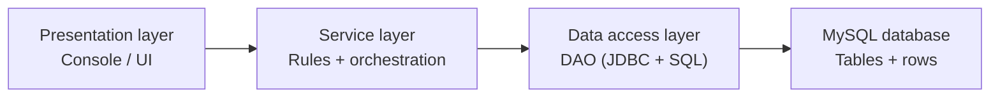

# DB Connectivity I — JDBC + DAO (Data Access Object)

> **Prerequisites:**
> - You can create Java classes with fields, constructors, and methods  
> - You can use interfaces and understand polymorphism (interface references)  
> - You can work comfortably with `ArrayList` and loops  
> - You can write defensive checks (null/blank validation, fail fast)  

---

## What you’ll learn

| Skill Type | You will be able to… |
| :- | :- |
| Understand | Define key persistence terms: database, table, schema, SQL, JDBC, driver, mapping. |
| Understand | Explain what a DAO is and what problem it solves. |
| Apply | Connect to a local MySQL database (via phpMyAdmin) using JDBC. |
| Apply | Implement a DAO interface with a JDBC-backed class (`Jdbc...Dao`). |
| Apply | Use `PreparedStatement` placeholders safely (no SQL string concatenation). |
| Analyse | Explain how DAO supports an N-tier structure (UI → Service → DAO → DB). |
| Debug | Identify and fix common connection and JDBC errors (driver, access denied, port, auth). |

---

## Why this matters

Once a program needs to **persist data** (keep it after the program ends), you need a storage layer outside your Java objects.

If you scatter SQL across your codebase (especially in `Main`), your program becomes difficult to change and difficult to test:
- the same SQL logic gets duplicated in multiple places,
- schema changes cause bugs everywhere,
- UI code, business rules, and persistence code become mixed together.

The DAO pattern gives you a clean boundary: **database access happens in one place**, and the rest of your program talks to simple Java methods.

---

## How this builds on Design Patterns I & II

In Design Patterns I and II you learned that **interfaces + composition** let you swap implementations and reduce coupling.

This topic uses those same ideas in a very practical way:

- You define a `TaskDao` **interface** (the contract).
- You implement it as `JdbcTaskDao` (one strategy/implementation).
- Your service layer depends on the interface, not the concrete class.

This connects directly to:
- **Design Patterns I — Behaviour & Decoupling** 
  Focus: programming to an interface, reducing conditionals, composition over inheritance.
- **Design Patterns II — Structure, Coordination & Extension**
  Focus: structuring larger systems, coordinating components, preparing for extension and deployment.

---

## Key terms

### Database
A **database** is a managed store of data. Here, your database system is **MySQL**.

### SQL
**SQL (Structured Query Language)** is the language you use to read and change data in a database:
- `SELECT` reads rows
- `INSERT` creates rows
- `UPDATE` changes rows
- `DELETE` removes rows

### Table, row, column
A **table** is like a spreadsheet:
- **columns** are fields (e.g., `title`, `status`)
- **rows** are records (e.g., one task)

### Schema
A **schema** is the structure of the database: what tables exist, what columns they contain, and what rules apply.

### JDBC
**JDBC (Java Database Connectivity)** is Java’s standard API for talking to SQL databases.

Key JDBC types you will use:
- `Connection` (a session with the database)
- `PreparedStatement` (a safe SQL command with placeholders)
- `ResultSet` (the returned rows from a query)

### Driver
A **driver** is the library that lets JDBC speak to a specific database (here: MySQL). Without the MySQL driver on your classpath, your program cannot connect.

### Placeholder
A **placeholder** is a `?` in an SQL statement used with a `PreparedStatement`. You fill placeholders using `setString(...)`, `setInt(...)`, etc.

### Mapping
**Mapping** is converting between:
- database rows → Java objects (when reading)
- Java object values → row values (when writing)

---

## Overview: What is a DAO and why use it?

### What “DAO” means
**DAO** stands for **Data Access Object**.

A DAO is a class (often implementing an interface) whose job is to:
1. run SQL against the database,
2. map database rows into Java objects,
3. hide JDBC details from the rest of the program.

### What problem DAO solves
If SQL and JDBC code appears across your application:
- you duplicate queries,
- you increase the chance of bugs when requirements change,
- your UI and business rules become tangled up with database access.

A DAO solves this by creating a single, consistent place where persistence happens.

### Where DAO fits in an N-tier structure



Rule of thumb:
- **UI** should never contain SQL.
- **Service** should not contain JDBC.
- **DAO** is the only layer that knows SQL exists.

---

# Local setup: MySQL + phpMyAdmin

## Step 1 — Create a database in phpMyAdmin

1. Open phpMyAdmin in your browser.
2. Go to the **Databases** tab.
3. Create a database named `taskhub`.
4. Choose collation `utf8mb4_general_ci`.

Collation controls how strings compare and sort. `utf8mb4` is a safe default for modern systems.

---

## Step 2 — Create a user (recommended)

Using `root` works locally, but a dedicated user is safer and more realistic.

Example user:
- Username: `taskhub_user`
- Host: `localhost`
- Password: set one
- Privileges: **ALL** on database `taskhub` (local dev only)

Privileges are permissions: what the user is allowed to do in the database.

---

## Step 3 — Create the table (schema)

Run this in phpMyAdmin’s **SQL** tab:

```sql
CREATE TABLE tasks (
  id INT NOT NULL AUTO_INCREMENT,
  title VARCHAR(120) NOT NULL,
  status ENUM('TODO','DOING','DONE') NOT NULL DEFAULT 'TODO',
  created_at TIMESTAMP NOT NULL DEFAULT CURRENT_TIMESTAMP,
  PRIMARY KEY (id)
);

CREATE INDEX idx_tasks_status ON tasks(status);
```

Key parts:
- `AUTO_INCREMENT` generates a new `id` automatically.
- `ENUM('TODO','DOING','DONE')` restricts allowed status values.
- `INDEX` makes status lookups faster.

---

## Step 4 — Add the MySQL JDBC driver to your project

### Maven dependency

```xml
<dependency>
  <groupId>com.mysql</groupId>
  <artifactId>mysql-connector-j</artifactId>
  <version>8.4.0</version>
</dependency>
```

---

## Step 5 — Your MySQL connection string 

Example:

```text
jdbc:mysql://localhost:3306/taskhub?useSSL=false&serverTimezone=UTC&allowPublicKeyRetrieval=true
```

Breakdown:
- `jdbc:mysql://` → MySQL JDBC driver
- `localhost:3306` → MySQL running locally on the default port
- `/taskhub` → database name
- `useSSL=false` → avoids SSL warnings in local dev
- `serverTimezone=UTC` → avoids timezone parsing issues
- `allowPublicKeyRetrieval=true` → avoids a common MySQL 8 authentication error

---

## Step 6 — Connection smoke test 

Before writing a DAO, confirm you can connect and run a trivial query.

```java
import java.sql.Connection;
import java.sql.DriverManager;
import java.sql.PreparedStatement;
import java.sql.ResultSet;

public class DbSmokeTest {

    public static void main(String[] args) throws Exception {

        String url = "jdbc:mysql://localhost:3306/taskhub?useSSL=false&serverTimezone=UTC&allowPublicKeyRetrieval=true";
        String user = "taskhub_user";
        String pass = "your_password";

        String sql = "SELECT 1";

        try (Connection c = DriverManager.getConnection(url, user, pass);
             PreparedStatement ps = c.prepareStatement(sql);
             ResultSet rs = ps.executeQuery()) {

            rs.next();
            int value = rs.getInt(1);

            System.out.println("DB connection OK, SELECT 1 -> " + value);
        }
    }
}
```

---

# Building the DAO 

## Step 7 — Domain class: `Task`

A domain class represents something meaningful in your system. Here: a task you want to store in MySQL.

```java
public class Task {
    private int id;
    private String title;
    private String status;

    public Task(int id, String title, String status) {
        if (id < 0)
            throw new IllegalArgumentException("id must be >= 0");

        if (title == null || title.isBlank())
            throw new IllegalArgumentException("title is required");

        if (status == null || status.isBlank())
            throw new IllegalArgumentException("status is required");

        this.id = id;
        this.title = title.trim();
        this.status = status.trim().toUpperCase();
    }

    public int id() { return id; }
    public String title() { return title; }
    public String status() { return status; }

    @Override
    public String toString() {
        return "Task{id=" + id + ", title='" + title + "', status=" + status + "}";
    }
}
```

---

<details style="background:#f5f7ff; border:1px solid rgba(0,0,0,0.15); border-radius:10px; padding:0.9rem 1rem; margin:1rem 0;">
  <summary style="cursor:pointer; font-weight:800; list-style:none; margin:0;">
    Aside: Optional (Java) — what it is, why we use it, and how to use it
  </summary>
  <div style="margin-top:0.8rem;">

### What `Optional<T>` means
`Optional<T>` is a small wrapper object that represents **a value that may or may not exist**.

- If the value exists, the `Optional` is **present**.
- If the value does not exist, the `Optional` is **empty**.

This is a safer alternative to returning `null`.

### Why use `Optional` instead of `null`?
If a method can legitimately return “nothing found”, returning `null` often leads to bugs:
- you forget to check for `null`,
- you call a method on a `null` reference → `NullPointerException`,
- your code becomes full of confusing `if (x != null)` checks.

`Optional` makes “might be missing” **explicit in the method signature**, so you are more likely to handle it correctly.

### Where you will see `Optional` in this topic
When you search by an ID, the record might not exist:
- `findById(5)` might find a row → you get a `Task`
- `findById(9999)` might find nothing → you get empty

That is why the DAO uses:

```java
Optional<Task> findById(int id) throws Exception;
```

### Typical use cases
1. Search results: `findById`, `findUserByEmail`, `findPlayerByName`
2. Configuration lookup: “is there a value present?”
3. API results where “not found” is normal and not an error

### How to use `Optional` (patterns you should know)

#### Pattern A — `isPresent()` / `get()` (simple, but not the nicest)
```java
Optional<Task> result = dao.findById(10);

if (result.isPresent())
{
    Task t = result.get();               // Only safe because you checked isPresent()
    System.out.println(t);
}
else
{
    System.out.println("No task found.");
}
```

#### Pattern B — `orElse(...)` (use a default value)
```java
Task t = dao.findById(10)
            .orElse(new Task(0, "Missing task", "TODO"));

System.out.println(t);
```

#### Pattern C — `orElseThrow(...)` (treat “missing” as an error)
Use this when your logic says “this must exist”.

```java
Task t = dao.findById(10)
            .orElseThrow(() -> new IllegalStateException("Task not found: 10"));

System.out.println(t);
```

#### Pattern D — `ifPresentOrElse(...)` (clean and readable)
```java
dao.findById(10).ifPresentOrElse(
    t -> System.out.println("Found: " + t),
    () -> System.out.println("No task found.")
);
```

### When you should NOT use `Optional`
- Do not use `Optional` for every field in your domain classes.
- Do not store `Optional` in fields unless you have a strong reason.
- Do use it mainly for method return values where “no result” is normal.

  </div>
</details>

---

## Step 8 — DAO interface: `TaskDao`

The interface is the contract your service layer uses. It describes *what* data operations exist, without saying *how* they are implemented.

```java
import java.util.List;
import java.util.Optional;

public interface TaskDao {
    int insert(String title, String status) throws Exception;
    Optional<Task> findById(int id) throws Exception;
    List<Task> findAll() throws Exception;
    boolean updateStatus(int id, String newStatus) throws Exception;
    boolean deleteById(int id) throws Exception;
}
```

---

## Step 9 — JDBC implementation: `JdbcTaskDao`

This class contains:
- SQL statements,
- placeholder filling (`?`),
- mapping (row → `Task`).

Important rules:
- Use `PreparedStatement` (no string concatenation).
- Close resources with try-with-resources.
- Keep SQL inside the DAO only.

```java
import java.sql.*;
import java.util.ArrayList;
import java.util.List;
import java.util.Optional;

public class JdbcTaskDao implements TaskDao {

    private String _url;
    private String _user;
    private String _pass;

    public JdbcTaskDao(String url, String user, String pass) {
        if (url == null || url.isBlank())
            throw new IllegalArgumentException("url is required");

        _url = url.trim();
        _user = user;
        _pass = pass;
    }

    private Connection open() throws SQLException {
        return DriverManager.getConnection(_url, _user, _pass);
    }

    @Override
    public int insert(String title, String status) throws Exception {
        if (title == null || title.isBlank())
            throw new IllegalArgumentException("title is required");

        if (status == null || status.isBlank())
            throw new IllegalArgumentException("status is required");

        String sql = "INSERT INTO tasks(title, status) VALUES (?, ?)";

        try (Connection c = open();
             PreparedStatement ps = c.prepareStatement(sql, Statement.RETURN_GENERATED_KEYS)) {

            ps.setString(1, title.trim());
            ps.setString(2, status.trim().toUpperCase());

            int rows = ps.executeUpdate();
            if (rows != 1)
                throw new IllegalStateException("insert failed, rows=" + rows);

            try (ResultSet keys = ps.getGeneratedKeys()) {
                if (!keys.next())
                    throw new IllegalStateException("no generated key returned");
                return keys.getInt(1);
            }
        }
    }

    @Override
    public Optional<Task> findById(int id) throws Exception {
        if (id <= 0)
            return Optional.empty();

        String sql = "SELECT id, title, status FROM tasks WHERE id = ?";

        try (Connection c = open();
             PreparedStatement ps = c.prepareStatement(sql)) {

            ps.setInt(1, id);

            try (ResultSet rs = ps.executeQuery()) {
                if (!rs.next())
                    return Optional.empty();

                return Optional.of(mapRow(rs));
            }
        }
    }

    @Override
    public List<Task> findAll() throws Exception {
        String sql = "SELECT id, title, status FROM tasks ORDER BY id";

        try (Connection c = open();
             PreparedStatement ps = c.prepareStatement(sql);
             ResultSet rs = ps.executeQuery()) {

            ArrayList<Task> out = new ArrayList<>();
            while (rs.next())
                out.add(mapRow(rs));
            return out;
        }
    }

    @Override
    public boolean updateStatus(int id, String newStatus) throws Exception {
        if (id <= 0)
            return false;

        if (newStatus == null || newStatus.isBlank())
            throw new IllegalArgumentException("newStatus is required");

        String sql = "UPDATE tasks SET status = ? WHERE id = ?";

        try (Connection c = open();
             PreparedStatement ps = c.prepareStatement(sql)) {

            ps.setString(1, newStatus.trim().toUpperCase());
            ps.setInt(2, id);

            int rows = ps.executeUpdate();
            return rows == 1;
        }
    }

    @Override
    public boolean deleteById(int id) throws Exception {
        if (id <= 0)
            return false;

        String sql = "DELETE FROM tasks WHERE id = ?";

        try (Connection c = open();
             PreparedStatement ps = c.prepareStatement(sql)) {

            ps.setInt(1, id);
            return ps.executeUpdate() == 1;
        }
    }

    private static Task mapRow(ResultSet rs) throws SQLException {
        int id = rs.getInt("id");
        String title = rs.getString("title");
        String status = rs.getString("status");
        return new Task(id, title, status);
    }
}
```

---

## Step 10 — Service layer: `TaskService`

The service layer is where your business rules live:
- allowed statuses,
- what “create task” means,
- what you do when a task is missing.

```java
import java.util.List;
import java.util.Optional;
import java.util.Set;

public class TaskService {

    private static Set<String> ALLOWED = Set.of("TODO", "DOING", "DONE");

    private TaskDao _dao;

    public TaskService(TaskDao dao) {
        if (dao == null)
            throw new IllegalArgumentException("dao is null");
        _dao = dao;
    }

    public int createTask(String title) throws Exception {
        return _dao.insert(title, "TODO");
    }

    public boolean setStatus(int id, String status) throws Exception {
        if (status == null || status.isBlank())
            return false;

        String s = status.trim().toUpperCase();
        if (!ALLOWED.contains(s))
            return false;

        return _dao.updateStatus(id, s);
    }

    public Optional<Task> get(int id) throws Exception {
        return _dao.findById(id);
    }

    public List<Task> list() throws Exception {
        return _dao.findAll();
    }
}
```

---

## Step 11 — Presentation layer: console demo

```java
public class Main {
    public static void main(String[] args) throws Exception {

        String url = "jdbc:mysql://localhost:3306/taskhub?useSSL=false&serverTimezone=UTC&allowPublicKeyRetrieval=true";
        String user = "taskhub_user";
        String pass = "your_password";

        TaskDao dao = new JdbcTaskDao(url, user, pass);
        TaskService service = new TaskService(dao);

        int id = service.createTask("Write DAO notes");
        System.out.println("Created task id=" + id);

        service.setStatus(id, "doing");
        System.out.println("Updated status -> DOING");

        System.out.println("All tasks:");
        for (Task t : service.list())
            System.out.println(" - " + t);
    }
}
```

---

## Common problems (and what they mean)

| Problem | What it usually means | What to check |
| :- | :- | :- |
| `No suitable driver found` | MySQL driver not included | Maven dependency or build path |
| `Access denied for user` | Wrong credentials or privileges | phpMyAdmin user + grants |
| `Communications link failure` | MySQL not running / wrong host/port | Is MySQL running? Port 3306? |
| `Public Key Retrieval is not allowed` | MySQL 8 auth config | `allowPublicKeyRetrieval=true` in the URL |

---

## Practice tasks (quick wins)

1. Add a DAO method: `findByStatus(String status)`.
2. Add a service method that validates the status using `ALLOWED`.
3. Add a demo in `Main` that prints only `TODO` tasks.
4. Add paging: `findPage(int offset, int limit)` using `LIMIT ? OFFSET ?`.

---

## Patterns used in this topic (and why)

### 1) Layered Architecture (N-tier)
**What it is:** Your program is split into layers, where each layer has a clear job.

- presentation layer (UI): input/output
- service layer: business rules and workflows
- data access layer (DAO): SQL + mapping
- database: persistent storage

**Rationale:** This prevents “everything in `Main`”. When requirements change, you change one layer instead of rewriting the whole program.

### 2) DAO (Data Access Object)
**What it is:** A DAO is responsible for all database access for one part of your domain (tasks, scores, users).

**Rationale:** You isolate SQL and JDBC code in one place. This avoids duplication and keeps persistence changes local.

### 3) Strategy-like swapping (interface-driven design)
**What it is:** Your service depends on `TaskDao` (an interface), so you can swap implementations.

**Rationale:** This makes testing easier and supports future changes (in-memory DAO, cached DAO, different database).

### 4) Factory Method (likely next step)
**What it is:** A small creator method/class that builds your DAO based on configuration.

**Rationale:** When you move to Docker and environment variables, a factory keeps setup details out of your app logic.

---

## Reflective questions

1. Why is SQL in `Main` a design smell?
2. What benefits do you get by making `TaskDao` an interface?
3. What logic belongs in the service layer rather than the DAO?
4. When does `Optional` make your code safer than returning `null`?
5. If you moved from MySQL to Postgres, what code should change (and what should not)?

---

## Further reading

- DAO Pattern in Java
  https://www.baeldung.com/java-dao-pattern
- Refactoring Guru — Strategy Pattern  
  https://refactoring.guru/design-patterns/strategy
- MySQL Connector/J Developer Guide  
  https://dev.mysql.com/doc/connector-j/en/

---

