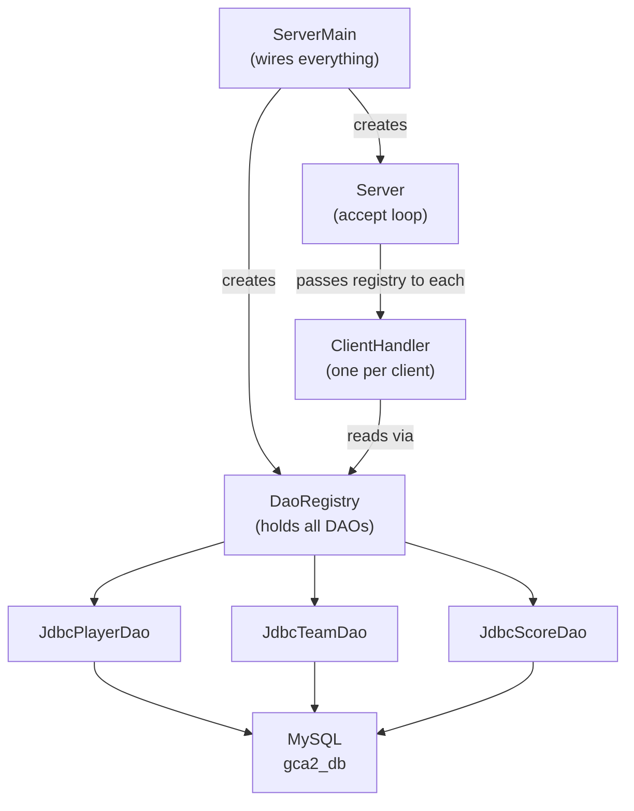

# Supplement — Managing Multiple DAOs in a Server

> **Context:**
> This note extends [t15_networking_notes.md](t15_networking_notes.md).
> Read it after you have a working single-table server.
> It targets GCA2 projects with **more than one database table**, where `ClientHandler` would otherwise receive a separate DAO parameter per table.

---

## What you'll learn

| Skill Type | You will be able to… |
| :- | :- |
| Understand | Explain why passing multiple DAO objects directly to `ClientHandler` becomes a problem as the schema grows. |
| Apply | Create a `DaoRegistry` class that bundles all DAOs into one object. |
| Apply | Refactor `ClientHandler` and `Server` to depend on a single `DaoRegistry`. |
| Apply | Extend the `dispatch` method to route requests across multiple entity types. |
| Analyse | Explain the trade-off between `DaoRegistry` and a full service layer. |

---

## Why this matters

In the single-table example from t15, `ClientHandler` received one DAO:

```java
new ClientHandler(client, taskDao);
```

GCA2 requires **multiple related tables** (e.g. Players, Teams, Scores). The obvious first attempt is to add a parameter for each new DAO:

```java
new ClientHandler(client, playerDao, teamDao, scoreDao);
```

This works, but it creates two problems that grow as your schema grows:
1. Every new table means another constructor parameter in `ClientHandler` **and** in `Server`.
2. `Server` accumulates knowledge of every DAO that exists — knowledge it does not need.

The fix is to **bundle all DAOs into one object** (`DaoRegistry`) and pass only that object to the server and handler.

---

## How this builds on what you know

| Previous concept | How it appears here |
| :- | :- |
| DAO interface + JDBC implementation | Each DAO is still defined by an interface; `DaoRegistry` holds interface references |
| Composition over inheritance | `DaoRegistry` holds DAO objects rather than extending them |
| Defensive coding (null/fail-fast) | `DaoRegistry` validates every DAO in its constructor |
| `ClientHandler` from t15 | Constructor shrinks from N DAO params to one `DaoRegistry` param |
| `Server` accept loop from t15 | `Server` stores one `DaoRegistry` instead of N separate DAO fields |

---

## The problem in full

The example domain below has three tables: `players`, `teams`, and `scores`.
Three interfaces exist: `PlayerDao`, `TeamDao`, and `ScoreDao`.

### Before: three parameters, and growing

```java
public class ClientHandler implements Runnable {

    // === Fields ===
    private Socket _socket;
    private PlayerDao _playerDao;
    private TeamDao _teamDao;
    private ScoreDao _scoreDao;
    private ObjectMapper _mapper;

    // === Constructors ===
    // Creates: a handler for the given socket using three DAOs
    public ClientHandler(Socket socket, PlayerDao playerDao,
                         TeamDao teamDao, ScoreDao scoreDao) {
        if (socket    == null) throw new IllegalArgumentException("socket is required");
        if (playerDao == null) throw new IllegalArgumentException("playerDao is required");
        if (teamDao   == null) throw new IllegalArgumentException("teamDao is required");
        if (scoreDao  == null) throw new IllegalArgumentException("scoreDao is required");

        _socket    = socket;
        _playerDao = playerDao;
        _teamDao   = teamDao;
        _scoreDao  = scoreDao;
        _mapper    = new ObjectMapper();
    }

    // ...
}
```

The same three parameters also appear in `Server`:

```java
public class Server {

    // === Fields ===
    private int _port;
    private PlayerDao _playerDao;
    private TeamDao _teamDao;
    private ScoreDao _scoreDao;
    private ExecutorService _pool;

    // Creates: a server using three DAOs
    public Server(int port, PlayerDao playerDao,
                  TeamDao teamDao, ScoreDao scoreDao) {
        // four parameters, three null checks ...
        _pool.submit(new ClientHandler(client, _playerDao, _teamDao, _scoreDao));
    }
}
```

Add a fourth table and both constructors change. Add a fifth and they change again.

---

## The fix: `DaoRegistry`

`DaoRegistry` is a plain holder class.
Its only job is to carry all the DAOs under one roof so that `Server` and `ClientHandler` each take **one object** instead of N.

```java
public class DaoRegistry {

    // === Fields ===
    private PlayerDao _playerDao;
    private TeamDao _teamDao;
    private ScoreDao _scoreDao;

    // === Constructors ===
    // Creates: a registry holding all three DAO objects — none may be null
    public DaoRegistry(PlayerDao playerDao, TeamDao teamDao, ScoreDao scoreDao) {
        if (playerDao == null) throw new IllegalArgumentException("playerDao is required");
        if (teamDao   == null) throw new IllegalArgumentException("teamDao is required");
        if (scoreDao  == null) throw new IllegalArgumentException("scoreDao is required");

        _playerDao = playerDao;
        _teamDao   = teamDao;
        _scoreDao  = scoreDao;
    }

    // === Public API ===
    // Gets: the DAO responsible for player persistence
    public PlayerDao players() { return _playerDao; }

    // Gets: the DAO responsible for team persistence
    public TeamDao teams()     { return _teamDao;   }

    // Gets: the DAO responsible for score persistence
    public ScoreDao scores()   { return _scoreDao;  }
}
```

Key points:
- Fields are interfaces (`PlayerDao`), not concrete classes — swapping implementations later requires no change here.
- The class contains **no logic** — that belongs in the service or DAO layers.
- Adding a fourth table means adding one field, one constructor parameter, and one getter.

---

## After: refactored `ClientHandler`

`ClientHandler` now has one DAO-related field. Its constructor takes one `DaoRegistry`.

```java
import com.fasterxml.jackson.databind.ObjectMapper;
import java.io.*;
import java.net.*;
import java.util.List;
import java.util.Optional;

public class ClientHandler implements Runnable {

    // === Fields ===
    private Socket _socket;
    private DaoRegistry _registry;
    private ObjectMapper _mapper;

    // === Constructors ===
    // Creates: a handler for the given socket using the shared DAO registry
    public ClientHandler(Socket socket, DaoRegistry registry) {
        if (socket   == null) throw new IllegalArgumentException("socket is required");
        if (registry == null) throw new IllegalArgumentException("registry is required");

        _socket   = socket;
        _registry = registry;
        _mapper   = new ObjectMapper();
    }

    // === Public API ===
    // Runs: the client session — reads JSON requests and writes JSON responses
    @Override
    public void run() {
        try (BufferedReader in = new BufferedReader(new InputStreamReader(_socket.getInputStream()));
             PrintWriter out  = new PrintWriter(_socket.getOutputStream(), true)) {

            String line;
            while ((line = in.readLine()) != null) {
                out.println(handle(line));
            }
        }
        catch (IOException e) {
            System.out.println("Client disconnected: " + e.getMessage());
        }
        finally {
            try { _socket.close(); } catch (IOException ignored) {}
        }
    }

    // === Helpers ===
    // Handles: a single raw JSON request line — returns a JSON response string
    private String handle(String rawJson) {
        try {
            ClientRequest req = _mapper.readValue(rawJson, ClientRequest.class);
            return _mapper.writeValueAsString(dispatch(req));
        }
        catch (Exception e) {
            return "{\"status\":\"ERROR\",\"message\":\"" + e.getMessage() + "\",\"data\":null}";
        }
    }

    // Dispatches: the request to the correct DAO method based on requestType
    private ServerResponse<?> dispatch(ClientRequest req) throws Exception {
        String type = req.getRequestType();

        // --- Player requests ---
        if ("GET_ALL_PLAYERS".equals(type)) {
            List<?> players = _registry.players().findAll();
            return ServerResponse.ok("retrieved " + players.size() + " players", players);
        }

        if ("GET_PLAYER_BY_ID".equals(type)) {
            int id = req.getInt("id");
            Optional<?> player = _registry.players().findById(id);
            return player.isPresent()
                ? ServerResponse.ok("player found", player.get())
                : ServerResponse.error("no player with id=" + id);
        }

        if ("INSERT_PLAYER".equals(type)) {
            String name     = req.getString("name");
            String position = req.getString("position");
            int newId = _registry.players().insert(name, position);
            Optional<?> created = _registry.players().findById(newId);
            return created.isPresent()
                ? ServerResponse.ok("player created", created.get())
                : ServerResponse.error("insert succeeded but player not found");
        }

        // --- Team requests ---
        if ("GET_ALL_TEAMS".equals(type)) {
            List<?> teams = _registry.teams().findAll();
            return ServerResponse.ok("retrieved " + teams.size() + " teams", teams);
        }

        if ("GET_TEAM_BY_ID".equals(type)) {
            int id = req.getInt("id");
            Optional<?> team = _registry.teams().findById(id);
            return team.isPresent()
                ? ServerResponse.ok("team found", team.get())
                : ServerResponse.error("no team with id=" + id);
        }

        // --- Score requests ---
        if ("GET_ALL_SCORES".equals(type)) {
            List<?> scores = _registry.scores().findAll();
            return ServerResponse.ok("retrieved " + scores.size() + " scores", scores);
        }

        // --- Lifecycle ---
        if ("DISCONNECT".equals(type)) {
            return ServerResponse.ok("goodbye", null);
        }

        return ServerResponse.error("unknown request type: " + type);
    }
}
```

Notice:
- Adding a new request type (`INSERT_TEAM`, `DELETE_SCORE`, etc.) only requires a new `if` block in `dispatch`.
- `_registry.players()`, `_registry.teams()`, and `_registry.scores()` are short, readable calls.
- The null checks in `DaoRegistry`'s constructor guarantee these accessors never return `null`.

---

## After: refactored `Server`

`Server` now holds one `DaoRegistry` field instead of one field per DAO.

```java
import java.io.*;
import java.net.*;
import java.util.concurrent.*;

public class Server {

    // === Fields ===
    private int _port;
    private DaoRegistry _registry;
    private ExecutorService _pool;

    // === Constructors ===
    // Creates: a server on the given port using the shared DAO registry
    public Server(int port, DaoRegistry registry) {
        if (port < 1_024 || port > 65_535)
            throw new IllegalArgumentException("port must be 1024–65535");
        if (registry == null)
            throw new IllegalArgumentException("registry is required");

        _port     = port;
        _registry = registry;
        _pool     = Executors.newCachedThreadPool();
    }

    // === Public API ===
    // Starts: the accept loop — runs indefinitely until interrupted
    public void start() throws IOException {
        System.out.println("Server listening on port " + _port);

        try (ServerSocket serverSocket = new ServerSocket(_port)) {
            while (!Thread.currentThread().isInterrupted()) {
                Socket client = serverSocket.accept();
                System.out.println("Client connected: " + client.getInetAddress());
                _pool.submit(new ClientHandler(client, _registry));
            }
        }
    }
}
```

The same `_registry` reference is passed to every `ClientHandler` that is submitted to the pool.
Each handler reads from the registry without modifying it, so this shared reference is safe.

---

## Wiring it all together: `ServerMain`

`ServerMain` is the only place that knows which concrete DAO implementations to use.
Everything else depends on interfaces.

```java
public class ServerMain {

    public static void main(String[] args) throws Exception {

        String url  = "jdbc:mysql://localhost:3306/gca2_db?useSSL=false&serverTimezone=UTC&allowPublicKeyRetrieval=true";
        String user = "gca2_user";
        String pass = "your_password";

        // --- Build DAO implementations ---
        PlayerDao playerDao = new JdbcPlayerDao(url, user, pass);
        TeamDao   teamDao   = new JdbcTeamDao(url, user, pass);
        ScoreDao  scoreDao  = new JdbcScoreDao(url, user, pass);

        // --- Bundle into registry ---
        DaoRegistry registry = new DaoRegistry(playerDao, teamDao, scoreDao);

        // --- Start server ---
        new Server(5_000, registry).start();
    }
}
```

`ServerMain` is the only class you change when:
- adding a new DAO (add the field, pass it to `DaoRegistry`),
- swapping an implementation (change `new JdbcPlayerDao(...)` to something else).

---

## Architecture diagram



---

## Common mistakes

| Mistake | What happens | Fix |
| :- | :- | :- |
| Storing `DaoRegistry` as `static` | Hides the dependency; makes testing harder | Pass it as a constructor parameter every time |
| Skipping null checks in `DaoRegistry` | `NullPointerException` deep inside a handler thread, hard to trace | Always validate every DAO in the registry constructor |
| Creating a new `DaoRegistry` per accepted connection | Unnecessary object creation; JDBC credentials re-parsed each time | Create one registry in `ServerMain`, share it across all handlers |
| Adding business logic to `DaoRegistry` | Mixes data access and rules; hard to test | `DaoRegistry` holds DAOs only; rules go in a service layer |
| Adding request-routing logic to `Server` | `Server` should only accept connections and submit tasks | All request routing stays in `ClientHandler.dispatch()` |

---

## Practice tasks

1. Add a fourth table to your schema (e.g. `matches`). Add `MatchDao` to `DaoRegistry` without changing `ClientHandler` or `Server`.
2. Add `GET_ALL_MATCHES` and `INSERT_MATCH` to `ClientHandler.dispatch()`.
3. Verify the registry's null checks by writing a JUnit test that passes `null` for one DAO and confirms `IllegalArgumentException` is thrown.

---

## Reflective questions

1. `DaoRegistry` is a plain holder with no logic. What design principle does that reflect?
2. Why is the same `DaoRegistry` instance passed to every `ClientHandler` safe in a multithreaded server?
3. What would break if `DaoRegistry` stored concrete types (`JdbcPlayerDao`) instead of interface types (`PlayerDao`)?
4. If you needed to support two different databases (e.g. MySQL for players, a mock for tests), which class would you change?
