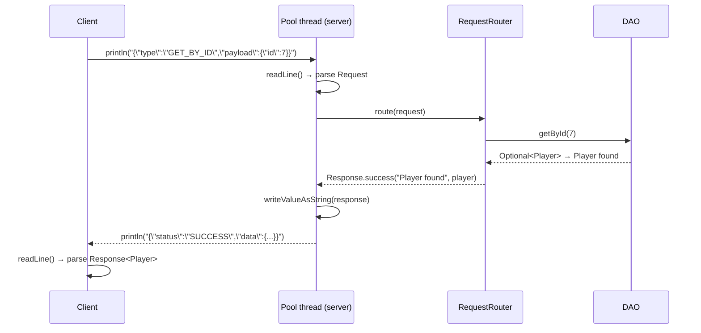

# JSON in Java — From Format Basics to Socket Communication

> **Prerequisites:**
> - You can create Java classes with fields, constructors, and methods
> - You understand generics: `Box<T>`, bounded type parameters, `List<T>`
> - You can use `ArrayList` and basic loops
> - You are comfortable with `try-catch` and checked exceptions

---

## What you'll learn

| Skill Type | You will be able to… |
| :- | :- |
| Understand | Describe the JSON format: its data types, structure rules, and how JSON values map to Java types. |
| Understand | Explain the difference between using JSON as a **file format** and using it as a **wire protocol**. |
| Understand | Explain why Java's type erasure means `readValue(json, List<Player>.class)` cannot compile, and how `TypeReference<T>` solves it. |
| Apply | Add Jackson to a Maven project and create a shared `ObjectMapper` instance correctly. |
| Apply | Use `ObjectMapper` to serialise a Java object to a `String` and deserialise a `String` back to an object. |
| Apply | Serialise and deserialise a **generic wrapper type** (`Response<T>`) using `TypeReference`. |
| Apply | Design a simple **JSON request/response protocol** with a `type` field and `payload` envelope. |
| Apply | Base64-encode a `byte[]` for safe inclusion in a JSON string, and decode it back to the original bytes. |
| Apply | Extend a MySQL table with a `MEDIUMBLOB` column and associated metadata columns; update `mysqlSetup.sql` accordingly. |
| Apply | Insert binary data into a `MEDIUMBLOB` column using `PreparedStatement.setBytes()`. |
| Apply | Retrieve binary data from a `MEDIUMBLOB` column using `ResultSet.getBytes()`. |
| Apply | Write a metadata-only SELECT query that deliberately omits the BLOB column. |
| Apply | Send a JSON string over a socket and read it back using `PrintWriter` and `BufferedReader`. |
| Apply | Write JUnit 5 round-trip tests that assert a serialise→deserialise cycle produces an equal object. |
| Debug | Fix common Jackson errors: missing no-arg constructor, field name mismatch, raw type warnings. |
| Debug | Use `@JsonProperty` to correct a JSON key that does not match the getter name convention. |
| Debug | Annotate DTOs with `@JsonIgnoreProperties(ignoreUnknown = true)` to handle evolving protocols defensively. |
| Debug | Safely read fields from a `JsonNode` payload using `payload.has(...)` before calling `.asInt()` / `.asText()`. |

---

## Why this matters

Programs communicate. A method call is communication within a single JVM. A file is communication across time — you write now, someone reads later. A socket is communication across space — two programs on different machines exchanging data right now.

Each of these needs a **shared language**. Within a JVM that language is Java. Across a network it cannot be Java, because the other side may be running a different language, a different JVM version, or a completely different runtime. The two sides need a format they can both understand without knowing anything about each other's internal representation.

JSON has become the dominant format for exactly this reason. It is human-readable, language-neutral, well-specified, and supported by every major programming language. Learning to read, write, and transmit JSON is a foundational skill for any networked application.

---

## How this builds on previous content

| Earlier topic | Concept carried forward |
| :- | :- |
| Generics I (t08) | `Box<T>` → `Response<T>`: wrapping arbitrary payloads in a typed container |
| Generics II (t09) | Type erasure → why `TypeReference<List<Player>>` is needed at runtime |
| Design Patterns I (t10) | Strategy pattern → request routing: one handler per request type, no `instanceof` chain |
| DB Connectivity (t12) | DAO returns Java objects → serialise them to JSON before sending across a socket |

---

## Section 1 — What is JSON?

### The format

**JSON (JavaScript Object Notation)** is a text-based data format. It was originally derived from JavaScript object syntax but has nothing to do with JavaScript as a language — it is completely language-neutral. A JSON document is just a string of characters that follows a strict grammar.

JSON has exactly **six value types**:

| JSON type | Example | Java equivalent |
| :- | :- | :- |
| String | `"Alice"` | `String` |
| Number | `42`, `9.2`, `-7` | `int`, `double`, `long` |
| Boolean | `true`, `false` | `boolean` |
| Null | `null` | `null` |
| Array | `[1, 2, 3]` | `List<T>` or array |
| Object | `{"key": "value"}` | class instance or `Map<String, Object>` |

That is the complete list. JSON has no concept of dates, binary data, undefined, functions, or comments. If you need to represent something that is not in this list (a `LocalDate`, a `byte[]`), you must encode it as one of the six types — typically a string.

### JSON values in practice

A JSON **string** is surrounded by double quotes. Single quotes are not valid JSON.

```json
"Hello, world"
```

A JSON **number** has no quotes. It can be an integer or have a decimal point. It cannot be `NaN` or `Infinity`.

```json
42
9.2
-100
```

A JSON **boolean** is lowercase. `True` and `False` are not valid JSON.

```json
true
false
```

A JSON **array** is a comma-separated list of values inside square brackets. The values can be of different types.

```json
[1, "two", true, null, [3, 4]]
```

A JSON **object** is a comma-separated list of key-value pairs inside curly braces. Keys must be strings (double-quoted). Values can be any JSON type.

```json
{
  "id": 1,
  "name": "Alice",
  "rating": 9.2,
  "active": true,
  "tags": ["defender", "captain"],
  "address": null
}
```

### A realistic JSON document

Here is what a typical server response payload might look like. Notice that it is just nested combinations of the six types above.

```json
{
  "status": "SUCCESS",
  "message": "Player retrieved",
  "data": {
    "id": 7,
    "name": "Alice",
    "rating": 9.2,
    "active": true,
    "recentScores": [8, 9, 10, 9, 8]
  }
}
```

### What makes JSON valid

Four rules cover most errors:
1. **Strings must use double quotes** — `"Alice"`, not `'Alice'`
2. **Object keys must be strings** — `{"id": 1}`, not `{id: 1}`
3. **No trailing commas** — `{"a":1, "b":2}` is valid; `{"a":1, "b":2,}` is not
4. **No comments** — JSON has no comment syntax

Violating any of these produces a parse error. When Jackson throws a `JsonParseException`, one of these four is usually the cause.

### JSON vs. Java: mapping the concepts

| Java concept | JSON representation |
| :- | :- |
| `int`, `long` | Number without decimal: `42` |
| `double`, `float` | Number with decimal: `9.2` |
| `String` | String: `"Alice"` |
| `boolean` | `true` or `false` |
| `null` | `null` |
| Object (class instance) | Object `{}` — each field becomes a key-value pair |
| `List<T>`, array | Array `[]` |
| `Map<String, V>` | Object `{}` — each map entry becomes a key-value pair |
| `LocalDate`, `byte[]`, enum | Must be encoded as a string or number |

---

## Section 2 — JSON as a file format vs. a wire protocol

### JSON as a file format

JSON is often used to store configuration, seed data, or exported records in `.json` files on disk. In the **ce13** challenge exercise, a `JSONSerialiser<T>` helper reads a JSON file containing incident reports and converts them into a `List<Incident>` for processing. The Jackson overloads for this use a `File` or `Path` object:

```java
// File → List<T>
List<T> data = mapper.readValue(path.toFile(), listType);

// List<T> → File
mapper.writerWithDefaultPrettyPrinter().writeValue(path.toFile(), items);
```

This is a useful pattern when JSON is **persistent storage** — it is written once and read later, possibly by a different program or a different run of the same program.

### JSON as a wire protocol

A networked client-server system has a different need. The client and server exchange messages in real time over a socket. Neither side wants to write to disk on every request. Instead, they convert objects to **strings in memory** and send those strings directly over the connection.

The Jackson overloads for this are different:

```java
// Object → String (in memory)
String json = mapper.writeValueAsString(entity);

// String → Object (in memory)
Player p = mapper.readValue(json, Player.class);
```

The distinction matters:

| | File-based | String-based |
| :- | :- | :- |
| Input / output | `File` or `Path` | `String` |
| Use case | Persistence, config, export | Network communication, inter-process messaging |
| Jackson method | `writeValue(File, ...)` / `readValue(File, ...)` | `writeValueAsString(...)` / `readValue(String, ...)` |

In a client-server application you will almost always use the string-based overloads. The file-based overloads from ce13 are not used in a networked context.

---

## Section 3 — Setting up Jackson

### Maven dependency

Jackson Databind is the core library. It handles conversion between Java objects and JSON strings, and it transitively pulls in the two other Jackson modules it depends on (`core` and `annotations`).

```xml
<dependency>
    <groupId>com.fasterxml.jackson.core</groupId>
    <artifactId>jackson-databind</artifactId>
    <version>2.17.2</version>
</dependency>
```

Add this inside the `<dependencies>` block of your `pom.xml`. After saving, reload the Maven project in IntelliJ (the elephant icon, or right-click → Maven → Reload Project).

### The `ObjectMapper`

`ObjectMapper` is Jackson's central class. It performs all serialisation and deserialisation. Two important properties:

1. **It is thread-safe** after construction. Multiple threads can call `writeValueAsString` and `readValue` on the same instance concurrently without problems.
2. **It is expensive to construct** — it loads configuration, registers modules, and scans annotations during construction.

The consequence of both properties is the same: **create one instance and reuse it everywhere**.

```java
import com.fasterxml.jackson.databind.ObjectMapper;

// Creates: a single shared mapper instance — construct once, use everywhere
private static final ObjectMapper MAPPER = new ObjectMapper();
```

Avoid creating a `new ObjectMapper()` inside a loop, inside a method that is called frequently, or in a per-request handler. A shared `static final` field is the standard pattern.

### What Jackson needs from your class

For Jackson to reconstruct an object from a JSON string (`readValue`), three things must be true:

1. **A public no-argument constructor** — Jackson calls this to create the empty object, then populates it.
2. **Public getters** — Jackson uses these to read field values when serialising (object → string).
3. **Public setters** — Jackson uses these to write field values when deserialising (string → object).

If the no-arg constructor is missing, Jackson throws `InvalidDefinitionException: No suitable constructor found` at runtime. If a getter or setter is missing, that field is silently ignored or left at its default value.

Here is a correctly structured class that Jackson can serialise and deserialise:

```java
public class Player {

    // === Fields ===
    private int    fId;
    private String fName;
    private double fRating;

    // === Constructors ===
    // Creates: required no-arg constructor for Jackson deserialisation
    public Player() {
        fId     = 0;
        fName   = "";
        fRating = 0.0;
    }

    // Creates: convenience constructor for application code
    public Player(int id, String name, double rating) {
        fId     = id;
        fName   = name;
        fRating = rating;
    }

    // === Public API ===
    // Gets: the player id
    public int getId()           { return fId; }

    // Sets: the player id
    public void setId(int id)    { fId = id; }

    // Gets: the player name
    public String getName()             { return fName; }

    // Sets: the player name
    public void setName(String name)    { fName = name; }

    // Gets: the player rating
    public double getRating()               { return fRating; }

    // Sets: the player rating
    public void setRating(double rating)    { fRating = rating; }

    // === Overrides ===
    @Override
    public int hashCode() {
        return Integer.hashCode(fId);
    }

    @Override
    public String toString() {
        return "Player{id=" + fId + ", name='" + fName + "', rating=" + fRating + "}";
    }

    @Override
    public boolean equals(Object o) {
        if (this == o) return true;
        if (!(o instanceof Player)) return false;
        Player other = (Player) o;
        return fId == other.fId
            && Double.compare(fRating, other.fRating) == 0
            && java.util.Objects.equals(fName, other.fName);
    }
}
```

**How Jackson maps field names:** Jackson derives the JSON key from the getter name, not the field name. The rule is: strip `get` from the getter name and lowercase the first letter. So `getId()` → `"id"`, `getName()` → `"name"`, `getRating()` → `"rating"`. The `f` prefix on the private field is invisible to Jackson. The resulting JSON is:

```json
{"id":1,"name":"Alice","rating":9.2}
```

**What happens if you name getters poorly:** If you follow the `f` prefix convention but accidentally name your getter `getFId()` instead of `getId()`, Jackson will derive the key `"fId"` — and the JSON key in outgoing messages will be `"fId"` rather than `"id"`. When the string is deserialised, Jackson looks for a setter named `setFId()` and calls it. If only `setId()` exists, the field is silently left at its default value. No exception is thrown.

The fix in either direction is `@JsonProperty`, which explicitly names the JSON key regardless of the getter name:

```java
import com.fasterxml.jackson.annotation.JsonProperty;

// Tells Jackson: this getter maps to JSON key "id", not "fId"
@JsonProperty("id")
public int getFId() { return fId; }

// Tells Jackson: this setter maps to JSON key "id"
@JsonProperty("id")
public void setFId(int id) { fId = id; }
```

With `@JsonProperty` in place, the JSON key is always `"id"` regardless of what the getter is called. The annotation must be placed on both the getter and the corresponding setter, or the round-trip will be asymmetric.

The cleanest approach, and the one used throughout these notes, is to name getters so the derived key is correct — `getId()` not `getFId()` — making `@JsonProperty` unnecessary for straightforward cases.

**Handling unknown fields — `@JsonIgnoreProperties`:** By default, Jackson throws `UnrecognizedPropertyException` if the JSON being deserialised contains a field that the target class has no corresponding setter for. This becomes a problem as a protocol evolves: if the server adds a new field to its response and an older client tries to deserialise it, the client will crash rather than simply ignoring the new field.

The defensive solution is `@JsonIgnoreProperties(ignoreUnknown = true)` on the class:

```java
import com.fasterxml.jackson.annotation.JsonIgnoreProperties;

// Tells Jackson: silently skip any JSON fields this class does not have a setter for
@JsonIgnoreProperties(ignoreUnknown = true)
public class Player {
    // ... fields, constructors, getters, setters as before
}
```

This is particularly important for `Response<T>` and `Request`, since both sides of the protocol may evolve at different times. Annotating them with `@JsonIgnoreProperties(ignoreUnknown = true)` makes deserialisation tolerant of forward-compatibility additions.

---

## Section 4 — String-based serialisation

### Serialising a single object

```java
Player p    = new Player(1, "Alice", 9.2);

// Converts: Player to a compact JSON string
String json = MAPPER.writeValueAsString(p);

System.out.println(json);
// {"id":1,"name":"Alice","rating":9.2}
```

`writeValueAsString` may throw a checked `JsonProcessingException`. In practice this only happens if the object contains a type that Jackson cannot handle (a circular reference, for example). For simple DTO classes it does not throw, but you must either handle or declare it.

### Deserialising a string to a single object

```java
String json = "{\"id\":1,\"name\":\"Alice\",\"rating\":9.2}";

// Converts: JSON string back to a Player instance
Player p = MAPPER.readValue(json, Player.class);

System.out.println(p.getName()); // Alice
```

`readValue` throws `JsonProcessingException` if the string is not valid JSON, or if the JSON structure does not match the target class (e.g. a string value where a number is expected).

### Serialising a list

```java
List<Player> players = List.of(
    new Player(1, "Alice", 9.2),
    new Player(2, "Bob",   7.5)
);

// Converts: List<Player> to a JSON array string
String json = MAPPER.writeValueAsString(players);

System.out.println(json);
// [{"id":1,"name":"Alice","rating":9.2},{"id":2,"name":"Bob","rating":7.5}]
```

### Deserialising a JSON array — and the type erasure problem

Deserialising a list requires careful handling. You cannot write:

```java
// DOES NOT COMPILE — generic type is erased; List<Player>.class is not valid syntax
List<Player> players = MAPPER.readValue(json, List<Player>.class);
```

The problem is **type erasure**: Java removes generic type parameters at compile time. At runtime, `List<Player>` and `List<String>` are both just `List`. If you pass `List.class`, Jackson only knows it should return a `List` — it has no idea what type the elements should be, so it falls back to `LinkedHashMap` for each element.

The solution is `TypeReference<T>`, which captures the full parameterised type in an anonymous subclass. Because the type argument is embedded in the subclass's generic supertype signature, it survives erasure and Jackson can read it back via reflection.

```java
import com.fasterxml.jackson.core.type.TypeReference;

// Converts: JSON array string to List<Player>, preserving the element type at runtime
List<Player> players = MAPPER.readValue(
    json,
    new TypeReference<List<Player>>() {}
);
```

The `{}` creates the anonymous subclass. It looks unusual but is the standard Jackson idiom for this situation.

### Pretty-printing

The default output of `writeValueAsString` is compact (no whitespace). For logging or debugging, pretty-print using a configured writer:

```java
// Converts: Player to a human-readable indented JSON string
String pretty = MAPPER.writerWithDefaultPrettyPrinter()
                      .writeValueAsString(player);
```

Pretty-printed output over a socket is wasteful (larger payload, more bandwidth), so use it only for debugging, not production message sending.

---

## Section 5 — Generic wrapper types and type erasure

### The problem with raw responses

Without a consistent response structure, a client receiving a message over a socket cannot reliably tell success from failure:

```
// What does this mean? Is "null" an error? Did the player not exist?
null

// Is this the player JSON, or an error message?
Player not found

// This works but has no standard shape — every handler is different
{"id":7,"name":"Alice","rating":9.2}
```

A **generic response wrapper** solves this by giving every reply the same envelope structure, regardless of what data it carries.

### Designing `Response<T>`

```json
{
  "status": "SUCCESS",
  "message": "Player retrieved",
  "data": { "id": 7, "name": "Alice", "rating": 9.2 }
}
```

```json
{
  "status": "FAILURE",
  "message": "No player found for id=99",
  "data": null
}
```

The receiver always reads `status` first. If `"SUCCESS"`, it reads `data`. If `"FAILURE"`, it reads `message` for the error description. The protocol is consistent across all entity types and all operations.

### Implementing `Response<T>`

```java
/**
 * A generic response wrapper that standardises all server replies.
 * Carries a status string, a human-readable message, and an optional data payload.
 *
 * @param <T> the type of the data payload (may be null on failure)
 * @author OOP Teaching Team
 */
public class Response<T> {

    // === Fields ===
    private String fStatus;
    private String fMessage;
    private T      fData;

    // === Constructors ===
    // Creates: empty response — required by Jackson for deserialisation
    public Response() {
        fStatus  = "";
        fMessage = "";
        fData    = null;
    }

    // Creates: response with all fields set
    public Response(String status, String message, T data) {
        fStatus  = status;
        fMessage = message;
        fData    = data;
    }

    // === Public API ===
    // Gets: the response status ("SUCCESS" or "FAILURE")
    public String getStatus() { return fStatus; }

    // Sets: the response status
    public void setStatus(String status) { fStatus = status; }

    // Gets: the human-readable result message
    public String getMessage() { return fMessage; }

    // Sets: the result message
    public void setMessage(String message) { fMessage = message; }

    // Gets: the response payload; null on failure responses
    public T getData() { return fData; }

    // Sets: the response payload
    public void setData(T data) { fData = data; }

    // === Helpers ===
    // Creates: a success response carrying the given data payload
    public static <T> Response<T> success(String message, T data) {
        return new Response<>("SUCCESS", message, data);
    }

    // Creates: a failure response with a null data payload
    public static <T> Response<T> failure(String message) {
        return new Response<>("FAILURE", message, null);
    }
}
```

### Serialising `Response<T>` — no special handling needed

Serialisation always works because Jackson inspects the actual runtime type of `fData`:

```java
Player          player   = new Player(1, "Alice", 9.2);
Response<Player> response = Response.success("Player found", player);

// Converts: Response<Player> to a JSON string — Jackson sees the actual Player at runtime
String json = MAPPER.writeValueAsString(response);
```

Output:
```json
{"status":"SUCCESS","message":"Player found","data":{"id":1,"name":"Alice","rating":9.2}}
```

### Deserialising `Response<T>` — type erasure strikes again

This is where the problem appears. If you write:

```java
// WRONG — Jackson has no idea what T is; 'data' will be deserialised as a LinkedHashMap
Response<Player> r = MAPPER.readValue(json, Response.class);
Player p = (Player) r.getData(); // ClassCastException at runtime!
```

At runtime, `Response.class` carries no information about `T`. Jackson falls back to deserialising the `data` field as a generic `LinkedHashMap<String, Object>`, which is the natural mapping for a JSON object when no target type is known. Casting that to `Player` fails at runtime.

The fix is `TypeReference`, which preserves `T` through to runtime:

```java
// Converts: JSON string to Response<Player>, preserving the Player type parameter
Response<Player> r = MAPPER.readValue(
    json,
    new TypeReference<Response<Player>>() {}
);

Player p = r.getData(); // Works correctly — fData was deserialised as Player
```

### When `data` is a list

```java
// Converts: JSON string to Response<List<Player>>, preserving both generic layers
Response<List<Player>> r = MAPPER.readValue(
    json,
    new TypeReference<Response<List<Player>>>() {}
);

List<Player> players = r.getData();
```

### `TypeReference` decision table

| What you are deserialising | Use |
| :- | :- |
| A single concrete class: `Player` | `readValue(json, Player.class)` |
| A list: `List<Player>` | `new TypeReference<List<Player>>() {}` |
| A response wrapping a single object: `Response<Player>` | `new TypeReference<Response<Player>>() {}` |
| A response wrapping a list: `Response<List<Player>>` | `new TypeReference<Response<List<Player>>>() {}` |

The rule is simple: if the type you are deserialising has any generic parameter, use `TypeReference`. If it is a plain concrete class with no generics, `ClassName.class` is sufficient.

---

## Section 6 — Designing a JSON request/response protocol

### What a protocol is

A **protocol** is an agreement between two parties about the format and meaning of the messages they exchange. Without an agreed protocol, the server receiving a JSON string from a client cannot determine what operation is being requested or how to interpret the payload.

A minimal, practical protocol for a Java client-server application needs two things:

1. **A request envelope** — a standard structure the client always sends, identifying the operation.
2. **A response envelope** — a standard structure the server always returns (this is `Response<T>` from Section 5).

### The request envelope

Every client message should carry at minimum:
- `type` — a string constant identifying the requested operation (e.g. `"GET_ALL"`, `"INSERT"`, `"DELETE"`)
- `payload` — a JSON object (or `null`) containing the parameters for that operation

```json
{
  "type": "GET_BY_ID",
  "payload": { "id": 7 }
}
```

```json
{
  "type": "GET_ALL",
  "payload": null
}
```

```json
{
  "type": "INSERT",
  "payload": {
    "name": "Charlie",
    "rating": 8.1
  }
}
```

Using `null` for payload (rather than omitting the field entirely) keeps the envelope structure consistent and avoids null-check branches when parsing.

### Implementing the request class

The payload structure varies per request type, so using `JsonNode` — Jackson's tree-model representation of any JSON value — allows the envelope to be parsed without knowing the specific payload shape in advance.

```java
import com.fasterxml.jackson.databind.JsonNode;

/**
 * A typed request envelope sent from client to server.
 * The 'type' field identifies the operation; 'payload' carries its parameters.
 *
 * @author OOP Teaching Team
 */
public class Request {

    // === Fields ===
    private String   fType;
    private JsonNode fPayload;

    // === Constructors ===
    // Creates: empty request — required by Jackson
    public Request() {
        fType    = "";
        fPayload = null;
    }

    // Creates: request with a type and a JsonNode payload
    public Request(String type, JsonNode payload) {
        fType    = type;
        fPayload = payload;
    }

    // === Public API ===
    // Gets: the operation type constant
    public String getType() { return fType; }

    // Sets: the operation type constant
    public void setType(String type) { fType = type; }

    // Gets: the raw JSON payload node (may be null for no-parameter requests)
    public JsonNode getPayload() { return fPayload; }

    // Sets: the raw JSON payload node
    public void setPayload(JsonNode payload) { fPayload = payload; }
}
```

### Reading values from a `JsonNode` payload

Once you have the `Request`, each handler reads the fields it needs from `getPayload()`. Two null-pointer risks must be handled defensively:

1. `getPayload()` returns `null` when the request was constructed with a `null` payload.
2. `payload.get("fieldName")` returns `null` when the named field is absent from the JSON — it does not throw an exception.

Calling `.asInt()` or `.asText()` on a `null` node will throw a `NullPointerException`. Always validate before reading:

```java
// Safely gets: an integer field from the payload with upfront validation
private Response<?> handleGetById(Request request) {
    JsonNode payload = request.getPayload();

    if (payload == null || !payload.has("id"))
        return Response.failure("Missing required field: id");

    int id = payload.get("id").asInt();
    // proceed with id ...
}
```

The same pattern applies to string and double fields:

```java
if (payload == null || !payload.has("name"))
    return Response.failure("Missing required field: name");

String name = payload.get("name").asText();
```

```java
if (payload == null || !payload.has("rating"))
    return Response.failure("Missing required field: rating");

double rating = payload.get("rating").asDouble();
```

`payload.has("fieldName")` returns `true` if the key is present in the JSON object, even if its value is `null`. Use `payload.hasNonNull("fieldName")` if you also want to reject explicitly-null values.

### Building a `Request` on the client side

When the client needs to send a request with a payload, use `MAPPER.valueToTree(object)` to convert a payload object into a `JsonNode`:

```java
// Converts: a plain Java object to a JsonNode for use as a request payload
JsonNode  node    = MAPPER.valueToTree(new Player(0, "Charlie", 8.1));
Request   request = new Request("INSERT", node);
String    json    = MAPPER.writeValueAsString(request);
```

For a no-payload request:

```java
Request request = new Request("GET_ALL", null);
String  json    = MAPPER.writeValueAsString(request);
```

### Routing requests — avoiding an `if-else` chain

A naive server reads `type` and dispatches with conditional logic:

```java
// Poor design — grows without bound as new operations are added
if (type.equals("GET_ALL")) {
    handleGetAll(request, out);
}
else if (type.equals("GET_BY_ID")) {
    handleGetById(request, out);
}
else if (type.equals("INSERT")) {
    handleInsert(request, out);
}
// ... every new operation means editing this method
```

This violates the Open/Closed Principle: adding an operation requires modifying existing code. A better design registers handlers in a `Map<String, RequestHandler>`, where `RequestHandler` is a functional interface:

```java
@FunctionalInterface
public interface RequestHandler {
    // Handles: one client request and returns a Response to be sent back
    Response<?> handle(Request request) throws Exception;
}
```

```java
/**
 * Routes incoming requests to the appropriate handler by type.
 *
 * @author OOP Teaching Team
 */
public class RequestRouter {

    // === Fields ===
    private final Map<String, RequestHandler> fHandlers = new HashMap<>();

    // === Constructors ===
    // Creates: a router with all handlers registered against their type constants
    public RequestRouter(PlayerDao dao) {
        fHandlers.put("GET_ALL",    req -> handleGetAll(dao));
        fHandlers.put("GET_BY_ID",  req -> handleGetById(req, dao));
        fHandlers.put("INSERT",     req -> handleInsert(req, dao));
        fHandlers.put("DELETE",     req -> handleDelete(req, dao));
        fHandlers.put("UPDATE",     req -> handleUpdate(req, dao));
        fHandlers.put("DISCONNECT", req -> handleDisconnect());
    }

    // === Public API ===
    // Handles: routing a request to its registered handler; returns a failure response for unknown types
    public Response<?> route(Request request) {
        RequestHandler handler = fHandlers.get(request.getType());

        if (handler == null)
            return Response.failure("Unknown request type: " + request.getType());

        try {
            return handler.handle(request);
        }
        catch (Exception e) {
            return Response.failure("Server error: " + e.getMessage());
        }
    }

    // === Helpers ===
    // Gets: all entities from the DAO and wraps them in a success response
    private Response<List<Player>> handleGetAll(PlayerDao dao) throws Exception {
        List<Player> players = dao.getAll();
        return Response.success("Retrieved " + players.size() + " players", players);
    }

    // Gets: a single entity by id or returns a failure response if not found
    private Response<Player> handleGetById(Request request, PlayerDao dao) throws Exception {
        JsonNode payload = request.getPayload();
        if (payload == null || !payload.has("id"))
            return Response.failure("Missing required field: id");

        int id = payload.get("id").asInt();
        return dao.getById(id)
                  .map(p  -> Response.success("Player found", p))
                  .orElseGet(() -> Response.failure("No player found for id=" + id));
        // Note: orElseGet(supplier) is preferred over orElse(value) here because
        // orElse(value) always evaluates its argument, even when the Optional is present.
        // For a simple string this makes no difference in practice, but orElseGet is the
        // correct idiom for any fallback that involves object construction or side effects.
    }

    // ... additional handlers follow the same pattern
}
```

Registering a new operation means adding one line to the constructor. No existing code changes. Each handler method is focused, testable, and independently readable.

---

## Section 7 — Base64 encoding binary data within JSON

### Why binary data cannot go directly into JSON

JSON is a **text format** — it carries strings, numbers, booleans, and structured objects, but not raw binary bytes. Binary files (images, audio, PDFs, documents) are sequences of bytes that include values with special meaning in JSON: `{` (123), `}` (125), `"` (34), `\` (92), and control characters. Embedding raw bytes in a JSON string would corrupt the JSON structure.

The solution is **Base64 encoding**: convert the `byte[]` into a plain ASCII string before placing it in the JSON field, then decode it back to bytes after reading the field out.

Base64 represents every group of three bytes as four printable ASCII characters drawn from the set `A–Z`, `a–z`, `0–9`, `+`, `/`, and `=` (padding). The result is always valid text and can be placed safely in any JSON string field.

The trade-off is size: Base64 encoding increases data size by approximately 33%. A 100 KB image becomes approximately 133 KB as a Base64 string inside a JSON field.

### Encoding bytes to a Base64 string

Java's `java.util.Base64` has been in the standard library since Java 8. No additional dependency is needed.

```java
import java.util.Base64;
import java.nio.file.Files;
import java.nio.file.Path;

byte[] fileBytes = Files.readAllBytes(Path.of("profile.png"));

// Converts: raw byte array to a Base64-encoded ASCII string
String encoded = Base64.getEncoder().encodeToString(fileBytes);

// 'encoded' is now safe to place in a JSON string field
```

### Decoding a Base64 string back to bytes

```java
// 'encoded' is the Base64 string received from the JSON field
String encoded = payload.getFileData();

// Converts: Base64 string back to the original byte array
byte[] fileBytes = Base64.getDecoder().decode(encoded);

// Write the reconstructed file to disk
Files.write(Path.of("retrieved_profile.png"), fileBytes);
```

### Embedding binary data in a JSON upload payload

```json
{
  "type": "UPLOAD_FILE",
  "payload": {
    "entityId": 7,
    "fileName": "profile.png",
    "contentType": "image/png",
    "fileSize": 48302,
    "fileData": "iVBORw0KGgoAAAANSUhEUgAA..."
  }
}
```

All fields except `fileData` are plain metadata — they can be stored and queried independently without reading the binary content. `fileData` carries the entire file as a Base64 string.

### A DTO for file upload payloads

```java
/**
 * DTO carrying a file upload payload, including Base64-encoded binary content
 * and associated metadata fields.
 *
 * @author OOP Teaching Team
 */
public class FileUploadPayload {

    // === Fields ===
    private int    fEntityId;
    private String fFileName;
    private String fContentType;
    private int    fFileSize;
    private String fFileData;     // Base64-encoded binary content

    // === Constructors ===
    // Creates: empty payload — required by Jackson
    public FileUploadPayload() {
        fEntityId    = 0;
        fFileName    = "";
        fContentType = "";
        fFileSize    = 0;
        fFileData    = "";
    }

    // Creates: fully populated upload payload
    public FileUploadPayload(int entityId, String fileName,
                             String contentType, int fileSize,
                             String fileData) {
        fEntityId    = entityId;
        fFileName    = fileName;
        fContentType = contentType;
        fFileSize    = fileSize;
        fFileData    = fileData;
    }

    // === Public API ===
    // Gets: the entity id this file is associated with
    public int getEntityId()                  { return fEntityId; }

    // Sets: the entity id
    public void setEntityId(int entityId)     { fEntityId = entityId; }

    // Gets: the original filename including extension
    public String getFileName()               { return fFileName; }

    // Sets: the original filename
    public void setFileName(String f)         { fFileName = f; }

    // Gets: the MIME content type (e.g. "image/png")
    public String getContentType()            { return fContentType; }

    // Sets: the MIME content type
    public void setContentType(String ct)     { fContentType = ct; }

    // Gets: the file size in bytes (pre-encoding)
    public int getFileSize()                  { return fFileSize; }

    // Sets: the file size in bytes
    public void setFileSize(int fileSize)     { fFileSize = fileSize; }

    // Gets: the Base64-encoded file content
    public String getFileData()               { return fFileData; }

    // Sets: the Base64-encoded file content
    public void setFileData(String fileData)  { fFileData = fileData; }
}
```

### Client upload sequence

```java
// Converts: a file on disk into a Base64 upload payload ready to send over a socket
public FileUploadPayload buildUploadPayload(Path filePath, int entityId) throws IOException {
    byte[] bytes = Files.readAllBytes(filePath);
    String b64   = Base64.getEncoder().encodeToString(bytes);
    String name  = filePath.getFileName().toString();

    // Files.probeContentType returns null when the type cannot be determined
    // (common for .bin, .dat, or any extension the OS doesn't recognise)
    String detectedMime = Files.probeContentType(filePath);
    String mime = (detectedMime != null) ? detectedMime : "application/octet-stream";

    return new FileUploadPayload(entityId, name, mime, bytes.length, b64);
}
```

```java
// Sends: a file upload request over the socket connection
FileUploadPayload payload  = buildUploadPayload(Path.of("profile.png"), 7);
JsonNode          node     = MAPPER.valueToTree(payload);
Request           request  = new Request("UPLOAD_FILE", node);
String            json     = MAPPER.writeValueAsString(request);
out.println(json);     // 'out' is the socket's PrintWriter — see Section 9
```

### Server decode sequence

```java
// Gets: the Base64 file content from the request payload and decodes it to a byte array
FileUploadPayload payload   = MAPPER.treeToValue(request.getPayload(), FileUploadPayload.class);
byte[]            fileBytes = Base64.getDecoder().decode(payload.getFileData());

// fileBytes can now be stored using PreparedStatement.setBytes()
// or passed to any other persistence mechanism
```

---

## Section 8 — Storing and retrieving binary data with JDBC (BLOB)

Section 7 showed how to encode a `byte[]` as a Base64 string for safe inclusion in a JSON message. This section covers the other half of the pipeline: persisting those bytes in a MySQL database using a `BLOB` column, and reading them back out.

The steps are independent. A `byte[]` arriving at the server from a JSON upload request is stored with `PreparedStatement.setBytes()`. A `byte[]` retrieved from the database is Base64-encoded and returned in a `ServerResponse<T>`. Neither side cares how the other works — the contract is just `byte[]` in and `byte[]` out.

---

### BLOB column types in MySQL

MySQL offers four BLOB types that differ only in the maximum number of bytes they can store:

| Type | Maximum size | Typical use |
| :- | :- | :- |
| `TINYBLOB` | 255 bytes | Very small payloads (rarely used) |
| `BLOB` | 65 535 bytes (~64 KB) | Small images, icons |
| `MEDIUMBLOB` | 16 777 215 bytes (~16 MB) | Most game assets, audio clips, documents |
| `LONGBLOB` | 4 294 967 295 bytes (~4 GB) | Large video files |

For most GCA2 use cases a `MEDIUMBLOB` is the right choice. It covers any realistic file a student might upload during a demo without the overhead of `LONGBLOB`.

---

### Schema design — extending a table with a BLOB column

Binary data should never live alone in a table. Metadata (the file name, content type, and size) must be stored alongside it in separate `VARCHAR`/`INT` columns so it can be queried cheaply without fetching the payload.

The three metadata columns required by the brief are:

| Column | SQL type | Purpose |
| :- | :- | :- |
| `file_name` | `VARCHAR(255) NOT NULL` | Original filename including extension |
| `content_type` | `VARCHAR(100) NOT NULL` | MIME type (`image/png`, `audio/ogg`, `application/pdf`) |
| `file_size` | `INT NOT NULL` | File size in bytes **before** Base64 encoding |

Add these columns (and the BLOB column) to an existing entity table using `ALTER TABLE`:

```sql
ALTER TABLE player
    ADD COLUMN file_name     VARCHAR(255)  NOT NULL DEFAULT '',
    ADD COLUMN content_type  VARCHAR(100)  NOT NULL DEFAULT '',
    ADD COLUMN file_size     INT           NOT NULL DEFAULT 0,
    ADD COLUMN player_image  MEDIUMBLOB;
```

Alternatively, define them directly in the `CREATE TABLE` statement in `mysqlSetup.sql`:

```sql
CREATE TABLE player (
    player_id     INT           NOT NULL AUTO_INCREMENT,
    player_name   VARCHAR(255)  NOT NULL,
    rating        DOUBLE        NOT NULL,
    file_name     VARCHAR(255)  NOT NULL DEFAULT '',
    content_type  VARCHAR(100)  NOT NULL DEFAULT '',
    file_size     INT           NOT NULL DEFAULT 0,
    player_image  MEDIUMBLOB,
    PRIMARY KEY (player_id)
);
```

`MEDIUMBLOB` columns are **nullable by default**. This is intentional — rows inserted before a file is uploaded should not be forced to provide binary data.

> **Update `mysqlSetup.sql`:** After altering the schema, update `mysqlSetup.sql` so that running it from scratch recreates the schema with the BLOB column in place. The seed `INSERT` rows may omit the BLOB columns (the `DEFAULT ''` and `DEFAULT 0` values handle metadata; the nullable BLOB stays `NULL`).

---

### Extending the DTO to hold binary data

Add the four columns as fields to your entity DTO. Jackson ignores `byte[]` fields by default when serialising (a raw `byte[]` in JSON would be Base64-encoded automatically by Jackson), but in your architecture the conversion is handled explicitly — the DTO carries a `byte[]` internally and the server/client code does the Base64 conversion before sending and after receiving. This keeps the DTO free of Jackson-specific concerns.

```java
public class Player {

    // === Fields ===
    private int    fPlayerId;
    private String fPlayerName;
    private double fRating;
    private String fFileName;      // original filename, e.g. "avatar.png"
    private String fContentType;   // MIME type, e.g. "image/png"
    private int    fFileSize;      // bytes, pre-encoding
    private byte[] fPlayerImage;   // raw bytes; null when no file has been uploaded

    // === Constructors ===
    // Creates: a Player with no binary data attached
    public Player(int playerId, String playerName, double rating) {
        fPlayerId    = playerId;
        fPlayerName  = (playerName == null || playerName.isBlank())
                           ? "Unknown" : playerName.trim();
        fRating      = (rating < 0.0 || rating > 10.0) ? 0.0 : rating;
        fFileName    = "";
        fContentType = "";
        fFileSize    = 0;
        fPlayerImage = null;
    }

    // Creates: a Player with all fields including binary data
    public Player(int playerId, String playerName, double rating,
                  String fileName, String contentType,
                  int fileSize, byte[] playerImage) {
        this(playerId, playerName, rating);
        fFileName    = (fileName    == null) ? "" : fileName.trim();
        fContentType = (contentType == null) ? "" : contentType.trim();
        fFileSize    = Math.max(0, fileSize);
        fPlayerImage = playerImage;
    }

    // === Public API ===
    // Gets: the player ID
    public int    getPlayerId()     { return fPlayerId; }

    // Gets: the player name
    public String getPlayerName()   { return fPlayerName; }

    // Gets: the player rating
    public double getRating()       { return fRating; }

    // Gets: the filename of the stored image
    public String getFileName()     { return fFileName; }

    // Sets: the filename
    public void   setFileName(String f)         { fFileName    = (f == null) ? "" : f.trim(); }

    // Gets: the MIME content type
    public String getContentType()              { return fContentType; }

    // Sets: the MIME content type
    public void   setContentType(String ct)     { fContentType = (ct == null) ? "" : ct.trim(); }

    // Gets: the file size in bytes (pre-encoding)
    public int    getFileSize()                 { return fFileSize; }

    // Sets: the file size in bytes
    public void   setFileSize(int size)         { fFileSize = Math.max(0, size); }

    // Gets: the raw image bytes; may be null if no file has been stored
    public byte[] getPlayerImage()              { return fPlayerImage; }

    // Sets: the raw image bytes
    public void   setPlayerImage(byte[] data)   { fPlayerImage = data; }
}
```

The key point is that `fPlayerImage` is `null` — not an empty array — when no file has been uploaded. Your DAO insert and retrieval code must handle `null` without crashing.

---

### Inserting a BLOB with `setBytes()`

`PreparedStatement.setBytes(paramIndex, bytes)` fills a `?` placeholder with a `byte[]`. The JDBC driver handles the conversion to the database's internal BLOB representation.

```java
// Inserts: a player row including binary image data; returns the auto-generated player_id
public int insertPlayerWithImage(Player player) throws Exception {
    String sql = """
            INSERT INTO player
                (player_name, rating, file_name, content_type, file_size, player_image)
            VALUES (?, ?, ?, ?, ?, ?)
            """;

    try (Connection c = DriverManager.getConnection(fUrl, fUser, fPass);
         PreparedStatement ps = c.prepareStatement(sql, Statement.RETURN_GENERATED_KEYS)) {

        ps.setString(1, player.getPlayerName());
        ps.setDouble(2, player.getRating());
        ps.setString(3, player.getFileName());
        ps.setString(4, player.getContentType());
        ps.setInt(5,    player.getFileSize());
        ps.setBytes(6,  player.getPlayerImage());   // null is valid — stored as NULL in the DB

        ps.executeUpdate();

        try (ResultSet keys = ps.getGeneratedKeys()) {
            if (keys.next())
                return keys.getInt(1);
        }
    }
    throw new Exception("Insert failed — no generated key returned");
}
```

`ps.setBytes(6, null)` is valid JDBC — the driver stores a SQL `NULL` in the BLOB column. This means you do not need to branch on whether the player has an image before calling `setBytes`.

---

### Retrieving a BLOB with `getBytes()`

`ResultSet.getBytes("column_name")` returns a `byte[]`. It returns `null` if the column contains SQL `NULL`. Check for `null` before using the array.

```java
// Gets: a Player by ID, including any stored binary image data
public Optional<Player> getPlayerById(int id) throws Exception {
    String sql = """
            SELECT player_id, player_name, rating,
                   file_name, content_type, file_size, player_image
            FROM player
            WHERE player_id = ?
            """;

    try (Connection c = DriverManager.getConnection(fUrl, fUser, fPass);
         PreparedStatement ps = c.prepareStatement(sql)) {

        ps.setInt(1, id);

        try (ResultSet rs = ps.executeQuery()) {
            if (rs.next()) {
                Player p = new Player(
                    rs.getInt("player_id"),
                    rs.getString("player_name"),
                    rs.getDouble("rating"),
                    rs.getString("file_name"),
                    rs.getString("content_type"),
                    rs.getInt("file_size"),
                    rs.getBytes("player_image")    // returns null if the column is NULL
                );
                return Optional.of(p);
            }
        }
    }
    return Optional.empty();
}
```

`rs.getBytes("player_image")` loads the entire BLOB into a `byte[]` in memory. For large files this can be significant. Only call this method when the caller actually needs the binary content — never in a list-all or metadata-only query.

---

### Metadata-only queries — never fetch the BLOB you don't need

A listing screen, a file browser, or a search result needs the filename, content type, and size — not the binary payload. Fetching a 5 MB image just to display its name wastes memory, slows the query, and increases network traffic between the database and the server.

Write a separate query that lists columns explicitly and **omits the BLOB column**:

```java
// Gets: metadata for all players that have a stored image, without loading the binary data
public List<Player> getAllPlayerMetadata() throws Exception {
    String sql = """
            SELECT player_id, player_name, rating,
                   file_name, content_type, file_size
            FROM player
            WHERE player_image IS NOT NULL
            ORDER BY player_id
            """;

    List<Player> results = new ArrayList<>();

    try (Connection c = DriverManager.getConnection(fUrl, fUser, fPass);
         PreparedStatement ps = c.prepareStatement(sql);
         ResultSet rs = ps.executeQuery()) {

        while (rs.next()) {
            results.add(new Player(
                rs.getInt("player_id"),
                rs.getString("player_name"),
                rs.getDouble("rating"),
                rs.getString("file_name"),
                rs.getString("content_type"),
                rs.getInt("file_size"),
                null    // deliberately not fetched
            ));
        }
    }
    return results;
}
```

The critical rule is: **name every column you want, and leave `player_image` out of the list**. Never use `SELECT *` — it would pull the BLOB even if your `ResultSet` code ignores it.

---

### Putting it all together — the full binary upload/download pipeline

The following diagram shows how the four stages of a binary upload connect:

```
Client side                          Server side                     Database
----------                           -----------                     --------
Files.readAllBytes(path)
  → byte[]
Base64.encode(bytes)
  → String b64
Build FileUploadPayload
  (fileName, contentType,
   fileSize, fileData=b64)
MAPPER.writeValueAsString(request)
  → JSON line
out.println(json)          ──────→  in.readLine()
                                    MAPPER.readValue(...)
                                    Base64.decode(payload.getFileData())
                                      → byte[]
                                    ps.setBytes(6, bytes)  ──────→  MEDIUMBLOB stored
                                    return generated id
in.readLine()              ←──────  out.println(responseJson)
MAPPER.readValue(...)
print stored id
```

And the retrieval direction:

```
Client side                          Server side                     Database
----------                           -----------                     --------
Send RETRIEVE_FILE { id: 7 }
out.println(json)          ──────→  in.readLine()
                                    ps.setInt(1, 7)
                                    rs.getBytes("player_image")  ←── MEDIUMBLOB loaded
                                      → byte[]
                                    Base64.encode(bytes)
                                      → String b64
                                    Build response payload
in.readLine()              ←──────  out.println(responseJson)
MAPPER.readValue(...)
Base64.decode(b64) → byte[]
Files.write(savePath, bytes)
```

Each arrow is one method call. The complexity is in knowing which API to call at each step — the structure itself is straightforward.

---

### What `getBinaryStream()` and `setBinaryStream()` are for

The brief permits both `setBytes()`/`getBytes()` and `setBinaryStream()`/`getBinaryStream()`. The stream-based variants exist for files too large to fit in a single `byte[]` in memory (hundreds of megabytes). They let JDBC transfer binary data incrementally without loading the whole payload at once.

For GCA2, `setBytes()` and `getBytes()` are simpler and sufficient. Use the stream variants only if you choose to handle very large files and want to avoid loading the full payload into memory.

```java
// Alternative insert using a stream (not required for GCA2 but shown for completeness)
InputStream stream = new ByteArrayInputStream(player.getPlayerImage());
ps.setBinaryStream(6, stream, player.getPlayerImage().length);

// Alternative retrieval using a stream
InputStream stream = rs.getBinaryStream("player_image");
byte[] bytes = stream.readAllBytes();
```

---

## Section 9 — Sending JSON over a socket

### How a socket connection works

A TCP socket provides a **bidirectional byte stream** between two programs. Once connected, each side can write bytes to its output stream (which appears at the other side's input stream) and read bytes from its input stream (which came from the other side's output stream).

The socket itself knows nothing about JSON. It just moves bytes. Your job is to agree on how JSON messages are delimited within that byte stream so each side knows where one message ends and the next begins.

### Line-delimited JSON — the simplest approach

The simplest delimiter is a **newline character**. Each JSON message is written as a single line — no embedded newlines — and the receiver reads one line at a time. This works well for messages that are compact; for very large payloads (large Base64-encoded files) more sophisticated framing is sometimes used, but line-delimiting is appropriate for most applications.

Jackson's `writeValueAsString` produces compact JSON with no embedded newlines by default. Each serialised object is exactly one line, which makes the protocol straightforward: one `println` per send, one `readLine` per receive.

### The socket streams

To send and receive text over a socket, wrap the socket's raw streams in character-oriented readers and writers:

```java
import java.io.*;
import java.net.*;

Socket socket = ...; // either a new Socket(...) from the client, or accept() from the server

// Creates: a writer that sends text to the remote side; autoFlush ensures each println is sent immediately
PrintWriter out = new PrintWriter(
    new OutputStreamWriter(socket.getOutputStream(), StandardCharsets.UTF_8), true
);

// Creates: a reader that receives text from the remote side, one line at a time
BufferedReader in = new BufferedReader(
    new InputStreamReader(socket.getInputStream(), StandardCharsets.UTF_8)
);
```

Two important details:
- **`StandardCharsets.UTF_8`** is specified explicitly. JSON is required to be UTF-8 by its specification (RFC 8259). Relying on the platform default encoding is a common source of cross-platform bugs.
- **`autoFlush = true`** on `PrintWriter` means each call to `println` immediately flushes the output buffer. Without this, messages sit in the buffer and may never be sent until the buffer fills or the connection closes.

### Sending a JSON message

```java
// Converts: a Request object to a JSON string and sends it as a single line
String json = MAPPER.writeValueAsString(request);
out.println(json);   // autoFlush sends it immediately
```

### Receiving a JSON message

```java
// Gets: one line from the socket, which is one complete JSON message
String line = in.readLine();

if (line == null) {
    // readLine returns null when the remote side has closed the connection
    // handle disconnection here
}

// Converts: the received JSON string back to a Request
Request request = MAPPER.readValue(line, Request.class);
```

### A minimal echo server

This server accepts one client, reads JSON request lines, prints what it received, and echoes a response back. It handles one client then stops — not realistic for production use, but useful as a starting point.

```java
import java.io.*;
import java.net.*;
import java.nio.charset.StandardCharsets;
import com.fasterxml.jackson.databind.ObjectMapper;

public class MinimalEchoServer {

    private static final int PORT = 9000;

    // Creates: a single shared mapper — declared here so all methods in this class can use it
    private static final ObjectMapper MAPPER = new ObjectMapper();

    // Creates: a server that accepts one client, echoes its messages, then exits
    public static void main(String[] args) throws IOException {
        System.out.println("Server listening on port " + PORT);

        try (ServerSocket serverSocket = new ServerSocket(PORT)) {

            // accept() blocks until a client connects
            Socket clientSocket = serverSocket.accept();
            System.out.println("Client connected: " + clientSocket.getInetAddress());

            try (PrintWriter  out = new PrintWriter(
                     new OutputStreamWriter(clientSocket.getOutputStream(), StandardCharsets.UTF_8), true);
                 BufferedReader in = new BufferedReader(
                     new InputStreamReader(clientSocket.getInputStream(), StandardCharsets.UTF_8))) {

                String line;
                while ((line = in.readLine()) != null) {
                    System.out.println("Received: " + line);

                    // Parse the incoming request
                    Request  request  = MAPPER.readValue(line, Request.class);
                    Response<String> response = Response.success(
                        "Echo: " + request.getType(), "ok"
                    );

                    // Send the response back on one line
                    out.println(MAPPER.writeValueAsString(response));
                }

                System.out.println("Client disconnected");
            }
        }
    }
}
```

### A minimal client

```java
import java.io.*;
import java.net.*;
import java.nio.charset.StandardCharsets;

public class MinimalClient {

    // Creates: a client that connects, sends one request, reads one response, then exits
    public static void main(String[] args) throws IOException {

        try (Socket socket = new Socket("localhost", 9000);
             PrintWriter  out = new PrintWriter(
                 new OutputStreamWriter(socket.getOutputStream(), StandardCharsets.UTF_8), true);
             BufferedReader in = new BufferedReader(
                 new InputStreamReader(socket.getInputStream(), StandardCharsets.UTF_8))) {

            // Build and send a request
            Request request = new Request("GET_ALL", null);
            out.println(MAPPER.writeValueAsString(request));

            // Read and parse the response
            String             line     = in.readLine();
            Response<String>   response = MAPPER.readValue(
                line, new TypeReference<Response<String>>() {}
            );

            System.out.println("Status:  " + response.getStatus());
            System.out.println("Message: " + response.getMessage());
        }
    }
}
```

### A realistic server loop with request routing

A production server loop reads requests in a `while` loop until the client disconnects or sends `"DISCONNECT"`:

```java
// Handles: the full request/response cycle for one connected client
private void handleClient(Socket clientSocket, RequestRouter router) {
    try (Socket cs = clientSocket;
         PrintWriter  out = new PrintWriter(
             new OutputStreamWriter(cs.getOutputStream(), StandardCharsets.UTF_8), true);
         BufferedReader in = new BufferedReader(
             new InputStreamReader(cs.getInputStream(), StandardCharsets.UTF_8))) {

        String line;
        while ((line = in.readLine()) != null) {
            Request     request  = MAPPER.readValue(line, Request.class);
            Response<?> response = router.route(request);

            out.println(MAPPER.writeValueAsString(response));

            if ("DISCONNECT".equals(request.getType()))
                break;
        }
    }
    catch (Exception e) {
        System.err.println("Client handler error: " + e.getMessage());
    }
}
```

### Handling multiple clients with `ExecutorService`

The single-client server above blocks on `accept()` and handles one client at a time. Each new client must wait until the previous one finishes. For concurrent clients, each connection is handled on a separate thread using an `ExecutorService`:

```java
import java.util.concurrent.*;

public class ConcurrentServer {

    private static final int PORT          = 9000;
    private static final int THREAD_POOL   = 10;

    // Creates: a multithreaded server that handles up to THREAD_POOL simultaneous clients
    public static void main(String[] args) throws IOException {

        RequestRouter     router   = new RequestRouter(/* inject DAO */);
        ExecutorService   pool     = Executors.newFixedThreadPool(THREAD_POOL);

        System.out.println("Server listening on port " + PORT);

        try (ServerSocket serverSocket = new ServerSocket(PORT)) {
            while (true) {
                Socket clientSocket = serverSocket.accept();   // blocks until a client arrives
                System.out.println("Accepted: " + clientSocket.getInetAddress());

                // Submit the client handler to the pool — main thread immediately returns to accept()
                pool.submit(() -> handleClient(clientSocket, router));
            }
        }
        finally {
            pool.shutdown();
        }
    }
}
```

Key points:
- `serverSocket.accept()` blocks the main thread until a client connects. Once a connection arrives, `accept()` returns a `Socket` for that client.
- The `Socket` is immediately submitted to the thread pool. The main thread loops back to `accept()` and waits for the next client.
- Each client is handled on a pool thread, concurrently with all other connected clients.
- `pool.shutdown()` in the `finally` block ensures the pool drains cleanly when the server exits.
- The `RequestRouter` is shared across all threads, so it must be thread-safe. Since it only reads the `fHandlers` map after construction (and `HashMap` is safe for concurrent reads when not written to), this is fine. Jackson's `ObjectMapper` is also thread-safe.

### Full message flow — client to server and back



Every step in this diagram is a single `println` or `readLine`. The complexity is in the mapping (Section 4) and the routing (Section 6) — the socket communication itself is just string sending and receiving.

---

## Section 10 — Testing JSON round-trips

### Why round-trip tests matter

A **round-trip test** checks that an object survives the full serialise–deserialise cycle:

```
original object  →  writeValueAsString  →  JSON string  →  readValue  →  reconstructed object
```

and that `original.equals(reconstructed)` holds. This kind of test catches:
- a missing no-arg constructor (Jackson cannot construct the object)
- a missing setter (Jackson cannot populate the field)
- a field name mismatch (field is present in JSON but not mapped to the right Java field)
- precision loss in a `double` field
- data silently dropped because a getter is private or misnamed

None of these errors produce a compiler warning. They all produce either a runtime exception or, worse, silent data corruption that only shows up when the data is read back from the database or displayed to a user.

### Test structure

```java
import org.junit.jupiter.api.*;
import com.fasterxml.jackson.core.type.TypeReference;
import com.fasterxml.jackson.databind.ObjectMapper;
import java.util.List;

import static org.junit.jupiter.api.Assertions.*;

class PlayerJsonTest {

    private static final ObjectMapper MAPPER = new ObjectMapper();
    private Player fPlayer;

    // Sets: up a known Player before each test; tests do not share mutable state
    @BeforeEach
    void setUp() {
        fPlayer = new Player(1, "Alice", 9.2);
    }

    // Checks: a single Player survives a serialise→deserialise round-trip intact
    @Test
    void playerToJson_andBack_returnsEqualPlayer() throws Exception {
        String json          = MAPPER.writeValueAsString(fPlayer);
        Player reconstructed = MAPPER.readValue(json, Player.class);

        assertEquals(fPlayer, reconstructed);
    }

    // Checks: a List<Player> round-trip preserves size, order, and all field values
    @Test
    void playerListToJson_andBack_preservesAllPlayers() throws Exception {
        List<Player> original = List.of(fPlayer, new Player(2, "Bob", 7.5));
        String       json     = MAPPER.writeValueAsString(original);

        List<Player> reconstructed = MAPPER.readValue(
            json, new TypeReference<List<Player>>() {}
        );

        assertEquals(2, reconstructed.size());
        assertEquals(original.get(0), reconstructed.get(0));
        assertEquals(original.get(1), reconstructed.get(1));
    }

    // Checks: a Response<Player> round-trip preserves the generic data payload correctly
    @Test
    void response_withPlayer_roundTripPreservesData() throws Exception {
        Response<Player> original     = Response.success("Player found", fPlayer);
        String           json         = MAPPER.writeValueAsString(original);
        Response<Player> reconstructed = MAPPER.readValue(
            json, new TypeReference<Response<Player>>() {}
        );

        assertEquals("SUCCESS", reconstructed.getStatus());
        assertEquals(fPlayer,   reconstructed.getData());
    }

    // Checks: a failure Response round-trip preserves null data and the error message
    @Test
    void response_failure_roundTripPreservesNullDataAndMessage() throws Exception {
        Response<Player> original     = Response.failure("Player not found");
        String           json         = MAPPER.writeValueAsString(original);
        Response<Player> reconstructed = MAPPER.readValue(
            json, new TypeReference<Response<Player>>() {}
        );

        assertEquals("FAILURE",          reconstructed.getStatus());
        assertNull(                        reconstructed.getData());
        assertEquals("Player not found",  reconstructed.getMessage());
    }

    // Checks: Base64 encoding and decoding preserves all bytes exactly
    @Test
    void base64_roundTrip_preservesAllBytes() {
        byte[] original     = {72, 101, 108, 108, 111};   // ASCII for "Hello"
        String encoded      = java.util.Base64.getEncoder().encodeToString(original);
        byte[] reconstructed = java.util.Base64.getDecoder().decode(encoded);

        assertArrayEquals(original, reconstructed);
    }
}
```

### Test method naming

A good test name reads as a sentence describing exactly what is being verified. The conventional pattern is:

```
methodOrFeatureUnderTest_stateOrCondition_expectedOutcome
```

Examples:
- `playerToJson_andBack_returnsEqualPlayer`
- `response_withNullData_serialisesWithoutException`
- `base64_roundTrip_preservesAllBytes`

Avoid names like `test1`, `testJson`, or `roundTripWorks`. A well-named test is self-documenting — someone reading the test report can understand what failed without opening the code.

### `@BeforeEach` and test independence

Each test should set up its own known state. Using `@BeforeEach` ensures that:
- no test depends on another test running first,
- no test can corrupt shared state that affects another test,
- the test suite can run in any order and produce consistent results.

Placing a `new Player(...)` call inside `@BeforeEach` (rather than as a `static final` field) ensures each test gets a fresh, independent object.

---

## Common mistakes

| Mistake | Symptom | Fix |
| :- | :- | :- |
| Missing no-arg constructor | `InvalidDefinitionException: No suitable constructor found` at runtime | Add `public MyClass() {}` with all fields initialised to safe defaults |
| Using `Response.class` instead of `TypeReference` | `ClassCastException` when calling `getData()` | Use `new TypeReference<Response<Player>>() {}` |
| Field silently null after deserialisation | No exception, but `getName()` returns `null` | Check getter/setter naming — `getFName()` maps to key `"fName"`, not `"name"`; use `@JsonProperty("name")` on both getter and setter to override |
| Calling `.asInt()` / `.asText()` without checking `payload.has("field")` | `NullPointerException` at runtime when the field is absent | Call `payload.has("field")` first and return `Response.failure(...)` if missing |
| Not annotating DTOs with `@JsonIgnoreProperties(ignoreUnknown = true)` | `UnrecognizedPropertyException` when the JSON contains a new field the class doesn't know about | Add `@JsonIgnoreProperties(ignoreUnknown = true)` to `Request`, `Response<T>`, and any DTO that may evolve |
| Constructing `ObjectMapper` per request | Significant performance degradation; thread-safety issues possible | Declare `private static final ObjectMapper MAPPER = new ObjectMapper()` once |
| Sending raw binary bytes in a JSON string | `JsonParseException` on the receiving end | Base64-encode before embedding; Base64-decode after extracting |
| Using `SELECT *` in a metadata query | The BLOB is loaded even though the column is never read — unnecessary memory and I/O cost | List every column explicitly and omit the BLOB column |
| Calling `rs.getString("player_image")` instead of `rs.getBytes(...)` | Corrupted or truncated binary data; `getBytes` is the only safe way to read a BLOB column | Always use `rs.getBytes("column")` for BLOB columns |
| Not checking for `null` after `rs.getBytes(...)` | `NullPointerException` when a row has no stored image | Check `if (bytes != null)` before using the array |
| Using `BLOB` instead of `MEDIUMBLOB` for typical files | `MysqlDataTruncation` for files over ~64 KB | Use `MEDIUMBLOB` (up to 16 MB) for any asset that could be a real image, audio clip, or document |
| Forgetting `Statement.RETURN_GENERATED_KEYS` on the insert `PreparedStatement` | `getGeneratedKeys()` returns an empty `ResultSet` — the stored ID is lost | Always pass `Statement.RETURN_GENERATED_KEYS` as the second argument to `prepareStatement` |
| `Files.probeContentType` returning `null` | `NullPointerException` when passing to constructor | Fall back to `"application/octet-stream"` if the return value is `null` |
| Building JSON strings manually by concatenation | Fragile, escaping errors, injection risk | Always use `MAPPER.writeValueAsString(object)` |
| Forgetting `autoFlush = true` on `PrintWriter` | Messages are buffered and never arrive at the other end | Construct as `new PrintWriter(outputStream, true)` |
| Using platform default charset on socket streams | Works locally, breaks on a different OS or locale | Always specify `StandardCharsets.UTF_8` explicitly |
| Not asserting field values after round-trip | Test passes even when fields are silently dropped | Assert each field individually, or implement `equals()` and assert `assertEquals(original, reconstructed)` |

---

## Link to challenge exercise

The **ce13** challenge exercise (Alien vs. Predicate) uses JSON as an **input data source**: incident reports are loaded from a `.json` file on disk and processed using predicates, comparators, and strategy patterns. A `JSONSerialiser<T>` helper class provided with the exercise handles the file-to-list conversion.

Working through ce13 is a useful way to practise the Jackson API in a structured context before applying it to a client-server system. When you do, notice the difference between what ce13 covers and what this topic adds:

| ce13 | This topic |
| :- | :- |
| Reading JSON from a file | Reading JSON from a socket |
| Writing JSON to a file | Writing JSON to a socket |
| File-based overloads (`readValue(File, ...)`) | String-based overloads (`readValue(String, ...)`) |
| Single direction: file → `List<T>` → process | Both directions: object → string → socket → string → object |
| No response envelope | `Response<T>` wrapper with status, message, data |
| No protocol design | `Request` envelope with `type` and `payload` fields |

---

## Reflective questions

1. JSON has exactly six value types. Name them. For each one, give the corresponding Java type you would typically use when mapping it to a Java class field.

2. What is the difference between `mapper.writeValue(file, entity)` and `mapper.writeValueAsString(entity)`? When would you choose one over the other?

3. What three things does Jackson require from a Java class in order to correctly round-trip it through `writeValueAsString` and `readValue`? What exception would you see if one of them were missing?

4. Explain in plain language what type erasure is and why it prevents `readValue(json, List<Player>.class)` from compiling. How does `TypeReference` work around this?

5. A colleague writes `Response<Player> r = MAPPER.readValue(json, Response.class)` and then calls `r.getData()` and casts the result to `Player`. The code compiles. Describe exactly what will happen at runtime, and explain why.

6. Why is `PrintWriter`'s `autoFlush` flag particularly important in a socket context? What would happen if it were `false` and the client called `out.println(json)` and then immediately called `in.readLine()`?

7. The `RequestRouter` uses a `Map<String, RequestHandler>` instead of an `if-else` chain. Describe a concrete maintenance scenario that illustrates why the map approach is better as the number of supported request types grows.

8. Why is Base64 encoding necessary when sending binary file data inside a JSON payload? Give a concrete example of what would go wrong without it.

9. `ObjectMapper` is thread-safe once constructed. In the multithreaded server from Section 9, a single `MAPPER` instance is shared across all client handler threads. Why is this safe, and what benefit does it provide over creating a `new ObjectMapper()` inside each handler thread?

10. In a round-trip test, why is it insufficient to simply assert that `readValue` does not throw an exception? What additional assertion is necessary, and what does it verify that the exception check does not?

11. The `handleGetById` helper uses `orElseGet(() -> Response.failure(...))` rather than `orElse(Response.failure(...))`. Both compile and both produce the same result in this case. What is the practical difference between the two, and in what situation would using `orElse(...)` instead of `orElseGet(...)` cause a concrete problem?

12. A colleague adds a new `"lastSeen"` field to the `Player` JSON returned by the server. Older clients that do not yet have a `setLastSeen(...)` method on their `Player` class start throwing `UnrecognizedPropertyException`. What annotation would you add to `Player` to prevent this crash, and where exactly should it be placed?

13. MySQL has four BLOB types: `TINYBLOB`, `BLOB`, `MEDIUMBLOB`, and `LONGBLOB`. Which would you choose for a column that stores player avatar images (typical size: 50 KB–2 MB)? Explain why the other three are unsuitable.

14. A developer writes `SELECT * FROM player` in a metadata-only query handler, reasoning that "Java just won't use the `player_image` column." Explain two concrete problems this causes, even though the Java code never calls `rs.getBytes("player_image")`.

15. `ps.setBytes(6, null)` is valid JDBC — it stores a SQL `NULL` in the BLOB column. When would you intentionally pass `null` to `setBytes`, and why is this preferable to storing an empty `byte[]`?

16. Your server currently loads the full `Player` object (including the BLOB) in the `GET_ALL_PLAYERS` handler before serialising the list to JSON. A team member points out this is slow for a table with 500 players, each with a 500 KB image. Describe the architectural change required and name the specific SQL and JDBC API changes involved.

---

## Further reading

- **Jackson Databind GitHub — README**
  https://github.com/FasterXML/jackson-databind
  The canonical reference. Start with the Usage section for `ObjectMapper` basics.

- **Baeldung — Jackson ObjectMapper**
  https://www.baeldung.com/jackson-object-mapper-tutorial
  Practical walkthrough of `writeValueAsString`, `readValue`, configuration, and common options.

- **Baeldung — Jackson and Type References**
  https://www.baeldung.com/jackson-typeref
  Focused explanation of why `TypeReference` exists, how it works, and when to use it.

- **Baeldung — Java Base64 Encoding and Decoding**
  https://www.baeldung.com/java-base64-encode-and-decode
  Covers `Base64.getEncoder()` / `getDecoder()` with practical examples including file content.

- **Baeldung — Storing and Reading BLOBs with JDBC**
  https://www.baeldung.com/java-jdbc-blobs
  Practical walkthrough of `setBytes()`, `setBinaryStream()`, `getBytes()`, and `getBinaryStream()` with MySQL examples.

- **JSON specification — RFC 8259**
  https://www.rfc-editor.org/rfc/rfc8259
  The formal definition of the JSON format — short and readable. Section 9 explains why JSON must be UTF-8.

- **Baeldung — Java Sockets**
  https://www.baeldung.com/a-guide-to-java-sockets
  Covers `ServerSocket`, `Socket`, and the streams used in Section 9, with practical examples.

---

## Lesson Context

```yaml
previous_lesson:
  topic_code: t15_networking
  domain_emphasis: Balanced

this_lesson:
  topic_code: t16_json
  primary_domain_emphasis: Balanced
  difficulty_tier: Intermediate
```
