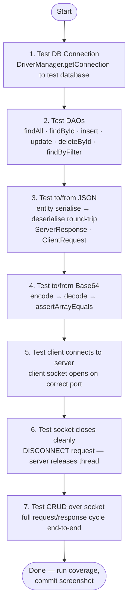

# Unit Testing — What Good Tests Look Like 

> **Prerequisites:**
> - You have a working JDBC DAO layer (t12)
> - You can serialise and deserialise Java objects to/from JSON (t16)
> - You have a running `ClientHandler` and `ServerResponse<T>` (t15)
> - JUnit 5 is already in your `pom.xml` (see the [JUnit setup cheatsheet](../../../shared/cheat%20sheets/cheatsheet_junit_in_intellij.md))

---

## What you'll learn

| Skill Type | You will be able to… |
| :- | :- |
| Understand | Describe what makes a test meaningful versus trivial or misleading. |
| Understand | Explain the Arrange–Act–Assert pattern and why it matters. |
| Understand | Explain what ≥70% line coverage means and what it does **not** guarantee. |
| Apply | Name tests using the `method_scenario_expectedBehaviour` convention. |
| Apply | Write DTO/entity constructor validation tests that exercise guard clauses. |
| Apply | Write DAO integration tests against a dedicated test database. |
| Apply | Write JSON round-trip tests that verify serialise → deserialise produces an equal object. |
| Apply | Write `ServerResponse<T>` and `ClientRequest` unit tests. |
| Apply | Write binary encoding tests that verify Base64 round-trips and BLOB storage. |
| Apply | Run IntelliJ coverage and interpret the result for your GCA2 submission. |
| Analyse | Identify which classes in a GCA2 project require the most thorough test coverage. |

---

## Why this matters

GCA2 Stage 4 requires **≥70% line coverage** across your DAO, JSON handling, and binary handling classes, plus a test suite that demonstrates you understand what you built.

A passing coverage number is the floor, not the goal. A project with 70% coverage built from trivial tests (tests that would pass even if your code was completely wrong) earns no credit for test quality.

This note tells you:
1. what a good test actually tests,
2. what makes a test trivial or useless,
3. exactly which scenarios to cover in each layer of your GCA2 project.

---

## How this builds on what you know

| Previous concept | How it reappears here |
| :- | :- |
| DAO interface + JDBC implementation (t12) | DAO methods are what you call in integration tests |
| Jackson `ObjectMapper` (t16) | Round-trip tests serialise then deserialise to verify no data is lost |
| `ServerResponse<T>` (t15) | Tests verify `ok(...)` sets the right status and `error(...)` sets `null` data |
| Defensive coding (null/blank validation) | Constructor guard tests check that invalid inputs are rejected |
| `Optional<T>` (t12) | `findById` tests check both the present and empty paths |

---

## Key terms

### Unit test
A test that calls a **single method** on a **single class**, checks the result, and has no dependencies on other classes or external systems.

### Integration test
A test that exercises **more than one class working together**, often including an external system such as a database. DAO tests that connect to MySQL are integration tests, even though we call the file `...Test.java`.

### AAA (Arrange–Act–Assert)
The three-section structure every test should have:
- **Arrange** — set up the inputs and objects needed
- **Act** — call the one thing being tested
- **Assert** — check the result

### Test method name
The full name of the test as shown in IntelliJ's test runner. Good names describe the scenario at a glance.

### Line coverage
The percentage of executable source lines that were executed during the test run. A line counts as covered if it ran at least once.

### Test database
A separate MySQL database used only during testing. It has the same schema as your main database but is reset before each test run so tests are independent and repeatable.

---

## Part 1 — Anatomy of a good test

### AAA in practice

Every test you write should have exactly three clearly separated concerns.

```java
@Test
void insert_validPlayer_returnsPositiveId() throws Exception {

    // Arrange
    String name     = "Alice";
    String position = "Striker";

    // Act
    int id = _playerDao.insert(name, position);

    // Assert
    assertTrue(id > 0, "generated id must be positive");
}
```

The three sections are short, direct, and obvious. If you find your Arrange growing to 20 lines, you are probably testing too many things at once.

---

### Test naming convention

Use the pattern: `methodName_scenario_expectedBehaviour`

| Good name | What it tells you immediately |
| :- | :- |
| `insert_validPlayer_returnsPositiveId` | `insert` with valid input → ID > 0 |
| `findById_existingId_returnsPresent` | `findById` for a known ID → `Optional` is present |
| `findById_nonexistentId_returnsEmpty` | `findById` for unknown ID → `Optional` is empty |
| `constructor_nullName_throwsIllegalArgument` | constructor with null name → exception |
| `toJson_validPlayer_roundTripEqualsOriginal` | JSON round-trip → deserialized object equals original |

When a test fails, its name should tell you exactly what broke without opening the test file.

---

### The single-purpose rule

One test, one scenario. If a test has five assertions that check unrelated things, you cannot tell from the failure report which scenario broke.

This is fine — each test checks one specific outcome:

```java
@Test void findById_existingId_returnsPresent()  throws Exception { ... }
@Test void findById_nonexistentId_returnsEmpty() throws Exception { ... }
@Test void findById_negativeId_returnsEmpty()    throws Exception { ... }
```

This is not — one test name, three unrelated scenarios:

```java
@Test
void playerDaoTest() throws Exception {
    List<Player> all = _playerDao.findAll();
    assertFalse(all.isEmpty());
    Optional<Player> found = _playerDao.findById(1);
    assertTrue(found.isPresent());
    int id = _playerDao.insert("Bob", "Keeper");
    assertTrue(id > 0);
}
```

---

### What makes a test worthless

#### Anti-pattern 1 — Testing that an object was constructed

```java
// BAD: assertNotNull on a freshly-created object is always true
@Test
void playerConstructorTest() {
    Player p = new Player(1, "Alice", "Striker", 5);
    assertNotNull(p);
}
```

This test passes even if your constructor does nothing at all. It tests that Java's `new` keyword works.

#### Anti-pattern 2 — Testing a getter

```java
// BAD: you are testing Java's field-read mechanism, not your code
@Test
void getNameReturnsName() {
    Player p = new Player(1, "Alice", "Striker", 5);
    assertEquals("Alice", p.getName());
}
```

If your constructor stores the value and your getter returns it, this test adds no protection. Write a test that checks what your constructor **does** with the input (trim, validate, reject).

#### Anti-pattern 3 — A test that always passes

```java
// BAD: this passes regardless of what your code does
@Test
void test1() {
    assertTrue(true);
}
```

#### Anti-pattern 4 — Testing DAO behaviour inside an entity test

```java
// BAD: entity tests and DAO tests are mixed — failure is ambiguous
@Test
void playerTest() throws Exception {
    Player p = new Player(1, "Alice", "Striker", 5);
    assertNotNull(p);
    List<Player> list = _playerDao.findAll();
    assertFalse(list.isEmpty());
    int id = _playerDao.insert("Bob", "Keeper");
    assertTrue(id > 0);
}
```

Entity tests go in `PlayerTest`. DAO tests go in `PlayerDaoTest`. Never both.

#### Anti-pattern 5 — No assertion

```java
// BAD: this just calls the method and hopes it doesn't throw
@Test
void insertPlayer() throws Exception {
    _playerDao.insert("Alice", "Striker");
}
```

A test with no assertion is not a test. It is noise that inflates your coverage number without verifying anything.

---

## Part 2 — DTO / entity validation tests

Your entity constructors contain guard clauses: null checks, blank checks, range checks. These are some of the easiest and most valuable tests to write.

The goal is to test **every guard** with the **exact input that triggers it**.

```java
public class PlayerTest {

    @Test
    void constructor_nullName_throwsIllegalArgument() {
        assertThrows(IllegalArgumentException.class,
            () -> new Player(1, null, "Striker", 5));
    }

    @Test
    void constructor_blankName_throwsIllegalArgument() {
        assertThrows(IllegalArgumentException.class,
            () -> new Player(1, "   ", "Striker", 5));
    }

    @Test
    void constructor_negativeGoals_throwsIllegalArgument() {
        assertThrows(IllegalArgumentException.class,
            () -> new Player(1, "Alice", "Striker", -1));
    }

    @Test
    void constructor_validInput_trimsName() {
        Player p = new Player(1, "  Alice  ", "Striker", 5);
        assertEquals("Alice", p.getName());
    }

    @Test
    void constructor_validInput_normalisesPosition() {
        Player p = new Player(1, "Alice", "  striker  ", 5);
        assertEquals("STRIKER", p.getPosition());
    }
}
```

One test per guard clause. If a constructor has four guards, you need at least four tests — one that reaches each guard and confirms it fires.

---

## Part 3 — DAO integration tests

DAO tests connect to a real MySQL database.
They are integration tests, not unit tests, but that is the appropriate choice here: a DAO that works only against a mock is not proven to work against a real database.

### Test database setup

Create a **separate database** for testing so you never corrupt your development data:

```sql
CREATE DATABASE IF NOT EXISTS gca2_test_db;
-- Run your same mysqlSetup.sql against this database
```

Your test class points its DAO at `gca2_test_db`, not `gca2_db`.

### `@BeforeEach` and `@AfterEach`

Every test needs a **known starting state** in the database.

```java
public class PlayerDaoTest {

    private static final String URL  =
        "jdbc:mysql://localhost:3306/gca2_test_db?useSSL=false&serverTimezone=UTC&allowPublicKeyRetrieval=true";
    private static final String USER = "gca2_user";
    private static final String PASS = "your_password";

    private PlayerDao _dao;

    @BeforeEach
    void setUp() throws Exception {
        _dao = new JdbcPlayerDao(URL, USER, PASS);

        // Wipe all rows so every test starts clean
        try (Connection c = DriverManager.getConnection(URL, USER, PASS);
             PreparedStatement ps = c.prepareStatement("DELETE FROM players")) {
            ps.executeUpdate();
        }
    }
}
```

`DELETE FROM players` before each test means no test can be broken by left-over data from a previous test.

---

### DAO test catalogue

The table below shows the scenarios you must cover. Each row is one test method.

| Method | Scenario | Assertion |
| :- | :- | :- |
| `insert` | Valid input | `assertTrue(id > 0)` |
| `insert` | Null required field | `assertThrows(IllegalArgumentException.class, ...)` |
| `findById` | ID that was just inserted | `assertTrue(result.isPresent())` |
| `findById` | ID that was never inserted | `assertTrue(result.isEmpty())` |
| `findById` | Negative ID | `assertTrue(result.isEmpty())` |
| `findAll` | Called after inserting 3 rows | `assertEquals(3, result.size())` |
| `findAll` | Called on empty table | `assertTrue(result.isEmpty())` |
| `update` | ID that exists | `assertTrue(updated)` |
| `update` | ID that does not exist | `assertFalse(updated)` |
| `deleteById` | ID that exists | `assertTrue(deleted)` — then `findById` returns empty |
| `deleteById` | ID that does not exist | `assertFalse(deleted)` |
| `findByFilter` | Filter matching 2 of 3 rows | `assertEquals(2, result.size())` |
| `findByFilter` | Filter matching nothing | `assertTrue(result.isEmpty())` |

```java
    @Test
    void insert_validPlayer_returnsPositiveId() throws Exception {
        int id = _dao.insert("Alice", "Striker");
        assertTrue(id > 0);
    }

    @Test
    void findById_insertedPlayer_returnsPresent() throws Exception {
        int id = _dao.insert("Bob", "Keeper");
        Optional<Player> result = _dao.findById(id);
        assertTrue(result.isPresent());
        assertEquals("Bob", result.get().getName());
    }

    @Test
    void findById_nonexistentId_returnsEmpty() throws Exception {
        Optional<Player> result = _dao.findById(99999);
        assertTrue(result.isEmpty());
    }

    @Test
    void findAll_afterInsertingThreePlayers_returnsThree() throws Exception {
        _dao.insert("Alice",   "Striker");
        _dao.insert("Bob",     "Keeper");
        _dao.insert("Charlie", "Midfielder");

        List<Player> all = _dao.findAll();
        assertEquals(3, all.size());
    }

    @Test
    void findAll_emptyTable_returnsEmptyList() throws Exception {
        List<Player> all = _dao.findAll();
        assertTrue(all.isEmpty());
    }

    @Test
    void deleteById_existingId_returnsTrueAndRemovesRow() throws Exception {
        int id = _dao.insert("Dave", "Defender");
        assertTrue(_dao.deleteById(id));
        assertTrue(_dao.findById(id).isEmpty());
    }

    @Test
    void deleteById_nonexistentId_returnsFalse() throws Exception {
        assertFalse(_dao.deleteById(99999));
    }

    @Test
    void findByFilter_positionMatch_returnsOnlyStrikers() throws Exception {
        _dao.insert("Alice",   "Striker");
        _dao.insert("Bob",     "Keeper");
        _dao.insert("Charlie", "Striker");

        List<Player> strikers = _dao.findByFilter(p -> "Striker".equals(p.getPosition()));
        assertEquals(2, strikers.size());
        assertTrue(strikers.stream().allMatch(p -> "Striker".equals(p.getPosition())));
    }
```

---

## Part 4 — JSON round-trip tests

A round-trip test verifies that serialise → deserialise produces an object **equal to the original**. This requires a correct `equals` implementation on your entity.

```java
public class PlayerJsonTest {

    private final ObjectMapper _mapper = new ObjectMapper();

    @Test
    void toJson_validPlayer_roundTripEqualsOriginal() throws Exception {
        Player original = new Player(1, "Alice", "Striker", 5);

        // Arrange + Act
        String json         = _mapper.writeValueAsString(original);
        Player deserialised = _mapper.readValue(json, Player.class);

        // Assert
        assertEquals(original, deserialised);
    }

    @Test
    void toJson_playerList_roundTripPreservesSize() throws Exception {
        List<Player> original = List.of(
            new Player(1, "Alice",   "Striker",    5),
            new Player(2, "Bob",     "Keeper",     0),
            new Player(3, "Charlie", "Midfielder", 2)
        );

        String json = _mapper.writeValueAsString(original);
        List<Player> deserialised = _mapper.readValue(json, new TypeReference<List<Player>>() {});

        assertEquals(original.size(), deserialised.size());
        assertEquals(original.get(0), deserialised.get(0));
    }
}
```

> **Prerequisite for round-trip equality:** Your entity class must have:
> - a public no-arg constructor (Jackson needs this to deserialise)
> - `equals` and `hashCode` implemented (so `assertEquals` compares field values, not references)

---

### `ServerResponse<T>` tests

Test both the `ok(...)` factory and the `error(...)` factory. These are pure unit tests — no database required.

```java
public class ServerResponseTest {

    @Test
    void ok_setsStatusAndData() {
        ServerResponse<String> r = ServerResponse.ok("done", "hello");
        assertEquals("OK",    r.getStatus());
        assertEquals("done",  r.getMessage());
        assertEquals("hello", r.getData());
        assertTrue(r.isOk());
    }

    @Test
    void error_setsStatusAndNullData() {
        ServerResponse<String> r = ServerResponse.error("not found");
        assertEquals("ERROR",     r.getStatus());
        assertEquals("not found", r.getMessage());
        assertNull(r.getData());
        assertFalse(r.isOk());
    }

    @Test
    void ok_serialisesToJson_containsStatusOk() throws Exception {
        ObjectMapper mapper = new ObjectMapper();
        ServerResponse<Integer> r = ServerResponse.ok("created", 42);
        String json = mapper.writeValueAsString(r);
        assertTrue(json.contains("\"status\":\"OK\""));
        assertTrue(json.contains("42"));
    }
}
```

---

### `ClientRequest` tests

Test that `getInt` and `getString` extract payload values correctly, including the fallback for missing keys.

```java
public class ClientRequestTest {

    private ClientRequest buildRequest(String type, Map<String, Object> payload) throws Exception {
        ObjectMapper mapper = new ObjectMapper();
        Map<String, Object> raw = new HashMap<>();
        raw.put("requestType", type);
        raw.put("payload", payload);
        String json = mapper.writeValueAsString(raw);
        return mapper.readValue(json, ClientRequest.class);
    }

    @Test
    void getInt_presentKey_returnsValue() throws Exception {
        ClientRequest req = buildRequest("GET_BY_ID", Map.of("id", 7));
        assertEquals(7, req.getInt("id"));
    }

    @Test
    void getInt_missingKey_returnsMinusOne() throws Exception {
        ClientRequest req = buildRequest("GET_ALL", Map.of());
        assertEquals(-1, req.getInt("id"));
    }

    @Test
    void getString_presentKey_returnsValue() throws Exception {
        ClientRequest req = buildRequest("INSERT", Map.of("name", "Alice"));
        assertEquals("Alice", req.getString("name"));
    }

    @Test
    void getString_missingKey_returnsNull() throws Exception {
        ClientRequest req = buildRequest("GET_ALL", Map.of());
        assertNull(req.getString("name"));
    }
}
```

---

## Part 5 — Binary handling tests

### Base64 round-trip

The simplest binary test: encode bytes to Base64 then decode back — the result must be byte-for-byte identical to the original.

```java
public class BinaryEncodingTest {

    @Test
    void base64_encodeDecodeRoundTrip_bytesMatch() {
        byte[] original = { 72, 101, 108, 108, 111 };  // "Hello" in ASCII

        String encoded = Base64.getEncoder().encodeToString(original);
        byte[] decoded = Base64.getDecoder().decode(encoded);

        assertArrayEquals(original, decoded);
    }

    @Test
    void base64_encodeDecodeRoundTrip_largerPayload() {
        byte[] original = new byte[1024];
        new java.util.Random(42).nextBytes(original);

        String encoded = Base64.getEncoder().encodeToString(original);
        byte[] decoded = Base64.getDecoder().decode(encoded);

        assertArrayEquals(original, decoded);
    }
}
```

### BLOB storage round-trip

Test that bytes stored into the database are retrieved unchanged.
Use your test database and clean up with `@BeforeEach`.

```java
public class PlayerBlobDaoTest {

    private PlayerDao _dao;

    @BeforeEach
    void setUp() throws Exception {
        // Create DAO pointed at gca2_test_db
        _dao = new JdbcPlayerDao(URL, USER, PASS);

        try (Connection c = DriverManager.getConnection(URL, USER, PASS);
             PreparedStatement ps = c.prepareStatement("DELETE FROM players")) {
            ps.executeUpdate();
        }
    }

    @Test
    void uploadAndRetrieve_smallImage_bytesMatch() throws Exception {
        byte[] imageBytes = { 10, 20, 30, 40, 50 };
        String fileName   = "photo.png";
        String mimeType   = "image/png";

        int id = _dao.insertWithBlob("Alice", "Striker", imageBytes, fileName, mimeType);

        byte[] retrieved = _dao.getBlobById(id);
        assertArrayEquals(imageBytes, retrieved,
            "retrieved bytes must be identical to uploaded bytes");
    }

    @Test
    void getMetadataOnly_doesNotReturnBlobBytes() throws Exception {
        byte[] imageBytes = new byte[5000];
        int id = _dao.insertWithBlob("Bob", "Keeper", imageBytes, "img.jpg", "image/jpeg");

        // Metadata-only method must not throw and must return a non-null result
        PlayerFileMetadata meta = _dao.getFileMetadata(id);
        assertNotNull(meta);
        assertEquals("img.jpg",    meta.getFileName());
        assertEquals("image/jpeg", meta.getMimeType());
    }
}
```

---

## Part 6 — What ≥70% coverage means

### How to run coverage in IntelliJ

1. Right-click your test class or the `test/` folder in the Project view.
2. Select **Run 'XxxTest' with Coverage** (or use the gutter icon and choose **Run with Coverage**).
3. IntelliJ opens the **Coverage** tool window on the right.
4. Classes are listed with their line and branch percentages.

Commit a screenshot of this view to `/reports/coverage.png` as required by the GCA2 brief.

### What counts as a covered line

A line is covered if **at least one test executes it**.

```java
// These three lines each count separately:
if (title == null || title.isBlank())          // line 1
    throw new IllegalArgumentException("...");  // line 2 — only covered if the guard fires
_title = title.trim();                          // line 3 — only covered if input is valid
```

To reach 70% on your DAO classes, you need tests that exercise both branches of every `if` — the path where the guard fires and the path where it doesn't.

### What 70% does NOT guarantee

| What coverage measures | What coverage does not tell you |
| :- | :- |
| Which lines were executed | Whether the result is correct |
| Whether your if-branches ran | Whether the right value was returned |
| That a method was called | That the method behaved as specified |

A test that calls `findAll()` and throws away the result covers those lines but asserts nothing about correctness. Coverage is a measure of **what was exercised**, not **what was verified**.

**Rule:** every line that coverage shows as green should have at least one assertion depending on what that line does.

### Which classes to prioritise

| Class category | Target coverage | Why |
| :- | :- | :- |
| JDBC DAO implementations | ≥70% | Most complex and most likely to contain bugs |
| Entity/DTO constructors | ≥70% | Guard clauses protect every other layer |
| JSON conversion helpers | ≥70% | Serialisation bugs are silent and hard to debug |
| `ServerResponse<T>` | ≥70% | Used in every response path |
| Binary handling methods | ≥70% | Byte corruption is the hardest class of bug to spot |
| `Server` / accept loop | Not required | Concurrency and socket lifecycle are hard to test in JUnit |
| `ClientHandler.run()` | Not required | Live socket I/O is not a JUnit target |

---

## Part 7 — GCA2 Stage 4 test checklist

Use this list to verify you have written the right tests before submitting.

### DTO / entity tests

- [ ] Constructor rejects `null` for each required `String` field
- [ ] Constructor rejects blank/whitespace-only for each required `String` field
- [ ] Constructor rejects out-of-range values for each numeric field
- [ ] Constructor trims and/or normalises `String` fields correctly

### DAO tests (one `@BeforeEach` that cleans the test table)

- [ ] `insert` with valid input → returned ID is positive
- [ ] `insert` with invalid input → `IllegalArgumentException` is thrown before any DB call
- [ ] `findById` with the ID returned by a prior `insert` → `Optional` is present, name matches
- [ ] `findById` with an ID that was never inserted → `Optional` is empty
- [ ] `findAll` after inserting N rows → list size equals N
- [ ] `findAll` on an empty table → list is empty (not null)
- [ ] `update` with a valid existing ID → returns `true`
- [ ] `update` with an ID that does not exist → returns `false`
- [ ] `deleteById` with a valid existing ID → returns `true`, subsequent `findById` returns empty
- [ ] `deleteById` with an ID that does not exist → returns `false`
- [ ] `findByFilter(Predicate<T>)` with a filter matching a subset → correct count returned
- [ ] `findByFilter(Predicate<T>)` with a filter matching nothing → empty list returned

### JSON tests

- [ ] Serialise entity → deserialise → `assertEquals` to original (round-trip)
- [ ] Serialise a `List<Entity>` → deserialise → size and first element match
- [ ] `ServerResponse.ok(message, data)` → status is `"OK"`, data is present, `isOk()` is true
- [ ] `ServerResponse.error(message)` → status is `"ERROR"`, data is `null`, `isOk()` is false
- [ ] `ClientRequest.getInt("id")` → correct value extracted from payload
- [ ] `ClientRequest.getInt("id")` for missing key → returns `-1`
- [ ] `ClientRequest.getString("name")` → correct value extracted
- [ ] `ClientRequest.getString("name")` for missing key → returns `null`

### Binary handling tests

- [ ] Base64 encode → decode round-trip → `assertArrayEquals` original bytes
- [ ] Insert entity with BLOB bytes → retrieve BLOB bytes → `assertArrayEquals` original bytes
- [ ] Metadata-only query → `fileName` and `mimeType` correct, no exception thrown

---

## Common mistakes

| Mistake | What happens | Fix |
| :- | :- | :- |
| Using `assertNotNull(new Player(...))` as your only test | Coverage goes up; no behaviour is verified | Test what the constructor **does**: validation, trimming, normalisation |
| Pointing test DAO at production database | Tests delete or corrupt your development data | Always use a dedicated test database |
| Skipping `@BeforeEach` cleanup | Tests pass in isolation, fail in sequence because previous test left rows | Always reset the table to known state before each test |
| One test method with ten assertions | Hard to diagnose: you see one red, not which scenario failed | One test per scenario |
| Forgetting the no-arg constructor on your entity | `_mapper.readValue(...)` throws `InvalidDefinitionException` | Add `public Player() {}` for Jackson; your DAO constructor still validates |
| Comparing `Optional` with `assertEquals` | Compares the Optional wrapper, not the value inside | Use `assertTrue(result.isPresent())` then `assertEquals(expected, result.get())` |
| Running `mvn test` without a running MySQL instance | All DAO tests fail with connection errors | Start MySQL before running tests; document this in your README |
| Screenshot taken after only running one test class | Coverage shows 80% for one class; other classes show 0% | Run coverage on the **entire test folder** (right-click `src/test/java`) |

---

## Practice tasks

1. Write all DTO/entity tests for **your own domain entity** (at least 4 guard-clause tests).
2. Write a complete `@BeforeEach` that resets your test table and inserts exactly 3 known rows.
3. Write the full DAO test catalogue for your primary entity (all rows in the checklist above).
4. Write a JSON round-trip test for your entity. If it fails with `InvalidDefinitionException`, fix the no-arg constructor issue first.
5. Run IntelliJ coverage on all your test classes at once. Identify the two classes with the lowest coverage and write new tests to close the gap.

---

## Reflective questions

1. Why is `assertNotNull(new Player(...))` considered a trivial test even though it runs the constructor?
2. What is the difference between a unit test and an integration test? Which category do your DAO tests fall into and why?
3. A team has 80% coverage and all tests pass. A bug in production crops up. How is that possible?
4. What would happen if you pointed your DAO test at your development database instead of a test database?
5. Why does a round-trip test (serialise then deserialise) require `equals` to be implemented on the entity?
6. Which class in your GCA2 project would take the most work to reach 70% coverage, and what tests would get you there?

---

## Further reading

- Tutorial: Get started with JUnit
  https://junit.org/junit5/docs/current/user-guide/
- JetBrains — Run tests with coverage in IntelliJ  
  https://www.jetbrains.com/help/idea/running-test-with-coverage.html

---

---

## Appendix A — GCA2 Stage 4: In What Order Should I Write My Tests?

### Recommended order

Start with the lowest layer and work up. Each step depends on the one before it being stable — if a later test fails, you know the failure is in the current layer, not something below it.



---

## Lesson Context

```yaml
previous_lesson:
  topic_code: t16_json
  domain_emphasis: Balanced

this_lesson:
  topic_code: t17_unit_testing
  primary_domain_emphasis: GCA2
  difficulty_tier: Intermediate
```
