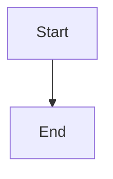
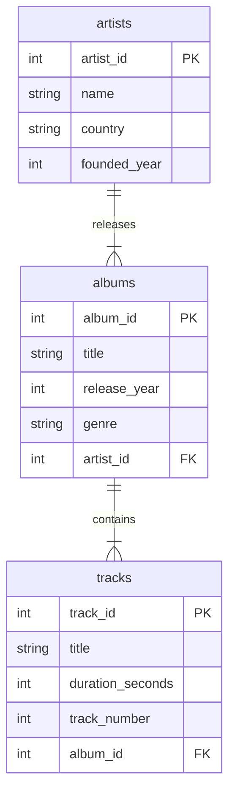
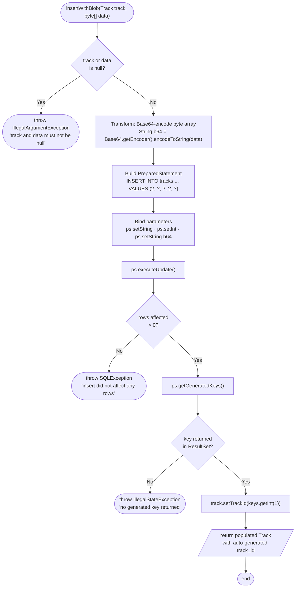
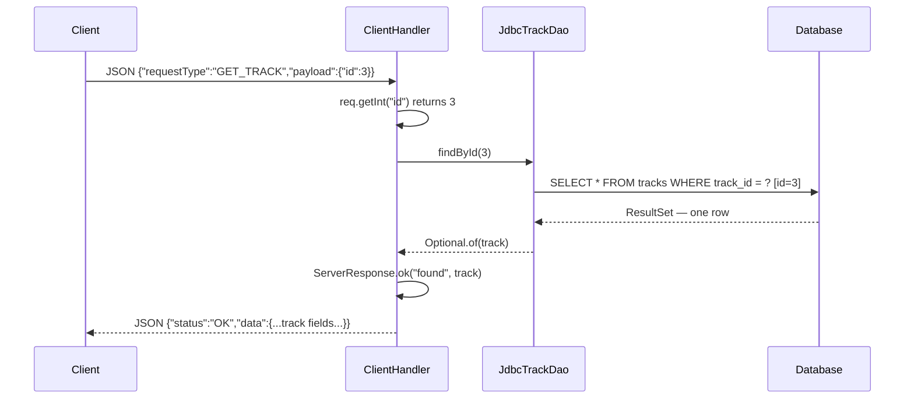
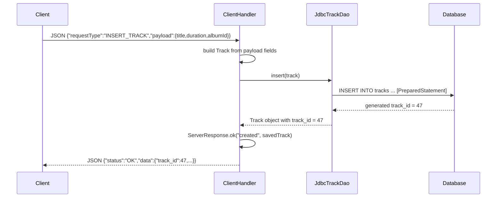
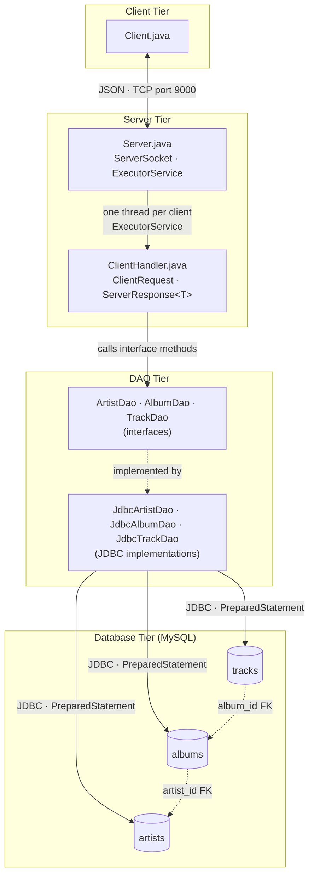
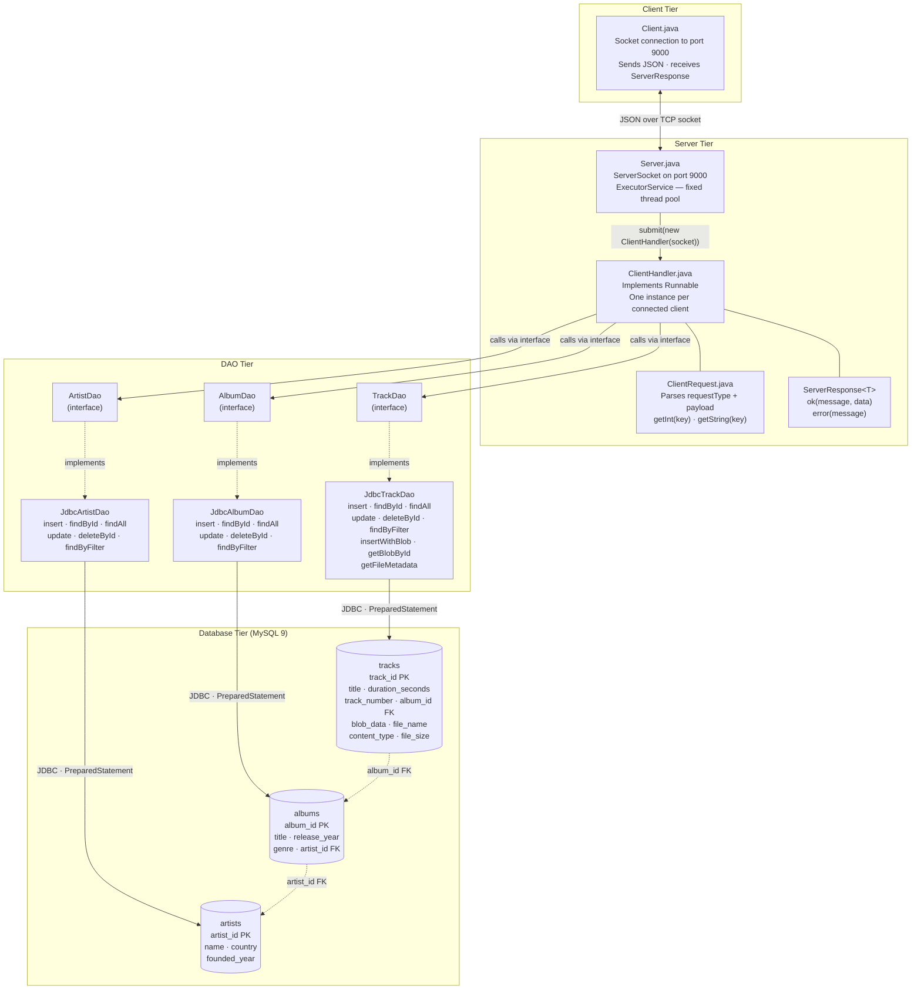

# Documenting a Project

> **Prerequisites:**
> - You have a working N-tier project with entities, DAO classes, a server, and at least one client
> - You are familiar with the DAO interface / JDBC implementation pattern (t12)
> - You understand the `ClientHandler` / `ServerResponse<T>` pattern (t15)

---

## What you'll learn

| Skill Type | You will be able to… |
| :- | :- |
| Understand | Explain what Javadoc is and when it is required versus optional. |
| Understand | Describe the purpose of each Javadoc tag (`@author`, `@param`, `@return`, `@throws`). |
| Understand | Distinguish between the four main Mermaid diagram types and when to use each. |
| Apply | Write correct class-level and method-level Javadoc for a GCA2 submission. |
| Apply | Produce a Mermaid ER diagram for a three-table relational schema. |
| Apply | Produce a Mermaid flowchart showing control flow through a method or handler. |
| Apply | Produce a Mermaid sequence diagram showing a client-server request/response. |
| Apply | Produce a Mermaid architecture diagram showing all tiers and communication paths of an N-tier system. |
| Analyse | Identify which classes and methods in a GCA2 project require Javadoc and which do not. |

---

## Why this matters

GCA2 requires an architecture diagram that shows all tiers and communication paths of your system, and Javadoc on all classes and non-trivial methods with correct `@author` attribution. These are assessed at every stage demo: your lecturer will ask you to open specific files and explain what the diagram represents or why a particular comment says what it does.

Documentation is not decoration. An architecture diagram that is missing a tier, or a Javadoc comment that only restates the method name, earns no credit and signals that you do not fully understand your own system.

This note gives you the tools and a complete worked example so that your documentation accurately reflects the system you built.

---

## How this builds on what you know

| Previous concept | How it reappears here |
| :- | :- |
| DAO interface + JDBC implementation (t12) | The DAO tier and its interface/implementation split appear in every diagram |
| `ServerResponse<T>` and `ClientHandler` (t15) | The server tier in architecture and sequence diagrams |
| Entity constructors with guard clauses | Class-level and method-level Javadoc describes these guards |
| MySQL schema with FK relationships | ER diagrams formalise the schema you already wrote in `mysqlSetup.sql` |

---

## Key terms

### Javadoc
A documentation tool built into the Java compiler. It reads specially formatted block comments (`/** ... */`) directly above classes, methods, and fields, and can generate HTML documentation from them. IntelliJ renders Javadoc inline as you hover over identifiers.

### Javadoc tag
A keyword prefixed with `@` inside a Javadoc comment that carries structured metadata. Common tags: `@author`, `@param`, `@return`, `@throws`.

### Mermaid
A plain-text diagramming language that is rendered into SVG by tools including GitHub, GitLab, IntelliJ (with the Mermaid plugin), and most modern Markdown viewers. Diagrams live inside fenced code blocks labelled ` ```mermaid `.

### ER diagram
An Entity-Relationship diagram. Shows the tables in a relational database, the columns in each table, and the relationships (foreign key constraints) between tables.

### Sequence diagram
Shows a time-ordered series of messages exchanged between participants (objects, classes, systems). Used to illustrate a single request/response cycle through a system.

### Architecture diagram
A high-level overview of all the components (tiers, classes, databases, external systems) that make up a system, and how they communicate. It answers the question: *what are the parts, and how do they connect?*

---

## The running example

All diagrams in this note use the same three-table music library system. This is a stand-in for any GCA2 domain — replace `Artist`, `Album`, and `Track` with whatever entities your group chose.

### Schema

| Table | Columns | Notes |
| :- | :- | :- |
| `artists` | `artist_id` PK, `name`, `country`, `founded_year` | Root table — no FK |
| `albums` | `album_id` PK, `title`, `release_year`, `genre`, `artist_id` FK | Many albums → one artist |
| `tracks` | `track_id` PK, `title`, `duration_seconds`, `track_number`, `album_id` FK | Many tracks → one album |

### Java layer

| Tier | Key classes |
| :- | :- |
| Entity | `Artist`, `Album`, `Track` |
| DAO interface | `ArtistDao`, `AlbumDao`, `TrackDao` |
| DAO implementation | `JdbcArtistDao`, `JdbcAlbumDao`, `JdbcTrackDao` |
| Server | `Server`, `ClientHandler` |
| Protocol | `ServerResponse<T>`, `ClientRequest` |
| Client | `Client` |

---

## Part 1 — Javadoc Comments

### What Javadoc is

Javadoc comments use `/** */` — two asterisks to open, one to close. Everything between them is documentation. Each `@tag` line carries structured information that tools and IDEs can parse.

```java
/**
 * One-sentence summary of what this class or method does.
 *
 * Optionally: a second paragraph with more detail.
 *
 * @tag value
 */
```

> Javadoc is **not** a block comment. A block comment uses `/* */`. Javadoc uses `/** */`. The extra `*` is what tells the Java compiler to treat it as documentation.

---

### Class-level Javadoc

Every class needs a Javadoc comment that states its purpose and identifies its authors. The GCA2 brief requires `@author` on every class so that individual contributions are traceable at demo.

```java
/**
 * Handles all database operations for Artist entities.
 * Implements the ArtistDao interface using JDBC and PreparedStatement.
 * All SQL uses parameterised queries — no string concatenation.
 *
 * @author Aoife Burke (primary)
 * @author Ciarán Walsh (contributor — refactored connection handling)
 */
public class JdbcArtistDao implements ArtistDao {
    // ...
}
```

The summary sentence states **what the class does**, not what it is. "Handles all database operations for Artist entities" is useful. "This is the JdbcArtistDao class" is not.

If only one person wrote the class, omit the contributor line:

```java
/**
 * Immutable data transfer object representing a music track.
 * Validates all fields in the constructor and trims String inputs.
 *
 * @author Aoife Burke
 */
public class Track {
    // ...
}
```

---

### Method-level Javadoc

Every non-trivial method needs a Javadoc comment. A method is non-trivial if it contains logic — validation, SQL, JSON conversion, computation. The four tags you use most often are:

| Tag | Purpose | Example |
| :- | :- | :- |
| `@param name` | Describes one parameter | `@param id the track_id to look up` |
| `@return` | Describes the return value | `@return Optional containing the Track if found, empty if not` |
| `@throws ExceptionType` | Names a checked or documented unchecked exception | `@throws SQLException if the database cannot be reached` |
| `@author` | Secondary author credit on a method (use sparingly) | `@author Ciarán Walsh` |

```java
/**
 * Retrieves a track by its primary key.
 * Returns an empty Optional rather than null if the id does not exist.
 *
 * @param id the track_id to search for; must be positive
 * @return Optional containing the matching Track, or Optional.empty() if not found
 * @throws SQLException if a database access error occurs
 */
@Override
public Optional<Track> findById(int id) throws SQLException {
    if (id <= 0) return Optional.empty();
    // ...
}
```

```java
/**
 * Inserts a new track record and returns the saved entity with its generated id.
 *
 * @param track the Track to persist; title and albumId must be valid
 * @return the inserted Track with track_id populated from getGeneratedKeys()
 * @throws IllegalArgumentException if track is null or contains invalid fields
 * @throws SQLException if the insert fails at the database level
 */
@Override
public Track insert(Track track) throws SQLException {
    // ...
}
```

---

### What does NOT need Javadoc

The GCA2 brief is explicit: trivial methods may omit Javadoc.

| Method type | Javadoc required? | Reason |
| :- | :- | :- |
| `getTitle()`, `getArtistId()` | No | Name already states purpose completely |
| `setTitle(String title)` | No | Name already states purpose completely |
| `toString()` | No | Standard override — no additional intent to document |
| `equals(Object o)`, `hashCode()` | No | Standard overrides |
| Constructor with no logic (`this.title = title`) | No | Trivial assignment |
| Constructor with validation logic | **Yes** | Documents what inputs are rejected and why |
| Any method containing an `if`, loop, or SQL | **Yes** | Logic that a reader needs to understand |

---

### Javadoc for the ServerResponse factory methods

`ServerResponse<T>` is used in every response path. Document both factories:

```java
/**
 * Creates a successful response carrying data.
 *
 * @param <T>     the type of the data payload
 * @param message a short human-readable description of the outcome
 * @param data    the payload to include; must not be null for an OK response
 * @return a ServerResponse with status "OK", the given message, and data
 */
public static <T> ServerResponse<T> ok(String message, T data) {
    // ...
}

/**
 * Creates an error response with no data payload.
 *
 * @param <T>     the expected data type (data will be null)
 * @param message a description of the error condition
 * @return a ServerResponse with status "ERROR", the given message, and null data
 */
public static <T> ServerResponse<T> error(String message) {
    // ...
}
```

---

## Part 2 — Mermaid Diagrams

Mermaid diagrams live inside a fenced code block with the language label `mermaid`:

````

````

GitHub, GitLab, and IntelliJ (with the Mermaid plugin) all render these to SVG automatically. You do not need to install any tool to write them — just write the text and push to GitHub.

The four diagram types you need for GCA2 are:

| Diagram type | Mermaid keyword | Use for |
| :- | :- | :- |
| ER diagram | `erDiagram` | Database schema — tables, columns, FK relationships |
| Flowchart | `flowchart TD` / `flowchart LR` | Control flow through a method, handler, or process |
| Sequence diagram | `sequenceDiagram` | Time-ordered messages between classes or systems |
| Architecture diagram | `flowchart TD` with subgraphs | System overview — tiers, classes, communication paths |

---

## Part 3 — ER Diagrams

An ER diagram documents the database schema. It shows every table, every column with its type and any key annotation, and the FK relationships that link tables together.

### Syntax reference

```
erDiagram
    TABLE_NAME {
        type  column_name  annotation
    }
    TABLE_A ||--o{ TABLE_B : "relationship label"
```

Relationship symbols:

| Symbol | Meaning |
| :- | :- |
| `\|\|` | Exactly one (mandatory) |
| `o\|` | Zero or one (optional) |
| `o{` | Zero or many |
| `\|{` | One or many (mandatory many) |

### Music library ER diagram



<details>
<summary>Source</summary>

```text
erDiagram
    artists {
        int    artist_id    PK
        string name
        string country
        int    founded_year
    }

    albums {
        int    album_id     PK
        string title
        int    release_year
        string genre
        int    artist_id    FK
    }

    tracks {
        int    track_id     PK
        string title
        int    duration_seconds
        int    track_number
        int    album_id     FK
    }

    artists ||--|{ albums : "releases"
    albums  ||--|{ tracks : "contains"
```

</details>

**Reading the relationships:**

- `artists ||--|{  albums` — one artist releases one or more albums; each album belongs to exactly one artist.
- `albums  ||--|{  tracks` — one album contains one or more tracks; each track belongs to exactly one album.

> The labels (`"releases"`, `"contains"`) describe the relationship from the perspective of the left-hand table. Choose a verb that makes the relationship readable in plain English.

---

## Part 4 — Flowcharts

A flowchart shows how execution moves through a piece of logic: decisions, branches, loops, and exits. Use it to document a single method or handler whose flow is not obvious from the code alone.

### Syntax reference

| Shape | Syntax | Use for |
| :- | :- | :- |
| Stadium / oval | `([Text])` | Start and end points |
| Rectangle | `[Text]` | A process step or transformation |
| Diamond | `{Text}` | A decision — always has two or more labelled outgoing arrows |
| Parallelogram | `[/Text/]` | Data received as input or produced as output |

| Arrow | Syntax | Use for |
| :- | :- | :- |
| Unlabelled | `A --> B` | Simple sequential flow |
| Labelled | `A -->\|label\| B` | Branch at a decision node |
| Dashed | `A -.-> B` | Optional or indirect flow |

Direction keywords: `flowchart TD` (top-down) or `flowchart LR` (left-right).

### Binary upload flow — `insertWithBlob`

The flowchart below documents `JdbcTrackDao.insertWithBlob()`. It shows a guard check, two transformations, a DB operation, and three distinct exit paths — one success and two errors.



<details>
<summary>Source</summary>

```text
flowchart TD
    START(["insertWithBlob(Track track, byte[] data)"])

    START  --> GUARD{"track or data\nis null?"}
    GUARD  -->|Yes| ERR1(["throw IllegalArgumentException\n'track and data must not be null'"])
    GUARD  -->|No| ENC["Transform: Base64-encode byte array\nString b64 = Base64.getEncoder().encodeToString(data)"]

    ENC    --> BUILD["Build PreparedStatement\nINSERT INTO tracks ... VALUES (?, ?, ?, ?, ?)"]
    BUILD  --> BIND["Bind parameters\nps.setString · ps.setInt · ps.setString b64"]
    BIND   --> EXEC["ps.executeUpdate()"]

    EXEC   --> ROWS{"rows affected\n> 0?"}
    ROWS   -->|No| ERR2(["throw SQLException\n'insert did not affect any rows'"])
    ROWS   -->|Yes| KEYS["ps.getGeneratedKeys()"]

    KEYS   --> KEYCHK{"key returned\nin ResultSet?"}
    KEYCHK -->|No| ERR3(["throw IllegalStateException\n'no generated key returned'"])
    KEYCHK -->|Yes| SET["track.setTrackId(keys.getInt(1))"]

    SET    --> OUT[/"return populated Track\nwith auto-generated track_id"/]
    OUT    --> DONE(["end"])
```

</details>

> **TD vs LR:** Use `flowchart TD` for processes that read naturally top-to-bottom, such as a method body. Use `flowchart LR` when you have a wide fan-out of parallel branches that would be too tall in TD layout.

---

## Part 5 — Sequence Diagrams

A sequence diagram shows messages passing between participants in time order. Use it to document a single end-to-end request/response cycle — from the client sending a request, through the server, DAO, and database, to the response arriving back at the client.

### Syntax reference

```
sequenceDiagram
    participant A
    participant B
    A->>B: message          solid arrow (method call / request)
    B-->>A: message         dashed arrow (return / response)
    Note over A,B: text     annotation spanning participants
```

### GET_TRACK_BY_ID request cycle



<details>
<summary>Source</summary>

```text
sequenceDiagram
    participant Client
    participant ClientHandler
    participant JdbcTrackDao
    participant Database

    Client->>ClientHandler: JSON {"requestType":"GET_TRACK","payload":{"id":3}}

    ClientHandler->>ClientHandler: req.getInt("id") returns 3

    ClientHandler->>JdbcTrackDao: findById(3)

    JdbcTrackDao->>Database: SELECT * FROM tracks WHERE track_id = ?  [id=3]
    Database-->>JdbcTrackDao: ResultSet — one row

    JdbcTrackDao-->>ClientHandler: Optional.of(track)

    ClientHandler->>ClientHandler: ServerResponse.ok("found", track)

    ClientHandler-->>Client: JSON {"status":"OK","data":{...track fields...}}
```

</details>

### INSERT_TRACK request cycle

A second scenario shows the insert path, including the auto-generated key being returned:



<details>
<summary>Source</summary>

```text
sequenceDiagram
    participant Client
    participant ClientHandler
    participant JdbcTrackDao
    participant Database

    Client->>ClientHandler: JSON {"requestType":"INSERT_TRACK","payload":{title,duration,albumId}}

    ClientHandler->>ClientHandler: build Track from payload fields

    ClientHandler->>JdbcTrackDao: insert(track)

    JdbcTrackDao->>Database: INSERT INTO tracks ... [PreparedStatement]
    Database-->>JdbcTrackDao: generated track_id = 47

    JdbcTrackDao-->>ClientHandler: Track object with track_id = 47

    ClientHandler->>ClientHandler: ServerResponse.ok("created", savedTrack)

    ClientHandler-->>Client: JSON {"status":"OK","data":{"track_id":47,...}}
```

</details>

> Sequence diagrams document **one scenario at a time** — not every possible path. Write one diagram per meaningful request type. The `GET_ALL_TRACKS` and `DELETE_TRACK` cycles follow the same structural pattern and do not need separate diagrams unless the routing is materially different.

---

## Part 6 — Architecture Diagrams

The architecture diagram is the hardest diagram to get right because it must show the system **as a whole** — all tiers, all key classes, and all communication paths — without becoming an unreadable wall of boxes.

The approach that works best for GCA2 is:

1. Use `flowchart TD` with **subgraphs** — one subgraph per tier.
2. Put key class names inside the nodes, not just tier labels.
3. Label every arrow with the **mechanism** of communication (JSON, JDBC, TCP socket).
4. Show the interface/implementation split in the DAO tier explicitly.

### Tier overview (simplified)

Start with a tier-level summary. This is the diagram you put at the top of your README.



<details>
<summary>Source</summary>

```text
flowchart TD
    subgraph CLIENT ["Client Tier"]
        CLI["Client.java"]
    end

    subgraph SERVER ["Server Tier"]
        SRV["Server.java\nServerSocket · ExecutorService"]
        CH["ClientHandler.java\nClientRequest · ServerResponse<T>"]
    end

    subgraph DAO ["DAO Tier"]
        INTF["ArtistDao · AlbumDao · TrackDao\n(interfaces)"]
        IMPL["JdbcArtistDao · JdbcAlbumDao · JdbcTrackDao\n(JDBC implementations)"]
    end

    subgraph DB ["Database Tier  (MySQL)"]
        direction LR
        T1[(artists)]
        T2[(albums)]
        T3[(tracks)]
    end

    CLI     <-->|"JSON · TCP port 9000"| SRV
    SRV     -->|"one thread per client\nExecutorService"| CH
    CH      -->|"calls interface methods"| INTF
    INTF    -.->|"implemented by"| IMPL
    IMPL    -->|"JDBC · PreparedStatement"| T1
    IMPL    -->|"JDBC · PreparedStatement"| T2
    IMPL    -->|"JDBC · PreparedStatement"| T3
    T2      -.->|"artist_id FK"| T1
    T3      -.->|"album_id FK"| T2
```

</details>

**Reading the arrows:**

| Arrow style | Meaning |
| :- | :- |
| `<-->` solid bidirectional | Data flows both ways (request and response) |
| `-->` solid with label | A direct method call or network connection |
| `-.->` dashed | A structural relationship: implements, extends, or foreign key |

---

### Full class-level architecture diagram

This second version includes every significant class and is suitable for committing as the project's architecture artefact. It is the diagram the GCA2 brief refers to when it says "Client → Server (socket); Server → DAO → Database; JSON protocol layer; binary file upload/retrieval flow."



<details>
<summary>Source</summary>

```text
flowchart TD
    subgraph CLIENT ["Client Tier"]
        CLI["Client.java\nSocket connection to port 9000\nSends JSON · receives ServerResponse"]
    end

    subgraph SERVER ["Server Tier"]
        direction TB
        SRV["Server.java\nServerSocket on port 9000\nExecutorService — fixed thread pool"]
        CH["ClientHandler.java\nImplements Runnable\nOne instance per connected client"]
        CR["ClientRequest.java\nParses requestType + payload\ngetInt(key) · getString(key)"]
        SR["ServerResponse<T>\nok(message, data)\nerror(message)"]
        SRV -->|"submit(new ClientHandler(socket))"| CH
        CH --- CR
        CH --- SR
    end

    subgraph DAO ["DAO Tier"]
        direction TB
        AI["ArtistDao\n(interface)"]
        ALI["AlbumDao\n(interface)"]
        TI["TrackDao\n(interface)"]
        AJ["JdbcArtistDao\ninsert · findById · findAll\nupdate · deleteById · findByFilter"]
        ALJ["JdbcAlbumDao\ninsert · findById · findAll\nupdate · deleteById · findByFilter"]
        TJ["JdbcTrackDao\ninsert · findById · findAll\nupdate · deleteById · findByFilter\ninsertWithBlob · getBlobById\ngetFileMetadata"]
        AI  -.->|implements| AJ
        ALI -.->|implements| ALJ
        TI  -.->|implements| TJ
    end

    subgraph DB ["Database Tier  (MySQL 9)"]
        direction LR
        T1[(artists\nartist_id PK\nname · country\nfounded_year)]
        T2[(albums\nalbum_id PK\ntitle · release_year\ngenre · artist_id FK)]
        T3[(tracks\ntrack_id PK\ntitle · duration_seconds\ntrack_number · album_id FK\nblob_data · file_name\ncontent_type · file_size)]
    end

    CLI  <-->|"JSON over TCP socket"| SRV
    CH   -->|"calls via interface"| AI
    CH   -->|"calls via interface"| ALI
    CH   -->|"calls via interface"| TI
    AJ   -->|"JDBC · PreparedStatement"| T1
    ALJ  -->|"JDBC · PreparedStatement"| T2
    TJ   -->|"JDBC · PreparedStatement"| T3
    T2   -.->|"artist_id FK"| T1
    T3   -.->|"album_id FK"| T2
```

</details>

> **Tip:** If your project has a BLOB column, show it in the relevant table node as above. The GCA2 brief specifically requires the binary file upload/retrieval flow to be visible in the architecture diagram. A reviewer should be able to see at a glance which table stores the BLOB and which DAO class accesses it.

---

### Where each diagram goes in your repository

| Diagram | Where it lives | Format |
| :- | :- | :- |
| Architecture diagram (tier overview) | README — Architecture section | Mermaid code block |
| Architecture diagram (full class-level) | README — or committed as `/docs/architecture.md` | Mermaid code block |
| ER diagram | README — Database section | Mermaid code block |
| Sequence diagrams | README — Protocol section, one per request type | Mermaid code block |
| Flowcharts | Inline in the notes file that explains the relevant method | Mermaid code block |

---

## Common mistakes

| Mistake | What it looks like | Fix |
| :- | :- | :- |
| Javadoc that restates the method name | `/** Returns the title. */ public String getTitle()` | Remove it — getters do not need Javadoc |
| Missing `@author` on a class | Class-level comment has no `@author` tag | Add `@author Name (primary)` to every class |
| `@param` with no description | `@param id` | Always add what the parameter represents: `@param id the track_id to look up; must be positive` |
| Architecture diagram missing a tier | DAO tier shown but database tier absent | Every tier must appear: Client · Server · DAO · Database |
| Architecture diagram using only tier labels | Boxes say "Server", "Database" with no class names | Add key class names inside each node |
| ER diagram with no relationship labels | `artists ||--|{ albums :` (blank label) | Always add a verb label: `"releases"` |
| Sequence diagram showing all scenarios at once | One diagram with 15 participants and branching arrows | One diagram per scenario; keep participants to 4–5 |
| Forgetting `<T>` escaping in Mermaid | Node text `ServerResponse<T>` breaks the diagram | Write `ServerResponse&lt;T&gt;` in Mermaid node labels |
| Dashed arrow `-.->` used for calls | Interface → implementation shown as a call | Dashed arrows mean structural relationships (implements, FK); solid arrows mean calls or data flow |

---

## Further reading

- Oracle — How to Write Doc Comments for the Javadoc Tool  
  https://www.oracle.com/technical-resources/articles/java/javadoc-tool.html

- Mermaid — Official documentation and live editor  
  https://mermaid.js.org/intro/

- Mermaid — ER diagram syntax  
  https://mermaid.js.org/syntax/entityRelationshipDiagram.html

- Mermaid — Sequence diagram syntax  
  https://mermaid.js.org/syntax/sequenceDiagram.html

- Mermaid — Flowchart syntax  
  https://mermaid.js.org/syntax/flowchart.html

---

## Lesson Context

```yaml
previous_lesson:
  topic_code: t17_unit_testing
  domain_emphasis: GCA2

this_lesson:
  topic_code: t18_documenting_a_project
  primary_domain_emphasis: GCA2
  difficulty_tier: Intermediate
```
