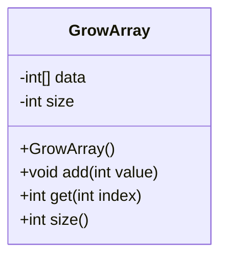
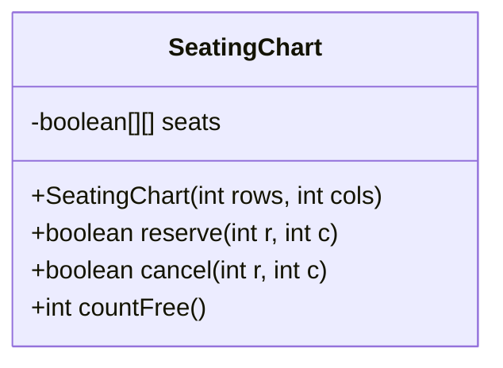
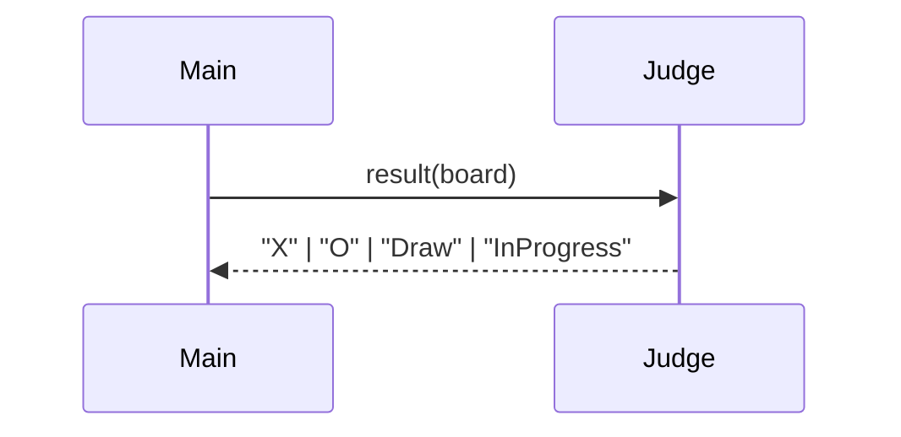

# Java Arrays — Exercises (1D & 2D)

### Exercise 1 — Indexing & Printing (1D)
**Description:**  
Create an `int[] temps` of length 7 for daily temperatures. Fill it and print **index:value** on one line (space-separated), then print the **first**, **last**, and **length**.

**Difficulty:** Easy

**Starter code**
```java
public class Ex1 {
    public static void main(String[] args) {
        int[] temps = new int[7];
        // TODO: assign values (e.g., 12, 11, 13, 14, 9, 10, 12)

        for (int i = 0; i < temps.length; i++) {
            System.out.print(i + ":" + temps[i] + (i == temps.length - 1 ? "" : " "));
        }
        System.out.println();
        // TODO: print first, last, length
    }
}
```

---

### Exercise 2 — Min/Max/Mean (1D)
**Description:**  
Write three static methods for an `int[]`: `min`, `max`, and `mean` (mean returns `double`). Handle empty arrays by returning `Integer.MAX_VALUE`, `Integer.MIN_VALUE`, and `0.0` respectively.

**Difficulty:** Easy

**Hints**
- Use an enhanced for-loop for readability.
- Guard against `arr == null` or `arr.length == 0`.

**Starter code**
```java
public class Stats {
    public static int min(int[] arr) { /* TODO */ return 0; }
    public static int max(int[] arr) { /* TODO */ return 0; }
    public static double mean(int[] arr) { /* TODO */ return 0.0; }

    public static void main(String[] args) {
        int[] a = {3, 1, 4, 1, 5};
        System.out.println(min(a));  // expect 1
        System.out.println(max(a));  // expect 5
        System.out.println(mean(a)); // expect 2.8
    }
}
```

---

### Exercise 3 — Growable Array (copy & double) (1D)
**Description:**  
Simulate an “auto-growing” array: start with `int[] data = new int[4]` and a `size = 0`. Implement `add(int value)` that, if full, **allocates a new array of double length**, copies elements, and then appends.

**Difficulty:** Easy–Medium

**Mermaid (Class Diagram)**


**Starter code**
```java
public class GrowArray {
    private int[] data = new int[4];
    private int size = 0;

    public void add(int value) {
        if (size == data.length) {
            int[] bigger = new int[data.length * 2];
            // TODO: copy
            data = bigger;
        }
        data[size++] = value;
    }

    public int get(int index) { /* TODO: bounds check */ return 0; }
    public int size() { return size; }

    public static void main(String[] args) {
        GrowArray g = new GrowArray();
        for (int i = 0; i < 10; i++) g.add(i*i);
        System.out.println(g.get(9)); // expect 81
    }
}
```

---

### Exercise 4 — Seating Chart (2D basics)
**Description:**  
Model a cinema seating chart with `boolean[][] seats` (true = reserved, false = free). Provide methods to **reserve** `(row, col)` if free, **cancel**, and **countFree()`. Assume a rectangular layout.

**Difficulty:** Medium

**Mermaid (Class Diagram)**


**Starter code**
```java
public class SeatingChart {
    private final boolean[][] seats;

    public SeatingChart(int rows, int cols) {
        seats = new boolean[rows][cols];
    }

    public boolean reserve(int r, int c) {
        // TODO: bounds check & reserve if false
        return false;
    }

    public boolean cancel(int r, int c) {
        // TODO: if true -> set false and return true
        return false;
    }

    public int countFree() {
        int free = 0;
        // TODO: nested loops
        return free;
    }

    public static void main(String[] args) {
        SeatingChart sc = new SeatingChart(3, 4);
        sc.reserve(1, 2);
        System.out.println(sc.countFree()); // expect 11
    }
}
```

---

### Exercise 5 — Row Sum & Column Max (2D)
**Description:**  
Given a rectangular `int[][] grid`, implement:
- `int sumRow(int[][] grid, int r)`
- `int[] colMaxima(int[][] grid)` → returns an array containing the max of each column.

**Difficulty:** Medium

**Hints**
- `grid.length` = row count.
- `grid[0].length` = column count (rectangular assumption).

**Starter code**
```java
public class MatrixOps {
    public static int sumRow(int[][] g, int r) { /* TODO */ return 0; }

    public static int[] colMaxima(int[][] g) {
        // TODO: create result of length g[0].length
        return null;
    }

    public static void main(String[] args) {
        int[][] g = {{1,9,2},{3,7,5},{4,1,8}};
        System.out.println(sumRow(g, 1));          // expect 15
        System.out.println(java.util.Arrays.toString(colMaxima(g))); // [4,9,8]
    }
}
```

---

### Exercise 6 — Minesweeper Counts (2D neighbors)
**Description:**  
Given a `char[][] board` where `'*'` = mine and `'.'` = empty, build an `int[][] counts` where each cell holds the **number of adjacent mines** (8-neighborhood).

**Difficulty:** Medium

**Hints**
- Neighbor offsets: `(-1..1)` for rows & cols, except `(0,0)`.
- Check bounds for each neighbor.

**Starter code**
```java
public class MineCount {
    public static int[][] compute(char[][] b) {
        int R = b.length, C = b[0].length;
        int[][] out = new int[R][C];
        // TODO: for each cell, iterate neighbors and count '*'
        return out;
    }

    public static void main(String[] args) {
        char[][] b = {
            {'.','*','.'},
            {'.','.','.'},
            {'*','.','*'}
        };
        int[][] c = compute(b);
        // TODO: print counts as a grid
    }
}
```

---

### Exercise 7 — Threshold a Grayscale Image (2D)
**Description:**  
Assume an image is `int[][] img` with values `0..255`. Write `int[][] threshold(int[][] img, int t)` that returns a **binary** image: `0` if `< t`, `255` if `>= t`. Keep input array unchanged.

**Difficulty:** Medium

**Hints**
- Create a **new** array of same size.
- Use `img[r][c]` safely.

**Starter code**
```java
public class Threshold {
    public static int[][] threshold(int[][] img, int t) {
        int R = img.length, C = img[0].length;
        int[][] out = new int[R][C];
        // TODO: fill out based on t
        return out;
    }
}
```

---

### Exercise 8 — Word Search (2D char grid, straight lines)
**Description:**  
Given a `char[][] letters` and a `String word`, detect if the word appears **horizontally (left→right)** or **vertically (top→bottom)**. Return `true/false`.

**Difficulty:** Medium

**Hints**
- For each cell as a start, try to match all chars horizontally and vertically.
- Stop early if mismatch or out of bounds.

**Starter code**
```java
public class WordSearch {
    public static boolean contains(char[][] g, String w) {
        // TODO: iterate grid, attempt horiz and vert matches
        return false;
    }

    public static void main(String[] args) {
        char[][] g = {
          {'C','A','T'},
          {'D','O','G'},
          {'R','A','T'}
        };
        System.out.println(contains(g, "CAT")); // true
        System.out.println(contains(g, "COG")); // true
        System.out.println(contains(g, "TAG")); // false
    }
}
```

---

### Exercise 9 — Tic-Tac-Toe Result (2D)
**Description:**  
Given a `char[][] board` (3×3) containing `'X'`, `'O'`, or `'.'`, determine the game state: `"X"`, `"O"`, `"Draw"`, or `"InProgress"`.

**Difficulty:** Medium

**Mermaid (Sequence Diagram - simple check flow)**


**Starter code**
```java
public class TTT {
    public static String result(char[][] b) {
        // TODO: check rows, cols, diagonals
        // if no winner and any '.', return "InProgress"
        // else "Draw"
        return "";
    }
}
```

---

### Exercise 10 — Rotate Square Matrix 90° Clockwise (2D)
**Description:**  
Implement `int[][] rotate90(int[][] m)` for **square** matrices (NxN). Return a **new** matrix with rotated content.

**Difficulty:** Medium–Hard

**Hints**
- New indices mapping: `out[c][N-1-r] = m[r][c]`.
- Use `N = m.length`.

**Starter code**
```java
public class Rotate {
    public static int[][] rotate90(int[][] m) {
        int N = m.length;
        int[][] out = new int[N][N];
        // TODO: nested loops, map (r,c) -> (c, N-1-r)
        return out;
    }
}
```

---

### Exercise 11 — Conway’s Game of Life (one generation) (2D)
**Description:**  
Given a `int[][] world` where `1`=alive, `0`=dead, compute **next generation** using the standard rules (consider 8 neighbors). Do not modify the original during counting.

**Difficulty:** Hard

**Rules (recap)**
- Alive cell with 2 or 3 neighbors → stays alive.
- Dead cell with exactly 3 neighbors → becomes alive.
- Else → dead.

**Starter code**
```java
public class Life {
    public static int[][] nextGen(int[][] w) {
        int R = w.length, C = w[0].length;
        int[][] next = new int[R][C];
        // TODO: count neighbors, apply rules into next
        return next;
    }
}
```

---

### Exercise 12 — Heatmap Normalization (2D, safe math)
**Description:**  
Given arbitrary `double[][] heat` (may be rectangular or jagged), normalize each **row** to range `[0,1]` by linear scaling based on that row’s min/max. Rows with no spread (min==max) become all `0.0`.

**Difficulty:** Hard

**Hints**
- Handle jagged rows carefully: check `heat[r] != null`.
- Avoid division by zero.

**Starter code**
```java
public class Normalize {
    public static double[][] byRow(double[][] h) {
        double[][] out = new double[h.length][];
        for (int r = 0; r < h.length; r++) {
            if (h[r] == null || h[r].length == 0) { out[r] = new double[0]; continue; }
            double min = Double.POSITIVE_INFINITY, max = Double.NEGATIVE_INFINITY;
            for (double v : h[r]) { if (v < min) min = v; if (v > max) max = v; }
            out[r] = new double[h[r].length];
            double range = max - min;
            for (int c = 0; c < h[r].length; c++) {
                out[r][c] = (range == 0) ? 0.0 : (h[r][c] - min) / range;
            }
        }
        return out;
    }
}
```

---

## Reflective Questions
- When did you choose **enhanced for** vs **indexed for**? Why?  
- How did you **guard against bounds errors** in neighbor-based algorithms?  
- Which exercises needed a **new array** vs modifying in place—and why?  
- For jagged arrays, what **extra checks** did you add?  
- If you refactored any repeated nested loops, what **helper methods** emerged?

---

## Tips & Common Pitfalls
- **Indices:** Always `i < arr.length` (not `<=`).  
- **2D sizes:** Use `grid.length` for rows and `grid[r].length` for that row’s columns.  
- **Jagged arrays:** Ensure `grid[r] != null` before accessing.  
- **Copy vs reference:** New arrays require **element-wise copy**—assignment does not duplicate contents.
